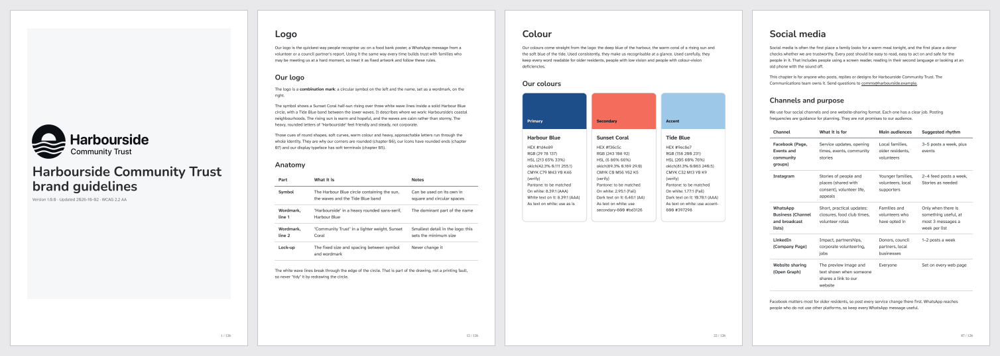

# Style Guide Creator

A Claude Code plugin that turns an organisation's **logo** into a complete, **accessible brand style guide**, covering identity, visual language, verbal identity, digital, print, environment, co-branding, governance and **social media**. It also produces a ready-to-use asset kit and design tokens.

```
/style-guide-creator:create-style-guide path/to/logo.svg "Northwind Labs"
```

That is all it needs. Optional inputs make the result more specific (see below).

## What you get

```
brand-guide/<org>/
├── style-guide.html        Accessible single-page guide (light/dark, responsive, print-ready)
├── style-guide.md          The same guide as portable Markdown
├── style-guide.pdf         Print-ready A4 PDF: cover, contents, page numbers, tagged, with bookmarks (--pdf, needs Chrome/Edge)
├── brand.json              Single source of truth for every brand value
├── content/                20 editable chapters
├── tokens/                 tokens.json (W3C DTCG), tokens.css, _tokens.scss, Tailwind v3 preset, Tailwind v4 theme
├── assets/
│   ├── logo/               Full-colour, single-colour (solid and knockout), reversed, clear-space versions, background tests
│   ├── favicons/           favicon.ico, PNG icons, apple-touch, maskable, site.webmanifest, <head> snippet
│   └── social/<platform>/  Avatars, covers, banners, post/story templates (PNG + editable SVG + safe-zone overlays)
└── analysis/               Logo analysis, palette build, validation report, accessibility audit
```

### The 20 chapters

| # | Chapter | # | Chapter |
|---|---|---|---|
| 1 | Introduction | 11 | Voice and tone |
| 2 | Brand foundations | 12 | Writing style |
| 3 | Logo | 13 | Accessibility |
| 4 | Colour | 14 | Digital and web (incl. email, signatures, favicons) |
| 5 | Typography | 15 | **Social media** |
| 6 | Layout, grid and spacing | 16 | Print and stationery |
| 7 | Iconography | 17 | Presentations and documents |
| 8 | Photography and illustration | 18 | Signage, environment and merchandise |
| 9 | Data visualisation | 19 | Co-branding and partnerships |
| 10 | Motion | 20 | Legal, governance and assets |

### Social media coverage

Profile and cover images, plus post, story, reel, short, thumbnail and pin templates with safe zones, for **Instagram, Facebook, LinkedIn, X, YouTube, TikTok, Threads, Pinterest, Bluesky, Mastodon, WhatsApp Business, Google Business Profile and Open Graph**. Also handles and bios, content pillars, captions, hashtags, emoji, alt text and captions per platform, community management, crisis protocol, employee advocacy, influencer disclosure and account governance.

## Examples

Three complete guides made by running the plugin on sample logos: a tech start-up (SVG), a charity (PNG) and a bakery (logo only, JPG). Each includes the PDF, HTML, tokens, asset kit and audit record. See [examples/](examples/).

[](examples/)

## Accessibility built in

Accessibility is enforced by scripts, not just written about:

- The colour system is generated in OKLCH, and every recommended pairing is **recomputed against WCAG 2.2** (4.5:1 text, 3:1 large text, UI and graphics).
- **Colour-vision deficiency** simulation (protanopia, deuteranopia, tritanopia, achromatopsia) flags confusable colours.
- The logo is checked on every brand background (≥ 3:1), and the right version is chosen automatically.
- Semantic tokens are verified in **light and dark** themes. Focus rings are at least 3:1 and at least 2px.
- Typography minimums: 16px body, 1.5 line height, nothing under 12px.
- The rendered guide itself has a skip link, landmarks, a correct heading outline, captioned tables, alt text, visible focus, reduced motion, dark mode and print styles.
- A **quality gate** (`validate_brand.py`) blocks handover on any failure. An **accessibility auditor** agent then reviews the guide manually.

## Inputs

| Input | Required |
|---|---|
| Logo (SVG preferred; PNG, JPG, WebP) | **Yes** |
| Organisation name | Recommended |
| Symbol / monogram (for avatars and favicons) | Optional, recommended for wide logos |
| Website URL or existing brand materials | Optional |
| Mission, vision, values, tagline, audiences, industry | Optional |
| Existing brand colours, Pantone, fonts | Optional |
| Personality and tone words | Optional |
| Social platforms and handles | Optional |
| Accessibility target (default WCAG 2.2 AA; AAA can be stated as the goal, but the automated gate checks AA thresholds) | Optional |
| Locale (default `en-GB`), owner, contact, output folder | Optional |

Anything not provided is proposed, clearly marked, and listed under **assumptions to confirm**. Nothing about the organisation is invented and presented as fact.

## How it works

```
Intake ─────────── logo + optional inputs, at most 4 questions
Analyse ────────── analyze_logo.py → colours, proportions, background, CVD risks
Core system ────── colour names and roles, accessible palette, typography, shape language
Assets ─────────── make_assets.py → logo variants, favicons, social kit; visual inspection
Chapters ──────── parallel agents:
                   brand-strategist         → foundations, voice, writing style
                   visual-identity-designer → logo, colour, type, layout, icons, imagery, data viz, motion
                   visual-identity-designer → digital, print, documents, signage, co-branding
                   social-media-designer    → social media
                   accessibility-auditor    → accessibility chapter
Build and gate ─── generate_tokens.py → render_guide.py → validate_brand.py (fix loop)
Audit ──────────── accessibility-auditor reviews the rendered guide and assets
Handover ───────── files, decisions to confirm, next steps
```

### Skills

| Skill | Use it directly for |
|---|---|
| `create-style-guide` | The full guide (main entry point); also resumes and updates a guide |
| `logo-analysis` | Logo usage rules, variants, clear space, misuse |
| `color-system` | Accessible palettes, contrast, CVD, colour guidelines |
| `typography` | Font selection and pairing, type scales |
| `visual-language` | Layout, icons, imagery, data viz, motion |
| `voice-and-tone` | Brand foundations, tone of voice, editorial style |
| `social-media-kit` | Social guidelines and asset kit |
| `brand-applications` | Stationery, email, slides, documents, signage, merch, co-branding |
| `accessibility-audit` | Accessibility chapter, or "is this asset on-brand and accessible?" |
| `brand-standards` | Shared contract and scripts (loaded by the others) |

## Installation

```bash
# In Claude Code
/plugin marketplace add pkrcoding/style_guide_creator_plugin
/plugin install style-guide-creator@style-guide-creator
```

Or, for local development, from a clone:

```bash
claude --plugin-dir /path/to/style_guide_creator_plugin
```

### Requirements

- Python 3.9+ (standard library only for analysis, palette, tokens, rendering and validation).
- **Optional:** [Pillow](https://pypi.org/project/pillow/) (`pip install pillow`) for JPG/WebP logos, PNG logo variants, favicons and social PNGs. Without it you still get SVG variants and SVG templates.
- **Optional:** an SVG renderer (cairosvg, rsvg-convert, Inkscape or ImageMagick; macOS Quick Look is used automatically) for pixel-accurate analysis of SVG logos.
- **Optional:** Google Chrome, Chromium or Microsoft Edge for PDF export.

## Using the scripts directly

```bash
S=skills/brand-standards/scripts
python3 $S/init_guide.py --logo logo.svg --name "Northwind Labs" --out brand-guide/northwind
python3 $S/build_palette.py --seed "#0f6e7a:primary:Northwind Teal" --brand brand-guide/northwind/brand.json
python3 $S/make_assets.py    brand-guide/northwind/brand.json
python3 $S/generate_tokens.py brand-guide/northwind/brand.json
python3 $S/render_guide.py   brand-guide/northwind/brand.json --pdf
python3 $S/validate_brand.py brand-guide/northwind/brand.json
python3 $S/contrast_check.py "#ffffff" "#0f6e7a" --use body
```

## Tests

```bash
python3 tests/smoke_test.py
```

This runs the full pipeline on SVG, PNG and (with Pillow) JPG fixtures. It checks that the gate fails while chapters are incomplete and passes once they are filled.

## Limitations and what to confirm

- **CMYK** values are mathematical conversions, and **Pantone** must be matched from a physical swatch. Always get a printer's proof.
- **Single-colour logos** are generated by recolouring. A designer should confirm, or supply official single-colour artwork.
- **Social platform specs** change often. `skills/social-media-kit/references/social-platforms.json` records the review date, and the gate warns after 180 days.
- Automated checks do not replace testing with disabled people and assistive technologies.
- Legal wording (trademarks, disclosure rules) should be reviewed by counsel.

## Contributing

Issues and pull requests are welcome. Please run `python3 tests/smoke_test.py` before submitting, and update `social-platforms.json` → `lastReviewed` when you change platform specs.
