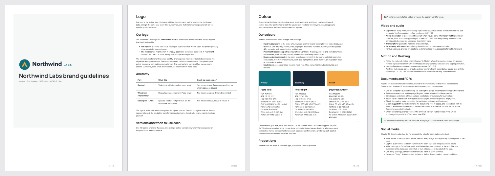
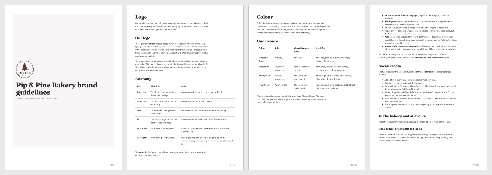

# Examples

Three complete style guides produced by this plugin, one per sample logo. The organisations are **fictional**; the logos were drawn for these examples by [`make_sample_logos.py`](make_sample_logos.py).

Each example was made by running the real plugin end to end (`/style-guide-creator:create-style-guide`) in a non-interactive Claude Code session. The run analysed the logo, built the colour system, generated assets, had five specialist agents write the chapters in parallel, passed the quality gate, and went through an accessibility audit.

| | [Northwind Labs](northwind-labs/) | [Harbourside Community Trust](harbourside-community-trust/) | [Pip & Pine Bakery](pip-and-pine-bakery/) |
|---|---|---|---|
| **Logo supplied** | Vector SVG combination mark + separate symbol | Transparent PNG (emblem + two-line wordmark) | Single-colour JPG badge on a cream background |
| **Other inputs** | Name, industry, audiences, personality, platforms, contact | Name, mission, values, audiences, platforms, contact | **None: logo only** |
| **Tests** | Vector path; wide logo with a symbol for avatars | Raster path; a near-miss contrast exception; older and second-language audiences | Name read from the logo; background removal; single-colour palette expanded by proposal |
| **Colours** | Fjord Teal, Polar Night, Daybreak Amber | Harbour Blue, Sunset Coral, Tide Blue | Pinecone Brown, Forest Pine*, Honey Glaze* |
| **Typefaces** | Manrope, Inter | Nunito, Atkinson Hyperlegible Next | Fraunces, Source Sans 3 |
| **Guide** | 110-page PDF, ~29,000 words | 126-page PDF, ~28,000 words | 130-page PDF, ~27,000 words |
| **Approved colour pairings** (all pass WCAG 2.2 AA) | 28 | 27 | 34 |
| **Asset kit** | 92 files | 81 files | 93 files |
| **Assumptions to confirm** | 24 | 22 | 18 |
| **Run cost** (Claude API usage) | $9.26 | $8.06 | $8.73 |

\* Proposed by the plugin, because the logo has only one colour. Listed as an assumption to confirm.

## Northwind Labs: climate data analytics (fictional)

**Read it:**
- [PDF](northwind-labs/guide/style-guide.pdf)
- [HTML](northwind-labs/guide/style-guide.html) (download the folder and open locally)
- [Markdown](northwind-labs/guide/style-guide.md)

**Inputs:** [`input/brief.md`](northwind-labs/input/brief.md)

## Harbourside Community Trust: local charity (fictional)

**Read it:**
- [PDF](harbourside-community-trust/guide/style-guide.pdf)
- [HTML](harbourside-community-trust/guide/style-guide.html)
- [Markdown](harbourside-community-trust/guide/style-guide.md)

**Inputs:** [`input/brief.md`](harbourside-community-trust/input/brief.md)

**Worth noticing:** the coral "Community Trust" line is 2.95:1 on white, just under the 3:1 logo rule. Rather than quietly allow it, the run recorded it as a logotype exception (`logo.fullColourExceptions`) for the Communications team to sign off. It also chose Atkinson Hyperlegible Next and stricter-than-WCAG sizes for older readers.

## Pip & Pine Bakery: independent bakery (fictional)

**Read it:**
- [PDF](pip-and-pine-bakery/guide/style-guide.pdf)
- [HTML](pip-and-pine-bakery/guide/style-guide.html)
- [Markdown](pip-and-pine-bakery/guide/style-guide.md)

**Inputs:** [`input/brief.md`](pip-and-pine-bakery/input/brief.md) (the logo, nothing else)

**Worth noticing:** with no other input, every statement about the business (mission, values, tagline, audiences) is labelled *Proposed — confirm with leadership*, and bracketed placeholders mark facts only the owner can supply.

## What's in each `guide/` folder

| Path | Contents |
|---|---|
| `style-guide.pdf` / `.html` / `.md` | The guide: 20 chapters from brand foundations to legal and governance |
| `brand.json` | Single source of truth: every colour, size, token and setting |
| `content/` | The 20 chapters as editable Markdown |
| `tokens/` | Design tokens: W3C DTCG JSON, CSS (light and dark), SCSS, Tailwind v3 preset, Tailwind v4 theme |
| `assets/logo/` | Full-colour, single-colour (solid and cut-out) and reversed logos, clear-space versions, background tests |
| `assets/favicons/` | `favicon.ico`, PNG icons, Apple touch icon, maskable icon, web manifest, `<head>` snippet |
| `assets/social/<platform>/` | Avatars, covers and post/story layouts (PNG), editable SVG templates and safe-zone overlays |
| `analysis/validation-report.md` | Quality gate result |
| `analysis/accessibility-audit.md` | Audit findings, and how each one was resolved |

## How these were produced, and what changed afterwards

1. Each example ran `/style-guide-creator:create-style-guide` headlessly with the inputs in `input/brief.md`, using Python with Pillow installed.
2. The three accessibility audits and the run handovers reported plugin-level problems. Examples: identical alt text on logo variants; tables without captions; transparent favicons that vanished in dark browser tabs; cover logos below minimum size on phones; doubled figure tags in the PDF.
3. Those were fixed **in the plugin**, and each example's assets, tokens and rendered guide were then rebuilt with the fixed scripts. The chapter text is the agents' own, apart from one mechanical change: generic repeated headings such as "Accessibility" and "Do and don't" were renamed per chapter (e.g. "Logo accessibility"), as one audit recommended.
4. Each `analysis/accessibility-audit.md` keeps the auditor's original report word for word, with a resolution table above it.

To regenerate the logos: `python3 make_sample_logos.py <out-dir>` (needs Pillow and fontTools, and uses macOS system fonts).
