# Pip & Pine Bakery brand guidelines

Version 1.0.0 · Updated 2026-10-02 · WCAG 2.2 AA

## Contents

1. [Introduction](#introduction)
2. [Brand foundations](#brand-foundations)
3. [Logo](#logo)
4. [Colour](#colour)
5. [Typography](#typography)
6. [Layout, grid and spacing](#layout-grid-and-spacing)
7. [Iconography](#iconography)
8. [Photography and illustration](#photography-and-illustration)
9. [Data visualisation](#data-visualisation)
10. [Motion](#motion)
11. [Voice and tone](#voice-and-tone)
12. [Writing style](#writing-style)
13. [Accessibility](#accessibility)
14. [Digital and web](#digital-and-web)
15. [Social media](#social-media-1)
16. [Print and stationery](#print-and-stationery)
17. [Presentations and documents](#presentations-and-documents)
18. [Signage, environment and merchandise](#signage-environment-and-merchandise)
19. [Co-branding and partnerships](#co-branding-and-partnerships)
20. [Legal, governance and assets](#legal-governance-and-assets)

## Introduction

A small bakery is recognised by the way it looks, sounds and feels long before anyone tastes the bread. These guidelines keep Pip & Pine Bakery consistent, warm and easy to recognise everywhere it appears, from a paper bag to an Instagram story, and make sure everything we publish works for everyone who reads it.

### What this guide is for

This guide sets out how to use the Pip & Pine Bakery identity: the logo, colours, typefaces, layout, imagery, voice and the templates that put them together. It turns the qualities already visible in our emblem (a hand-drawn pine, a small seed, a classic serif and an earthy brown on cream) into rules anyone can follow.

It is built from a single source of truth, `brand.json`. Colour values, type sizes, spacing and contrast ratios in this guide, in the design tokens and in the asset kit all come from that file, so they always agree.

### Who it is for

- **Owners and staff** writing a menu board, a price ticket, a social post or an email.
- **Designers and agencies** creating packaging, signage, print and campaigns.
- **Developers** building the website, online ordering or email templates, using the tokens in `tokens/`.
- **Printers, sign makers and embroiderers** reproducing the logo and colours.
- **Partners and suppliers** showing our logo alongside their own.

### How to use it

1. Start with the chapter for what you are making (for example *Social media* or *Print and stationery*).
2. Follow its links back to the core chapters (*Logo*, *Colour*, *Typography*) for the exact rules.
3. Download ready-made files from the asset library described in *Legal, governance and assets*. Do not redraw the logo or retype colour values by hand.
4. Check your work against the *Accessibility* chapter before you publish or print.

### What is fixed and what is flexible

| Fixed: always follow | Flexible: use your judgement |
|---|---|
| The logo artwork, its clear space, minimum size and approved colour versions | Which approved logo version and background suit the layout |
| Brand colour values and the approved colour pairings | How much of each colour a single piece uses, within the stated proportions |
| Typefaces and the minimum text sizes | Exact layout, crop and composition within the grid |
| Accessibility rules: contrast, alt text, captions, focus, motion | Tone within the voice, adjusted to the moment |
| Legal lines, trademark and licence rules | Photography subjects and seasonal styling |

If a rule seems to stop you doing something sensible, ask the brand owner before you work around it. Exceptions are recorded, so the guide improves over time.

### Our accessibility commitment

We design for everyone who buys from us, works with us or follows us online, including people with low vision, colour-vision differences, dyslexia, motor impairments, and people using screen readers or captions. Every colour pairing, type size, template and rule in this guide meets at least WCAG 2.2 level AA, and the guide is checked by an automated accessibility gate before each release. If something we publish is hard to use, we treat it as a fault to fix, not a matter of taste.

> **Do** use the templates and downloadable files in the asset library: they already meet our colour, size and accessibility rules.

> **Don't** recreate the logo from a screenshot or pick colours by eye from a photo of the shop. Use the master files and the values in this guide.

> **Note** Some content in this guide (for example our mission and values, the two supporting colours and the font choices) is marked as a proposal. Treat it as a working draft until the owner confirms it.

### Getting help

Send questions, requests for files and requests for exceptions to the brand owner listed below. Allow two working days for a reply, longer for new artwork.

**About this guide**

| Item | Detail |
|---|---|
| Organisation | Pip & Pine Bakery |
| Guide version | 1.0.0 |
| Last updated | 2026-10-02 |
| Brand owner | Brand and Marketing team |
| Contact | brand@pipandpine.example (placeholder: replace with the real brand contact) |
| Accessibility standard | WCAG 2.2 AA |
| Language and spelling | en-GB |
| Review cadence | Every 12 months, and after any rebrand or platform change |

**Assumptions to confirm:**

- Brand colours were extracted from the logo; confirm exact values against the master artwork or existing specifications.
- CMYK values are mathematical conversions; confirm with your printer and choose Pantone matches from a physical swatch book.
- Social platform specifications were last reviewed on the date in the social chapter; verify before production.
- Non-interactive run: no questions were asked. Organisation name 'Pip & Pine Bakery' was read from the logo.
- The logo is single-colour (#5a3a29) on cream (#fbf4e4). Forest Pine (#2f5a45) and Honey Glaze (#d9a441) are proposed supporting colours, not taken from the logo; Flour Cream (#fbf4e4) is the logo's own background, adopted as a warm surface colour. Confirm all colour names and the two proposed colours.
- Typefaces Fraunces (display) and Source Sans 3 (body) are recommended free Google Fonts (SIL OFL 1.1) matched to the logo's warm old-style serif; the wordmark itself is artwork, not set in Fraunces. Replace if the bakery has licensed fonts.
- The tree-and-pip symbol was cropped from the master JPG to assets/source/symbol.png (transparent) for avatars and favicons. A designer should redraw it as vector artwork.
- The master logo is a 1200px JPG with a cream background; request a vector (SVG/EPS) master from the original designer.
- Minimum logo size raised to 96px / 25mm because the small 'BAKERY' line becomes illegible below that; use the symbol below it.
- Default social platforms (Instagram, Facebook, LinkedIn, X, YouTube, TikTok, web sharing) and no handles were supplied; handles are placeholders.
- Mission, vision, values, tagline and boilerplate are proposals, since no website or brand statements were provided.
- Owner and contact are placeholders.
- Brand foundations (mission, vision, values, positioning, personality, audiences, tagline, boilerplate) are proposals; the reading of the name as 'small beginnings growing into something lasting' is our interpretation. Boilerplates contain [bracketed] gaps to fill.
- Social handles, hashtags, content pillar shares, posting and reply cadence are placeholders/proposals; handle availability is unchecked.
- Lucide (ISC licence) is the recommended icon set; illustration style, pip pattern and logo animation are proposals.
- In-shop signage sizes, price ticket sizes, embroidery sizes and approval lead times are proposed starting points to confirm on site and with suppliers.
- UK rules (Natasha's Law and Food Information Regulations, BS 8300, ASA CAP Code) are named for checking, not given as legal advice.
- LinkedIn cover, YouTube banner and favicons (white symbol on a Pinecone Brown tile) were re-composed after generation to keep the emblem above its minimum size with clear space and keep favicons visible in dark browser tabs; re-running make_assets.py overwrites them, so re-apply these fixes.

## Brand foundations

Brand foundations are the reasons behind every colour, word and photo in this guide. When you are unsure how to write a caption or design a poster, come back here and ask: does this sound and feel like Pip & Pine Bakery?

> **Warning** We built this guide from the logo alone. We had no website, mission statement or brand brief. Everything in this chapter except the name and the industry is a **proposal** for leadership to confirm, edit or replace. Each proposal is labelled. Do not publish any of it as fact until it is approved.

### Where these foundations come from

We had three sources:

- **The name**, read from the logo: Pip & Pine Bakery.
- **The industry**: a bakery.
- **The logo's personality**: a round emblem drawn in a single dark brown on cream. It has a three-tier pine tree beside a small upright seed (the "pip"), above a classic old-style serif wordmark. It feels organic, handmade, warm and earthy. It feels friendly and traditional rather than corporate or playful.

*Interpretation, not a fact:* a pip is a seed and a pine is a tree that lasts for generations. We read the name as "small beginnings that grow into something lasting". We use that idea below as a creative thread. If the founders chose the name for another reason, replace it with their story.

We have not stated anything about the bakery's history, location, ingredients, methods, products, awards or customers. Do not add claims like these to any copy until someone at the bakery confirms them.

### Mission

The mission says what we do, for whom and why, in one sentence.

*Proposed — confirm with leadership:* We bake good, honest bread and bakes, made with care, for our neighbours to share every day.

### Vision

The vision is the future we are working toward.

*Proposed — confirm with leadership:* A bakery people grow up with: a warm, welcoming place that is part of everyday life in its community for generations.

### Values

Values are only useful if they change how we behave. Each one has a behaviour you can check your work against.

*Proposed — confirm with leadership:*

| Value | What it means | How we behave |
|---|---|---|
| Made with care | We take time over things that matter. | We do small things properly, from the bake to the reply to a customer's message. |
| Honest and plain | We tell people what they need to know, simply. | We say what is in it, what it costs and when it is ready, in plain words with no fine print. |
| Rooted in community | We are here for the people around us. | We greet people by name when we can, listen to feedback and make room for everyone. |
| Growing steadily | Good things take time, like a seed becoming a pine. | We improve a little every day and never promise more than we can deliver. |

> **Do** show a value through an action, for example: "Call us before [time] and we'll put a loaf aside for you." (Only promise services the bakery actually offers.)

> **Don't** just name the value: "We are passionate about community." Readers believe what we do, not what we say we are.

### Positioning

The positioning statement is for internal use. It guides decisions; it is not customer copy.

*Proposed — confirm with leadership:* For local people who want everyday bread and treats they can trust, Pip & Pine Bakery is the neighbourhood bakery that feels like it has always been there, because we bake with care, speak plainly and treat every customer like a neighbour.

The proof in that statement ("bake with care") must be backed by real practice. Once leadership confirms what makes the bakery different (for example, its methods, ingredients or story), put that here instead.

### Audiences

*Proposed — confirm with leadership:* these are typical audiences for a neighbourhood bakery. Replace them with what the bakery knows about its real customers.

| Audience | Who they are | What they need from us | Channels | Accessibility needs to plan for |
|---|---|---|---|---|
| Everyday locals | Regulars buying bread and breakfast on the way to work or school | Opening times, what is available today, quick service | Shop window and counter, Google Business Profile, Instagram, Facebook | Large, high-contrast signs and price labels; menus that work with screen readers and zoom |
| Treat seekers and gift buyers | People buying cakes and bakes for occasions or as a treat | Clear choices, prices, how to order and collect | Website, Instagram, TikTok, phone | Allergen and ingredient information in text, not only in photos; ordering that works by keyboard and screen reader |
| Families and older customers | Parents with children, older neighbours, carers | Allergen information, a welcoming space, simple ways to ask questions | In person, phone, Facebook, printed notices | Plain language; print at least 12pt; phone and in-person options as well as online; step-free access information |
| Local businesses and partners | Cafés, offices and event organisers who might order in bulk | Reliable supply, clear terms, a named contact | Email, LinkedIn, website | Accessible PDF price lists and order forms |
| Future team members | Bakers, counter staff and apprentices | What the work is like, hours, pay and how to apply | Website, LinkedIn, Instagram, shop window | Accessible application forms; job adverts that welcome disabled applicants and offer adjustments |

> **Accessibility** Never put allergen or ingredient information only in an image, a photo caption or a colour code. Always give it as real text, with a phone number or in-person option for anyone who needs to check.

### Personality

Personality is how the brand would come across if it were a person behind the counter. These traits link directly to the voice attributes in the Voice and tone chapter.

*Proposed — confirm with leadership:*

- **Warm**: welcoming and kind, like the smell of fresh bread. Links to the voice attribute *Warm, not gushing*.
- **Honest**: plain, straightforward and trustworthy. Links to *Plain, not plain-boring*.
- **Crafted**: careful, skilled and unhurried, like the handmade feel of the emblem. Links to *Crafted, not fussy*.
- **Rooted**: steady, traditional and part of the neighbourhood. Links to *Neighbourly, not overfamiliar*.

### Tagline

*Proposed — confirm with leadership:* **From a pip, something lasting.**

The tagline echoes the name and our interpretation of it. It works below the logo, on bags and boxes, and at the end of a video. Alternatives for leadership to consider:

- *Proposed alternative:* Baked with care, every day.
- *Proposed alternative:* Your neighbourhood bakery.

> **Don't** set the tagline inside the emblem or change the logo to fit it. Place it as separate text in Fraunces, outside the logo's clear space.

### Boilerplate

Boilerplate is the standard "about us" text for press releases, partner websites, event listings and social profiles. Use the length that fits the space. Do not edit it per use; ask the brand team if it needs changing.

*Proposed — confirm with leadership.* Add the real location, founding year and any proof points before publishing. Square brackets show information we do not have.

#### Short (about 25 words)

Pip & Pine Bakery is a bakery in [town or area], baking bread and treats with care for our neighbours to enjoy every day.

#### Medium (about 50 words)

Pip & Pine Bakery is a bakery in [town or area]. We bake bread, cakes and everyday treats [confirm the range] with care, and serve them with a warm welcome. Our name says what we believe: from a small pip grows something lasting. We want to be the bakery our neighbours grow up with.

#### Long (about 100 words)

Pip & Pine Bakery is a bakery in [town or area]. We bake bread, cakes and everyday treats [confirm the range] with care, and we serve them with a warm welcome and plain, honest information about what goes into them. Our name says what we believe: from a small pip grows a pine that lasts for generations. We want to be that kind of bakery, a steady part of daily life in our community. [Add one or two confirmed facts here, such as when we opened or what we are known for.] Find our opening times, menu and ordering options at [website address].

> **Do** replace every square-bracket item with confirmed information before you publish.

> **Don't** add claims such as "award-winning", "organic" or "artisan" unless they are true and the bakery can show proof. Some of these words have legal or certification meanings.


## Logo

Our logo is the stamp that tells customers a loaf, box or post is genuinely ours. Using it the same way every time, on a bag sticker, a shop sign or a phone screen, makes Pip & Pine Bakery easy to recognise and hard to imitate.

### Our logo

The logo is an **emblem**: a round badge drawn in one colour, Pinecone Brown, on a light ground. A thick outer ring and a thin inner ring frame a simple three-tier pine tree with a short trunk. Beside the tree sits a small upright oval, the "pip" or seed. Below them, the name PIP & PINE is set in a classic serif, with BAKERY underneath in smaller, widely spaced capitals.

The emblem feels handmade, warm and traditional, like a baker's stamp or a label on a paper bag. The tree is crisp and geometric; the rings and the pip are round and soft. That mix of simple shapes and gentle curves runs through the whole identity, from our rounded corners to our icons.

### Anatomy

| Part | What it is | Rule |
|---|---|---|
| Outer ring | The thick circle that defines the emblem's edge | Always complete. Never crop, open or thin it |
| Inner ring | The thin circle just inside the outer ring | Always present in the full emblem |
| Tree | Three stacked triangles on a short trunk | Never redraw, add baubles or recolour separately |
| Pip | The small upright oval to the right of the tree's base | Always travels with the tree. It is half of our name |
| Wordmark | PIP & PINE in serif capitals | Artwork, not typed text. Never retype it in Fraunces or any other font |
| Descriptor | BAKERY in spaced capitals | Part of the emblem. Becomes illegible below the minimum size, which is why the minimum is set where it is |

The **symbol** is the tree and pip without the rings or words. Use it only where the full emblem is too small to read.

### Versions and when to use each

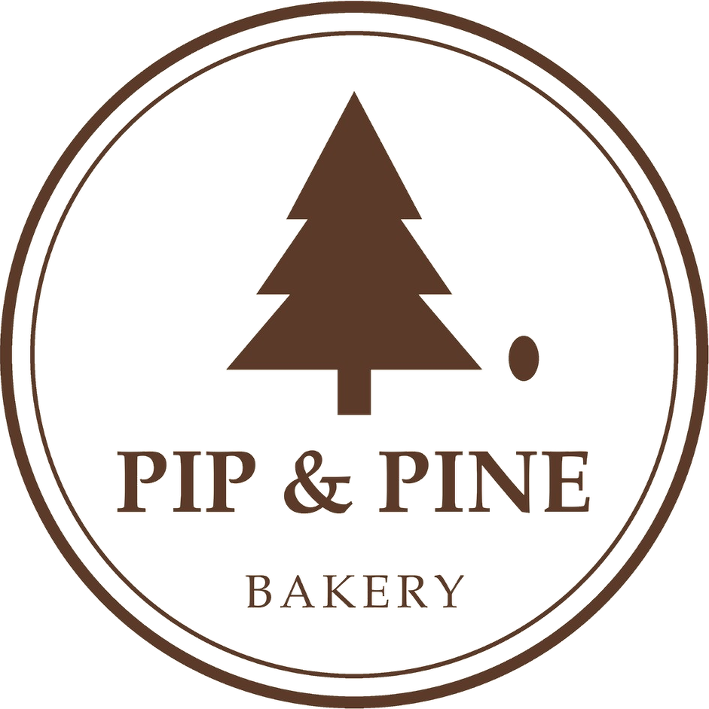
*primary logo, full colour (PNG, transparent)*

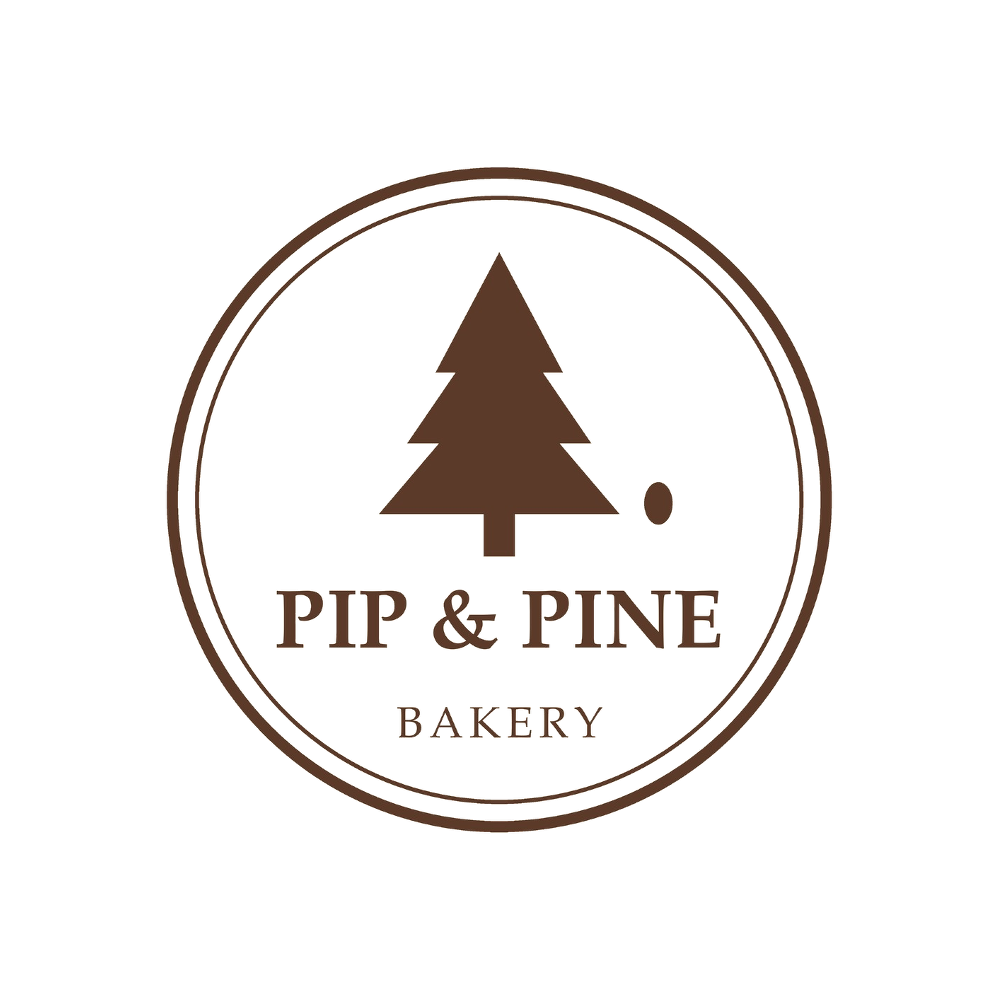
*primary logo, full colour, with minimum clear space built in*

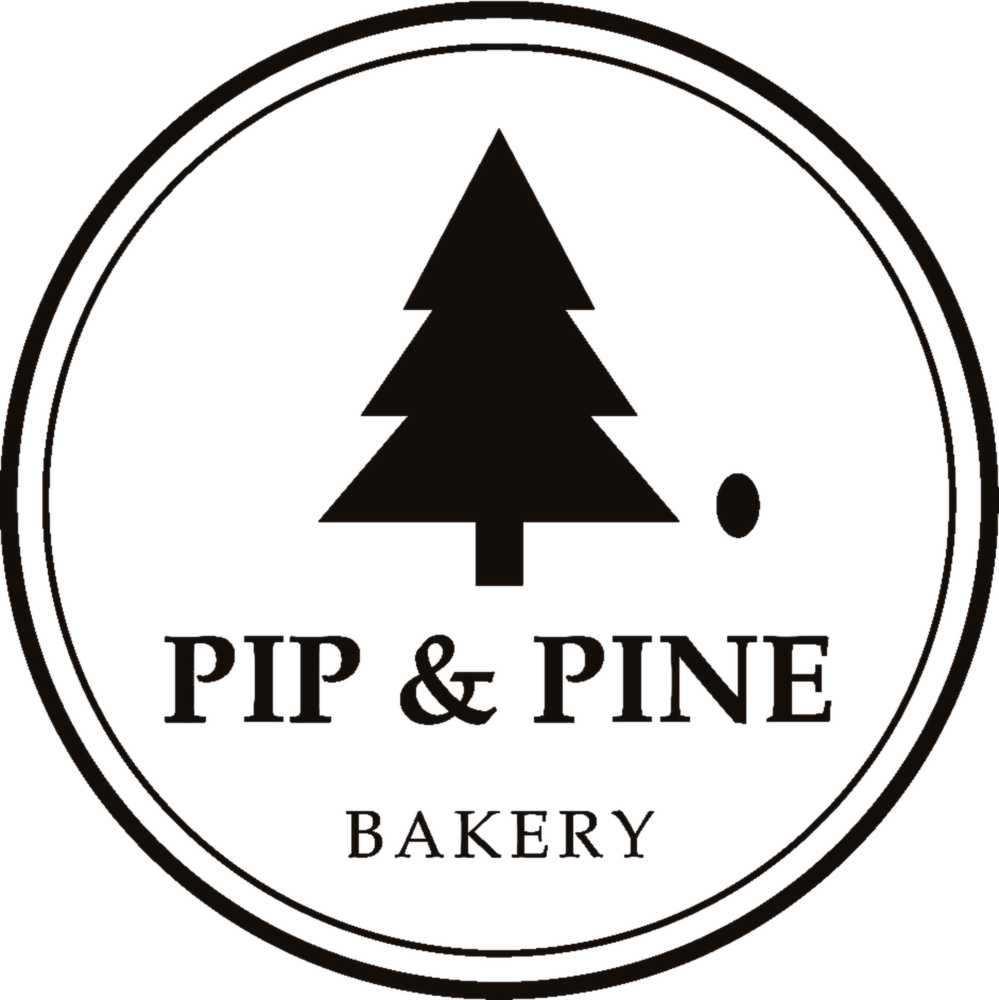
*primary logo, mono dark (PNG, transparent)*

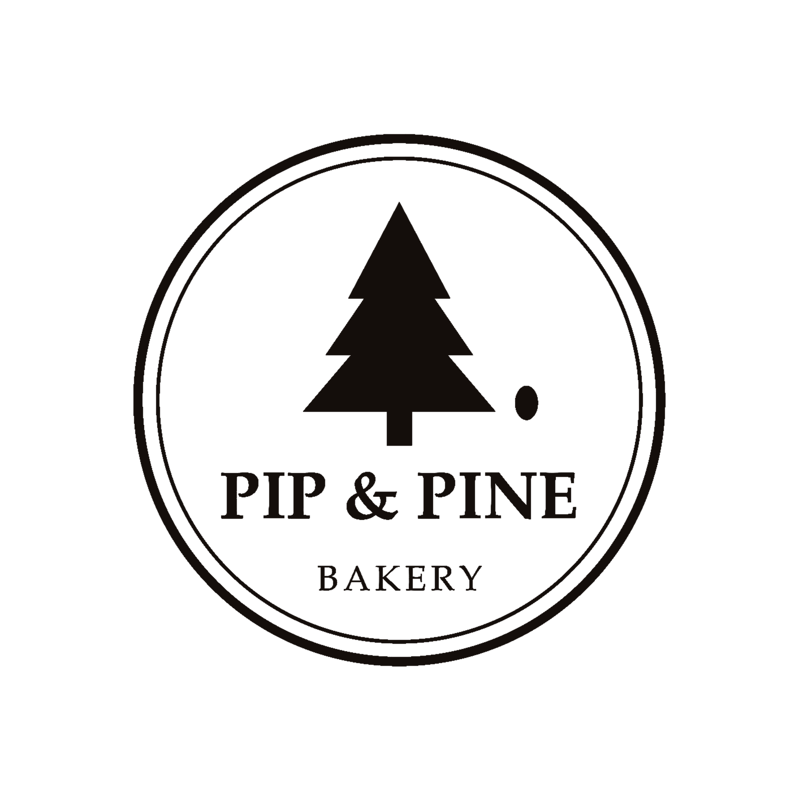
*primary logo, mono dark, with minimum clear space built in*

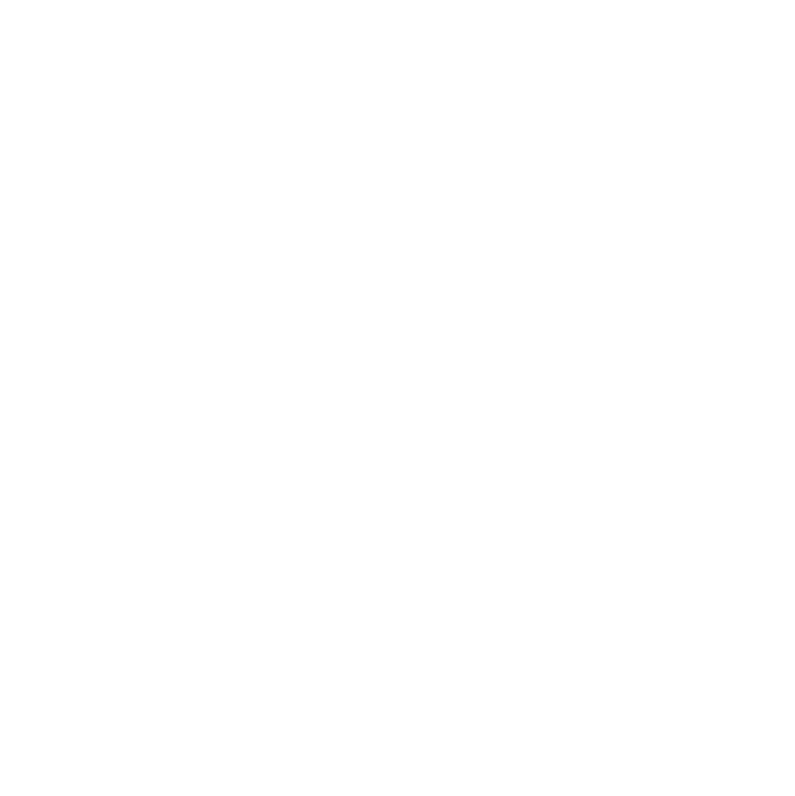
*primary logo, mono light (PNG, transparent)*

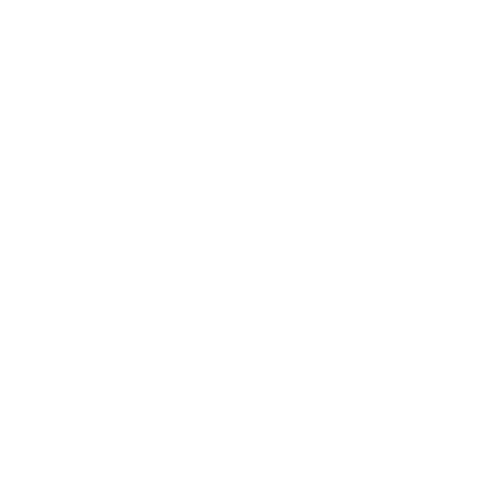
*primary logo, mono light, with minimum clear space built in*

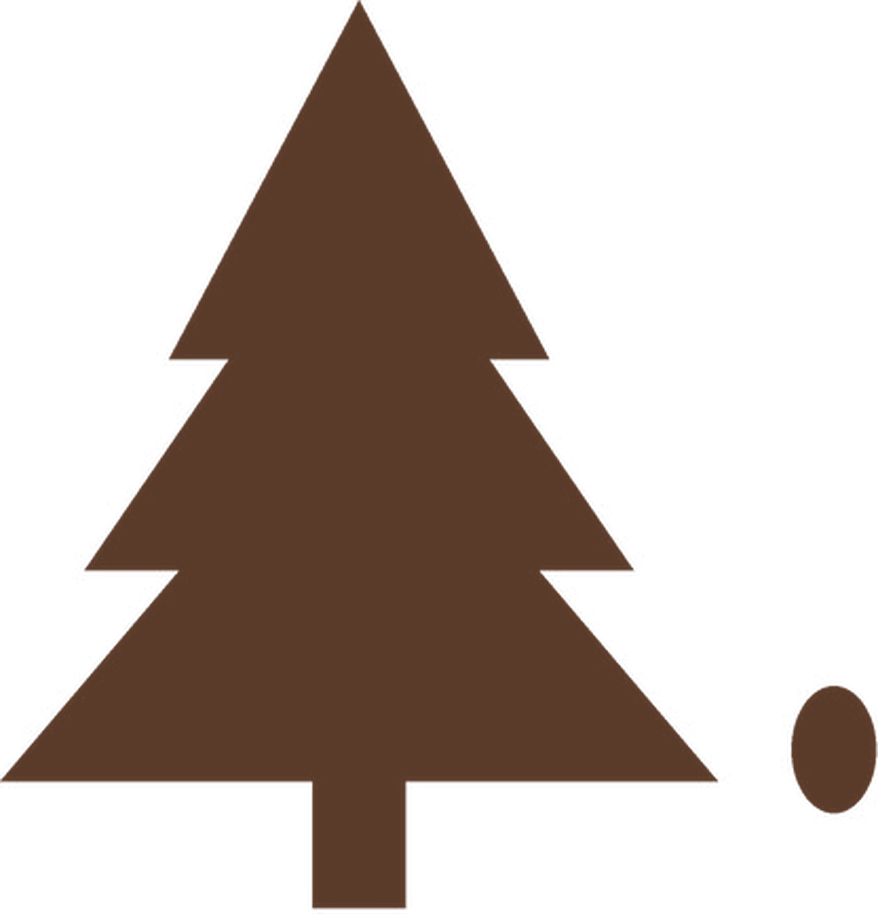
*symbol logo, full colour (PNG, transparent)*


*symbol logo, full colour, with minimum clear space built in*


*symbol logo, mono dark (PNG, transparent)*


*symbol logo, mono dark, with minimum clear space built in*


*symbol logo, mono light (PNG, transparent)*


*symbol logo, mono light, with minimum clear space built in*
| Version | Use it for | File stem |
|---|---|---|
| Full colour (Pinecone Brown) | Our default. White, Flour Cream, light neutral and Honey Glaze backgrounds | `primary-full-colour` |
| Single colour dark | One-colour black printing: newspapers, receipts, rubber stamps, fax, laser-etching templates | `primary-mono-dark` |
| Single colour light (white) | Pinecone Brown, Forest Pine, the dark neutral and dark, calm photographs | `primary-mono-light` |
| Symbol, full colour | Favicons, app icons, social avatars and anything under 96px wide | `symbol-full-colour` |
| Symbol, white | Small spaces on dark or brand-coloured backgrounds | `symbol-mono-light` |
| Symbol, single colour dark | Small one-colour black printing | `symbol-mono-dark` |

Because the logo is a single colour, the full-colour version and the dark single-colour version look alike. Choose full colour unless the job can only print black.

Single-colour versions use **solid** artwork: every ring, letter, tree and pip is filled in the one colour, and the white version keeps all of that detail. Nothing is knocked out.

We do not have a horizontal (side-by-side) lock-up. Do not create one by setting the name next to the symbol. If a wide, short space needs one, ask the Brand and Marketing team.

> **Do** use full colour on white, Flour Cream, light neutral or Honey Glaze.

> **Don't** use the supplied JPG with its cream square on any background other than Flour Cream. The square edge shows. Use the transparent PNG or vector file instead.

### Clear space

Keep an empty margin on every side of the emblem equal to the height of the capital P in PIP & PINE. That is about a quarter of the emblem's height, measured from the outer edge of the thick ring. No text, image edge, fold or other logo may enter it.

The emblem is a quiet, finely drawn badge; crowding it makes the thin inner ring and the BAKERY line disappear into the surroundings. The files ending in `-clearspace` already include this margin, so placing one of them edge to edge with other content is always safe.

### Minimum size

| Version | Screen | Print |
|---|---|---|
| Full emblem | 96px wide | 25mm wide |
| Symbol | 24px wide | 8mm wide |

Below 96px or 25mm the BAKERY line breaks up and the inner ring merges with the outer one. At that point switch to the symbol, and make sure the name appears nearby in live text (a page title, a profile name, a printed line). Never shrink the emblem below the minimum to fit a space.

**Logo specifications**

| Rule | Specification |
|---|---|
| Logo type | emblem |
| Clear space | Keep clear space on all sides equal to the height of the cap 'P' in the PIP & PINE wordmark (about a quarter of the emblem's height), measured from the outer ring. |
| Minimum size (screen) | 96 px wide |
| Minimum size (print) | 25 mm wide |
| Symbol minimum size | 24 px / 8 mm |
| Proportions | 1.0 : 1 (width : height), square |
| Alt text | “Pip & Pine Bakery logo” |
### Placement

- **Web and apps:** top left of the header, aligned to the left grid margin, linked to the home page. Give the emblem at least 96px; if the header is shorter, use the symbol at 40px or more.
- **Print (A4, menus, flyers):** top left or centred at the top, aligned to the margin. The emblem's round shape also works centred at the foot of a page as a sign-off.
- **Packaging and bags:** the emblem works as a round sticker or stamp. Centre it on the face of the bag or box lid, at 25mm or more.
- **Social posts and slides:** one corner, the same corner for a whole campaign, inside the platform's safe zone. Avatars use the symbol (see chapter 15).
- **Signs:** see chapter 18 for size by viewing distance.

Place the logo once per surface. Repeating it across a page reads as a pattern and weakens it.

### Backgrounds

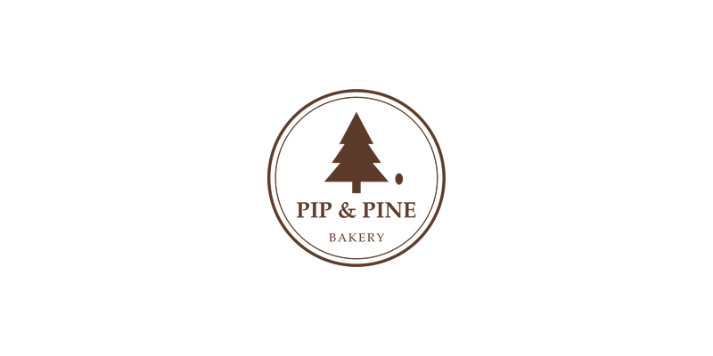
*On white (#ffffff): use **full-colour** (10.14:1). Full colour allowed (10.14:1).*

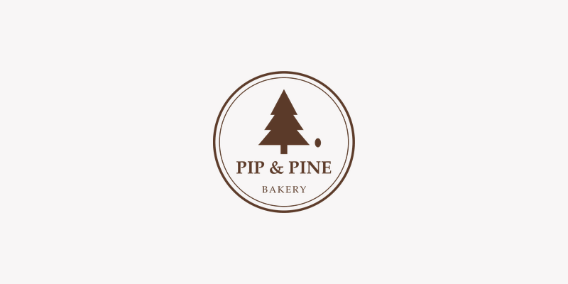
*On light-neutral (#f8f6f6): use **full-colour** (9.41:1). Full colour allowed (9.41:1).*

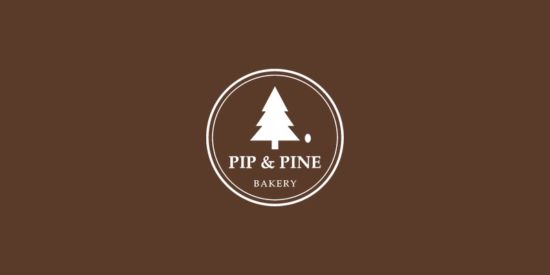
*On primary (#5a3a29): use **mono-light** (10.14:1). Full colour not allowed (1.0:1).*

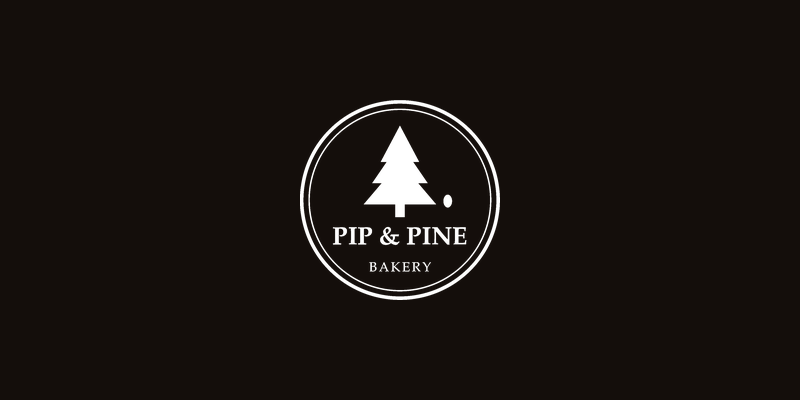
*On dark (#140e0b): use **mono-light** (19.14:1). Full colour not allowed (1.89:1).*

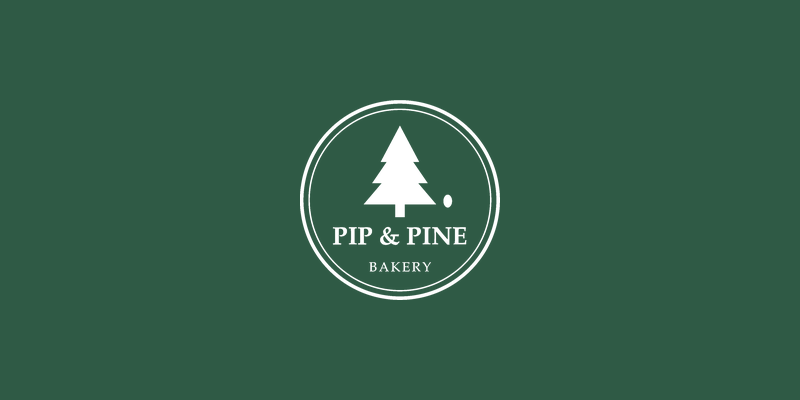
*On secondary (#2f5a45): use **mono-light** (7.87:1). Full colour not allowed (1.29:1).*

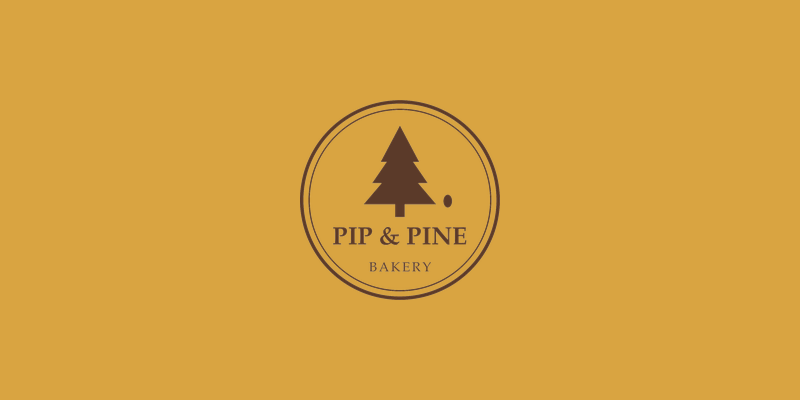
*On accent (#d9a441): use **full-colour** (4.51:1). Full colour allowed (4.51:1).*

**Which logo version to use on each background (minimum 3:1)**

| Background | Use this version | Contrast | Full colour allowed? |
|---|---|---|---|
| `white` | full-colour | 10.14:1 | Yes (10.14:1) |
| `light-neutral` | full-colour | 9.41:1 | Yes (9.41:1) |
| `primary` | mono-light | 10.14:1 | No (1.0:1) |
| `dark` | mono-light | 19.14:1 | No (1.89:1) |
| `secondary` | mono-light | 7.87:1 | No (1.29:1) |
| `accent` | full-colour | 4.51:1 | Yes (4.51:1) |
| Background | Version | Contrast |
|---|---|---|
| White | Full colour | Passes comfortably |
| Flour Cream (the logo's own ground) | Full colour | Passes comfortably |
| Light neutral (`neutral-50`) | Full colour | Passes comfortably |
| Honey Glaze | Full colour | Passes 3:1 |
| Pinecone Brown | White | Passes comfortably. Full colour would vanish |
| Forest Pine | White | Passes comfortably. Full colour fails |
| Dark neutral (`neutral-950`) or black | White | Full colour fails |

The full-colour logo fails on black and on the dark neutral, so always switch to white there. Never put the white logo on Honey Glaze, white or Flour Cream.

**Photographs:** place the logo only over a calm, evenly lit area (a plain wall, a floured worktop, an out-of-focus background), and check that the area directly behind it gives at least 3:1. If it doesn't, put the logo on a solid Flour Cream or Pinecone Brown panel. Never place it over crumb, crust or patterned textures.

### Misuse

Don't:

1. Stretch, squash or skew the emblem. Always scale it proportionally.
2. Rotate or tilt it, even for a "stamped" effect.
3. Recolour it outside the approved versions, including making the tree Forest Pine or the pip Honey Glaze.
4. Add shadows, glows, bevels, outlines, textures or gradients.
5. Move, resize, remove or rearrange parts: separating the pip from the tree, dropping the inner ring or removing BAKERY.
6. Retype PIP & PINE in Fraunces or any other font, or set the name beside the symbol to fake a lock-up.
7. Place it on busy photos, patterns or backgrounds below 3:1, or use the full-colour logo on Pinecone Brown, Forest Pine or dark backgrounds.
8. Put it inside another shape (a square tile, a second circle, a speech bubble) not shown in this guide.
9. Crop the rings or let the emblem bleed off the edge of a page or screen.
10. Use the supplied JPG with its cream square on any other background.
11. Use it smaller than the minimum size, or redraw, trace or recreate it from a screenshot.

### Files and naming

| Use | Format |
|---|---|
| Websites, apps, digital design | SVG (vector master, to be supplied) or transparent PNG |
| Professional print, signage, embroidery | PDF or EPS vector (to be supplied) |
| Word, PowerPoint, Google Docs, email | Transparent PNG |

Name files `pip-pine-bakery-logo-{version}-{colour}.{ext}`, for example `pip-pine-bakery-logo-emblem-white.png` or `pip-pine-bakery-logo-symbol-fullcolour.svg`. Download approved files from the downloads list in chapter 20.

> **Warning** Our master is currently a 1200px JPG, and the symbol was cut from it. Until the Brand and Marketing team supplies vector artwork, do not send the PNGs to a sign maker, embroiderer or large-format printer. Ask the team for the vector files first.

### Logo accessibility

- Use the alt text "Pip & Pine Bakery logo". When the logo links home, use "Pip & Pine Bakery home" instead, so screen reader users know where the link goes.
- If the logo sits next to the name in live text, give it empty alt text (`alt=""`) so the name isn't read twice.
- Keep at least 3:1 between the logo and the area behind it.
- Never use the logo image in place of our name in running text. Write "Pip & Pine Bakery" in words.
- Never rely on the logo as the only way to identify us: page titles, email sender names and document properties must also carry our name in text.


## Colour

Colour is the fastest way customers recognise us across the street or a feed. Our palette starts from the logo's warm brown on cream and adds two supporting colours from the pine forest and the bakery counter, and every combination we approve is readable for people with low vision or colour-vision deficiency.

### Our colours

| Colour | Role | Where it comes from | Use it for |
|---|---|---|---|
| Pinecone Brown | Primary | The logo | The logo, primary buttons, headings, footers, dark panels |
| Forest Pine | Secondary (*proposed*) | Echoes the tree in the logo | Secondary buttons, section bands, seasonal and outdoor moments |
| Honey Glaze | Accent (*proposed*) | The colour of a glazed crust | Small highlights: stickers, offer flashes, illustration details, dividers |
| Flour Cream | Warm surface | The logo's own background | Page and packaging backgrounds that feel like paper bags and flour |

Pinecone Brown is the only colour in the logo. Forest Pine and Honey Glaze are proposals that give the palette range; the Brand and Marketing team must confirm them before large print runs.

**Pinecone Brown** (primary)

- HEX #5a3a29
- RGB (90 58 41)
- HSL (21 37% 26%)
- oklch(38.2% 0.053 48.6)
- CMYK C0 M36 Y54 K65 (verify)
- Pantone: to be matched
- On white: 10.14:1 (AAA)
- White text on it: 10.14:1 (AAA)
- As text on white: use as is

**Forest Pine** (secondary)

- HEX #2f5a45
- RGB (47 90 69)
- HSL (151 31% 27%)
- oklch(43.0% 0.060 161.2)
- CMYK C48 M0 Y23 K65 (verify)
- Pantone: to be matched
- On white: 7.87:1 (AAA)
- White text on it: 7.87:1 (AAA)
- As text on white: use as is

**Honey Glaze** (accent)

- HEX #d9a441
- RGB (217 164 65)
- HSL (39 67% 55%)
- oklch(75.1% 0.130 79.8)
- CMYK C0 M24 Y70 K15 (verify)
- Pantone: to be matched
- On white: 2.25:1 (Fail)
- Dark text on it: 8.51:1 (AAA)
- As text on white: use accent-600 #8d6300
The swatches show HEX, RGB, HSL, OKLCH and CMYK. CMYK values are a mathematical starting point, not a print specification. Pantone references are still to be matched from a physical Pantone swatch book and confirmed on a printer's proof; coated and uncoated papers give different results, so match each stock separately.

### Proportions

*Approximate share of colour across a typical layout*

- Neutrals and white 55%
- Pinecone Brown 30%
- Forest Pine 10%
- Honey Glaze 5%
Neutrals (Flour Cream, white and the warm greys) cover about 55% of any layout, Pinecone Brown 30%, Forest Pine 10% and Honey Glaze 5%.

A menu board, for example, has a Flour Cream background, Pinecone Brown headings, prices and logo, one Forest Pine band for "This week's bakes", and a single Honey Glaze sticker shape behind "New". If Honey Glaze starts covering whole panels, the layout stops feeling like us and starts feeling like a warning sign.

### Tonal scales and tokens

**Pinecone Brown tonal scale**

| Token | HEX | Contrast with white | Contrast with black | Text colour on it |
|---|---|---|---|---|
| `primary-50` | #fcf5f2 | 1.08:1 (Fail) | 19.48:1 (AAA) | Dark |
| `primary-100` | #f8eae2 | 1.18:1 (Fail) | 17.86:1 (AAA) | Dark |
| `primary-200` | #eed5c8 | 1.40:1 (Fail) | 14.99:1 (AAA) | Dark |
| `primary-300` | #deb8a4 | 1.83:1 (Fail) | 11.50:1 (AAA) | Dark |
| `primary-400` | #c5967d | 2.61:1 (Fail) | 8.03:1 (AAA) | Dark |
| `primary-500` | #ab795e | 3.73:1 (AA Large / UI) | 5.63:1 (AA) | Dark |
| `primary-600` | #8d5f47 | 5.44:1 (AA) | 3.86:1 (AA Large / UI) | White |
| `primary-700` | #724a36 | 7.64:1 (AAA) | 2.75:1 (Fail) | White |
| `primary-800` | #5a3a29 | 10.14:1 (AAA) | 2.07:1 (Fail) | White |
| `primary-900` | #3d2518 | 14.23:1 (AAA) | 1.48:1 (Fail) | White |
| `primary-950` | #25130a | 17.85:1 (AAA) | 1.18:1 (Fail) | White |

**Forest Pine tonal scale**

| Token | HEX | Contrast with white | Contrast with black | Text colour on it |
|---|---|---|---|---|
| `secondary-50` | #f2f9f5 | 1.07:1 (Fail) | 19.64:1 (AAA) | Dark |
| `secondary-100` | #e3f1e9 | 1.17:1 (Fail) | 18.02:1 (AAA) | Dark |
| `secondary-200` | #c9e2d4 | 1.37:1 (Fail) | 15.31:1 (AAA) | Dark |
| `secondary-300` | #a6cbb7 | 1.77:1 (Fail) | 11.85:1 (AAA) | Dark |
| `secondary-400` | #7eae95 | 2.51:1 (Fail) | 8.38:1 (AAA) | Dark |
| `secondary-500` | #5e9478 | 3.51:1 (AA Large / UI) | 5.98:1 (AA) | Dark |
| `secondary-600` | #46785f | 5.11:1 (AA) | 4.11:1 (AA Large / UI) | White |
| `secondary-700` | #2f5a45 | 7.87:1 (AAA) | 2.67:1 (Fail) | White |
| `secondary-800` | #254837 | 10.19:1 (AAA) | 2.06:1 (Fail) | White |
| `secondary-900` | #173225 | 13.82:1 (AAA) | 1.52:1 (Fail) | White |
| `secondary-950` | #091d14 | 17.54:1 (AAA) | 1.20:1 (Fail) | White |

**Honey Glaze tonal scale**

| Token | HEX | Contrast with white | Contrast with black | Text colour on it |
|---|---|---|---|---|
| `accent-50` | #fdf6ea | 1.07:1 (Fail) | 19.55:1 (AAA) | Dark |
| `accent-100` | #faebd2 | 1.17:1 (Fail) | 17.88:1 (AAA) | Dark |
| `accent-200` | #f2d7ab | 1.39:1 (Fail) | 15.08:1 (AAA) | Dark |
| `accent-300` | #e3ba73 | 1.82:1 (Fail) | 11.54:1 (AAA) | Dark |
| `accent-400` | #d9a441 | 2.25:1 (Fail) | 9.34:1 (AAA) | Dark |
| `accent-500` | #ae7c00 | 3.70:1 (AA Large / UI) | 5.68:1 (AA) | Dark |
| `accent-600` | #8d6300 | 5.36:1 (AA) | 3.92:1 (AA Large / UI) | White |
| `accent-700` | #704e00 | 7.56:1 (AAA) | 2.78:1 (Fail) | White |
| `accent-800` | #553a00 | 10.54:1 (AAA) | 1.99:1 (Fail) | White |
| `accent-900` | #3b2700 | 14.23:1 (AAA) | 1.48:1 (Fail) | White |
| `accent-950` | #231500 | 17.82:1 (AAA) | 1.18:1 (Fail) | White |

**Neutral tonal scale**

| Token | HEX | Contrast with white | Contrast with black | Text colour on it |
|---|---|---|---|---|
| `neutral-50` | #f8f6f6 | 1.08:1 (Fail) | 19.50:1 (AAA) | Dark |
| `neutral-100` | #eeeceb | 1.18:1 (Fail) | 17.83:1 (AAA) | Dark |
| `neutral-200` | #dedad8 | 1.39:1 (Fail) | 15.13:1 (AAA) | Dark |
| `neutral-300` | #c6bfbc | 1.81:1 (Fail) | 11.58:1 (AAA) | Dark |
| `neutral-400` | #a7a09c | 2.58:1 (Fail) | 8.15:1 (AAA) | Dark |
| `neutral-500` | #8d8480 | 3.66:1 (AA Large / UI) | 5.74:1 (AA) | Dark |
| `neutral-600` | #726a66 | 5.29:1 (AA) | 3.97:1 (AA Large / UI) | White |
| `neutral-700` | #5a5450 | 7.45:1 (AAA) | 2.82:1 (Fail) | White |
| `neutral-800` | #443e3c | 10.50:1 (AAA) | 2.00:1 (Fail) | White |
| `neutral-900` | #2e2a28 | 14.21:1 (AAA) | 1.48:1 (Fail) | White |
| `neutral-950` | #140e0b | 19.14:1 (AAA) | 1.10:1 (Fail) | White |
Each colour has steps from 50 (palest) to 950 (darkest). Use them by token name, never by eye.

| Steps | Use |
|---|---|
| 50–200 | Tinted backgrounds, cards, selected rows, hover fills |
| 300–500 | Borders, dividers, illustration, chart marks (500 meets 3:1 on white) |
| 600 | Text, links and buttons with white text on light backgrounds |
| 700–950 | Headings, dark panels, hover states for buttons |

Exact Pinecone Brown is step `primary-800`; exact Forest Pine is `secondary-700`; exact Honey Glaze is `accent-400`. Keep exact values for the logo and large brand fills, and use the steps the pairing table names for text and interface.

### Accessible pairings

**Approved colour pairings and WCAG 2.2 contrast**

| Sample | Use | Foreground | Background | Ratio | Approved for | Result |
|---|---|---|---|---|---|---|
| Aa | Body text on light background | neutral-900 #2e2a28 | white #ffffff | 14.21:1 | Any text (4.5:1) | Pass ✓ |
| Aa | Secondary text / captions on light background | neutral-600 #726a66 | white #ffffff | 5.29:1 | Any text (4.5:1) | Pass ✓ |
| Aa | Body text on dark background | neutral-50 #f8f6f6 | neutral-950 #140e0b | 17.77:1 | Any text (4.5:1) | Pass ✓ |
| Aa | Pinecone Brown text and links on light background | primary-600 #8d5f47 | white #ffffff | 5.44:1 | Any text (4.5:1) | Pass ✓ |
| Aa | White text on Pinecone Brown buttons and banners | white #ffffff | primary-600 #8d5f47 | 5.44:1 | Any text (4.5:1) | Pass ✓ |
| Aa | Pinecone Brown text and links on dark background | primary-500 #ab795e | neutral-950 #140e0b | 5.13:1 | Any text (4.5:1) | Pass ✓ |
| Aa | Exact Pinecone Brown on white (any text) | primary #5a3a29 | white #ffffff | 10.14:1 | Any text (4.5:1) | Pass ✓ |
| Aa | Text on exact Pinecone Brown background | white #ffffff | primary #5a3a29 | 10.14:1 | Any text (4.5:1) | Pass ✓ |
| Aa | Forest Pine text and links on light background | secondary-600 #46785f | white #ffffff | 5.11:1 | Any text (4.5:1) | Pass ✓ |
| Aa | White text on Forest Pine buttons and banners | white #ffffff | secondary-600 #46785f | 5.11:1 | Any text (4.5:1) | Pass ✓ |
| Aa | Forest Pine text and links on dark background | secondary-500 #5e9478 | neutral-950 #140e0b | 5.45:1 | Any text (4.5:1) | Pass ✓ |
| Aa | Exact Forest Pine on white (any text) | secondary #2f5a45 | white #ffffff | 7.87:1 | Any text (4.5:1) | Pass ✓ |
| Aa | Text on exact Forest Pine background | white #ffffff | secondary #2f5a45 | 7.87:1 | Any text (4.5:1) | Pass ✓ |
| Aa | Honey Glaze text and links on light background | accent-600 #8d6300 | white #ffffff | 5.36:1 | Any text (4.5:1) | Pass ✓ |
| Aa | White text on Honey Glaze buttons and banners | white #ffffff | accent-600 #8d6300 | 5.36:1 | Any text (4.5:1) | Pass ✓ |
| Aa | Honey Glaze text and links on dark background | accent-500 #ae7c00 | neutral-950 #140e0b | 5.18:1 | Any text (4.5:1) | Pass ✓ |
| Aa | Exact Honey Glaze on white (decorative only - not for text or meaningful graphics) | accent #d9a441 | white #ffffff | 2.25:1 | Decorative only | Pass ✓ |
| Aa | Text on exact Honey Glaze background | neutral-950 #140e0b | accent #d9a441 | 8.51:1 | Any text (4.5:1) | Pass ✓ |
| Aa | Success message text on tinted background | success-600 #00823a | success-50 #eefbf0 | 4.63:1 | Any text (4.5:1) | Pass ✓ |
| Aa | Warning message text on tinted background | warning-600 #916100 | warning-50 #fff5e9 | 4.98:1 | Any text (4.5:1) | Pass ✓ |
| Aa | Error message text on tinted background | error-600 #b33f38 | error-50 #fff4f2 | 5.29:1 | Any text (4.5:1) | Pass ✓ |
| Aa | Info message text on tinted background | info-600 #006ebe | info-50 #f1f8ff | 4.93:1 | Any text (4.5:1) | Pass ✓ |
| Aa | Pinecone Brown text on Flour Cream (the logo's own ground) | #5a3a29 #5a3a29 | #fbf4e4 #fbf4e4 | 9.25:1 | Any text (4.5:1) | Pass ✓ |
| Aa | Forest Pine text on Flour Cream | #2f5a45 #2f5a45 | #fbf4e4 #fbf4e4 | 7.18:1 | Any text (4.5:1) | Pass ✓ |
| Aa | Honey Glaze 600 text on Flour Cream | #8d6300 #8d6300 | #fbf4e4 #fbf4e4 | 4.89:1 | Any text (4.5:1) | Pass ✓ |
| Aa | Pinecone Brown large text or icons on Honey Glaze panels | #5a3a29 #5a3a29 | #d9a441 #d9a441 | 4.51:1 | Large text and UI only (3:1) | Pass ✓ |
| Aa | Body text on Flour Cream | #2e2a28 #2e2a28 | #fbf4e4 #fbf4e4 | 12.97:1 | Any text (4.5:1) | Pass ✓ |
| Aa | Captions on Flour Cream | #726a66 #726a66 | #fbf4e4 #fbf4e4 | 4.83:1 | Any text (4.5:1) | Pass ✓ |
| Aa | Pinecone Brown 600 links and focus on Flour Cream | #8d5f47 #8d5f47 | #fbf4e4 #fbf4e4 | 4.96:1 | Any text (4.5:1) | Pass ✓ |
| Aa | Flour Cream text on Pinecone Brown | #fbf4e4 #fbf4e4 | #5a3a29 #5a3a29 | 9.25:1 | Any text (4.5:1) | Pass ✓ |
| Aa | Flour Cream text on Forest Pine | #fbf4e4 #fbf4e4 | #2f5a45 #2f5a45 | 7.18:1 | Any text (4.5:1) | Pass ✓ |
| Aa | Honey Glaze text on the dark surface | #d9a441 #d9a441 | #140e0b #140e0b | 8.51:1 | Any text (4.5:1) | Pass ✓ |
| Aa | Neutral borders and input outlines on Flour Cream | #8d8480 #8d8480 | #fbf4e4 #fbf4e4 | 3.34:1 | UI and graphics (3:1) | Pass ✓ |
| Aa | Honey Glaze large text and icons on Pinecone Brown | #d9a441 #d9a441 | #5a3a29 #5a3a29 | 4.51:1 | Large text and UI only (3:1) | Pass ✓ |
| Type | Approved combinations |
|---|---|
| **Text-safe (4.5:1 or more)** | `neutral-900` on white or Flour Cream; exact Pinecone Brown or Forest Pine on white or Flour Cream; `primary-600`, `secondary-600` and `accent-600` text and links on white; `accent-600` on Flour Cream; white on exact Pinecone Brown, exact Forest Pine, `primary-600`, `secondary-600` or `accent-600`; `neutral-950` on Honey Glaze |
| **Large text and icons only (3:1)** | Pinecone Brown on Honey Glaze panels |
| **Decorative only** | Honey Glaze on white or Flour Cream: shapes, rules, illustration fills. Never text, icons or chart marks |

Never combine:

- White text on Honey Glaze. It fails badly; use `neutral-950` or Pinecone Brown on Honey Glaze, or switch the panel to `accent-600`.
- Honey Glaze text or icons on white or Flour Cream. Use `accent-600`.
- Pinecone Brown on Forest Pine, or Forest Pine on Pinecone Brown. Both are dark and fail.
- `neutral-400` or lighter grey text on any light background.

Inside a Pinecone Brown or Forest Pine section, focus rings are white; on Honey Glaze they are `neutral-950`. The `focus.onBrand` tokens already set this.

> **Do** use Pinecone Brown for primary buttons with white text, and `primary-600` for links on white.

> **Don't** set any text in exact Honey Glaze on a light background, however large.

### State colours

**State colours (always pair with an icon and text)**

| State | Text / icon | Background | Border | Solid (white text) |
|---|---|---|---|---|
| Success | `#00823a` | `#eefbf0` | `#20a04e` | `#00823a` |
| Warning | `#916100` | `#fff5e9` | `#b37900` | `#916100` |
| Error | `#b33f38` | `#fff4f2` | `#d5584f` | `#b33f38` |
| Info | `#006ebe` | `#f1f8ff` | `#2389e2` | `#006ebe` |
Success, warning, error and info have their own scales. Use the `-600` step for text, the `-50` step for the message background and the `-500` step for borders. Every message always has an icon and a written label ("Error:", "Saved") as well as colour.

Two brand colours sit close to state colours:

- **Forest Pine is close to success green.** Keep Forest Pine out of success messages and use the success tokens. Don't use Forest Pine buttons or bands right next to a success message.
- **Honey Glaze is close to warning amber.** Never use Honey Glaze for warnings, and never use warning colours for offers. A Honey Glaze "New" sticker must not look like an alert.

### Colour-vision deficiency

**How key colours appear with colour-vision deficiencies (simulated)**

| Colour | Typical vision | Protanopia | Deuteranopia | Tritanopia | Achromatopsia |
|---|---|---|---|---|---|
| Pinecone Brown | `#5a3a29` | `#433d28` | `#4a4429` | `#623436` | `#414141` |
| Forest Pine | `#2f5a45` | `#595444` | `#525046` | `#235a54` | `#525252` |
| Honey Glaze | `#d9a441` | `#b9a535` | `#c6b245` | `#eb958f` | `#adadad` |
| Success | `#00823a` | `#837634` | `#766d40` | `#007f72` | `#707070` |
| Warning | `#916100` | `#726400` | `#7e6f06` | `#9f5452` | `#6b6b6b` |
| Error | `#b33f38` | `#5e5736` | `#7b7035` | `#c4233e` | `#666666` |
| Info | `#006ebe` | `#4474c1` | `#2365bc` | `#00818c` | `#6c6c6c` |

**Pairs that may be confused** — never use these together as the only way to tell things apart:

- Pinecone Brown and Forest Pine (deuteranopia)
- Forest Pine and Error (protanopia)
- Success and Warning (protanopia)
- Success and Warning (deuteranopia)
- Success and Error (deuteranopia)
- Success and Info (tritanopia)
- Warning and Error (protanopia)
- Warning and Error (deuteranopia)
The table shows how our colours appear to people with protanopia, deuteranopia and tritanopia, and flags pairs that become hard to tell apart:

- **Pinecone Brown and Forest Pine** look alike with deuteranopia. Wherever both carry meaning, such as two product ranges or two chart series, add text labels or a clear difference in lightness.
- **Forest Pine and Error** look alike with protanopia. Error messages always carry an icon and the word "Error"; never place a Forest Pine element where it could be read as an error, or the reverse.
- **Success, warning, error and info** can be confused with each other. Always pair them with an icon and text.

Bakery-specific rule: allergen and dietary information (vegan, contains nuts, gluten) must be written out in words. Never code it by colour alone, for example a green dot for vegan.

### Dark mode

On dark backgrounds use the dark neutral (`neutral-950`), not pure black, for large surfaces; it is warmer and less harsh. Body text is `neutral-50`. For brand text and links, swap to the `textOnDark` steps: `primary-500`, `secondary-500` and `accent-500`. Exact Honey Glaze also reads well on the dark neutral for highlights. The logo switches to white.

### Colour in charts

Series follow a fixed order with alternating lightness, every mark keeps at least 3:1 against the background, and series are labelled directly. Chapter 09 gives the order and rules.

### Print and other media

- **CMYK:** start from the values in the swatches and approve a hard-copy proof before any run.
- **Pantone:** to be matched from a physical swatch book, coated and uncoated separately. Record the agreed references with the Brand and Marketing team so every printer uses the same ones.
- **Embroidery:** match thread to a printed Pantone chip of Pinecone Brown under daylight, not to a screen.
- **Signage paint and vinyl:** match to a RAL or NCS reference from a physical fan deck, approved by the Brand and Marketing team.
- **Screens:** colours vary between devices. Judge colour on a calibrated monitor, and judge print only from a proof.

### Colour: do and don't
> **Do** let Flour Cream and white do most of the work, with Pinecone Brown as the confident main colour.

> **Do** use the step named in the pairing table whenever a colour carries text or meaning.

> **Do** write every allergen, status and error in words, with an icon where it helps.

> **Don't** adjust the exact Pinecone Brown to make something pass. Use a scale step instead.

> **Don't** place text over a gradient unless every point behind the text passes; otherwise use a solid panel.

> **Don't** use Forest Pine for success or Honey Glaze for warnings.


## Typography

Type carries most of what we say: menus, prices, ingredients, allergen notes and posts. Our typefaces echo the classic serif in the logo while staying easy to read on a chalkboard-style menu, a phone screen or a printed label.

### Our typefaces

**Typefaces**

| Role | Typeface | Weights | Fallback stack | Source | Licence |
|---|---|---|---|---|---|
| Display | Fraunces | 400, 600, 700 | 'Iowan Old Style', 'Palatino Linotype', Palatino, Georgia, 'Times New Roman', serif | Google Fonts | SIL Open Font License 1.1 |
| Body | Source Sans 3 | 400, 600, 700 | system-ui, -apple-system, 'Segoe UI', Roboto, 'Helvetica Neue', Arial, sans-serif | Google Fonts | SIL Open Font License 1.1 |
| Mono | JetBrains Mono | 400, 600 | ui-monospace, SFMono-Regular, Menlo, Consolas, monospace | Google Fonts | SIL Open Font License 1.1 |
| Role | Typeface | Why it fits | Weights |
|---|---|---|---|
| Display | Fraunces | A warm, old-style serif with soft, slightly bulbous details. It shares the traditional, handmade feel of the PIP & PINE wordmark without copying it | Regular 400, SemiBold 600, Bold 700 |
| Body | Source Sans 3 | A clear, friendly sans-serif with open shapes, a generous x-height and distinct I, l and 1. It keeps long text and small labels readable | Regular 400, SemiBold 600, Bold 700 |
| Mono | JetBrains Mono | Fixed-width figures for order numbers, codes and data tables | Regular 400, SemiBold 600 |

Fraunces is used for headings and short display lines; Source Sans 3 for everything else. Avoid thin and light weights (below 400): they break up on screens, menus and receipts.

Fraunces is a variable font with extra design axes. Leave optical sizing on (`font-optical-sizing: auto`), and if your tool shows the "Wonky" (WONK) or "Soft" (SOFT) axes, keep them at their defaults so headings look the same everywhere.

> **Note** The PIP & PINE wordmark is drawn artwork. Fraunces is a companion, not the logo's font. Never retype the name in Fraunces to imitate the logo.

### Where to get them and the licence

All three families are free from Google Fonts under the SIL Open Font License 1.1. The licence allows commercial use in print, websites, apps, social media, video and broadcast, and embedding in documents and apps. You may not sell the fonts on their own.

- **Websites:** self-host the WOFF2 files (download from Google Fonts or the projects' official repositories) for speed and privacy, or link Google Fonts. Load only the weights listed above.
- **Desktop:** install from the Google Fonts specimen pages for design tools, Word and PowerPoint.
- **Apps:** bundle the font files with the app and include the licence text.

### Fallbacks and substitutes

| Situation | Display substitute | Body substitute |
|---|---|---|
| Web (while fonts load, or if they fail) | The fallback stack in the table above | The fallback stack in the table above |
| Word, PowerPoint, Google Docs without brand fonts | Georgia | Arial or Calibri |
| Email | Georgia, serif | Arial, Helvetica, sans-serif |

Shared documents should use the substitutes unless every recipient has the brand fonts; otherwise their software swaps the font unpredictably.

### Type scale and hierarchy

- display — 60px / 3.75rem, line height 1.1, weight 700, tracking -0.02em. Campaign headlines, hero banners (one per page)
- h1 — 48px / 3rem, line height 1.15, weight 700, tracking -0.015em. Page titles
- h2 — 36px / 2.25rem, line height 1.2, weight 700, tracking -0.01em. Section titles
- h3 — 28px / 1.75rem, line height 1.25, weight 600, tracking 0. Sub-sections
- h4 — 22px / 1.375rem, line height 1.3, weight 600, tracking 0. Card and component titles
- body-lg — 20px / 1.25rem, line height 1.5, weight 400, tracking 0. Introductions and lead paragraphs
- body — 16px / 1rem, line height 1.5, weight 400, tracking 0. Default body text (never smaller on screen)
- small — 14px / 0.875rem, line height 1.5, weight 400, tracking 0.01em. Captions, metadata, legal (not for long passages)
- label — 14px / 0.875rem, line height 1.4, weight 600, tracking 0.02em. Buttons, form labels, tags
- code — 15px / 0.9375rem, line height 1.5, weight 400, tracking 0. Code, data, reference numbers

**Type scale**

| Token | Size | Line height | Weight | Tracking | Family | Use |
|---|---|---|---|---|---|---|
| display | 60px (3.75rem) | 1.1 | 700 | -0.02em | display | Campaign headlines, hero banners (one per page) |
| h1 | 48px (3rem) | 1.15 | 700 | -0.015em | display | Page titles |
| h2 | 36px (2.25rem) | 1.2 | 700 | -0.01em | display | Section titles |
| h3 | 28px (1.75rem) | 1.25 | 600 | 0 | display | Sub-sections |
| h4 | 22px (1.375rem) | 1.3 | 600 | 0 | body | Card and component titles |
| body-lg | 20px (1.25rem) | 1.5 | 400 | 0 | body | Introductions and lead paragraphs |
| body | 16px (1rem) | 1.5 | 400 | 0 | body | Default body text (never smaller on screen) |
| small | 14px (0.875rem) | 1.5 | 400 | 0.01em | body | Captions, metadata, legal (not for long passages) |
| label | 14px (0.875rem) | 1.4 | 600 | 0.02em | body | Buttons, form labels, tags |
| code | 15px (0.9375rem) | 1.5 | 400 | 0 | mono | Code, data, reference numbers |
- Use one `h1` per page or document, matching its title.
- Don't skip levels: `h2` follows `h1`, `h3` follows `h2`. Choose a heading level for structure, then style it with the matching token.
- Headings describe the content below them: "Opening hours", not "Info".
- `display` is for one campaign headline per page or poster. `body-lg` introduces a page. `small` is for captions and legal lines, never full paragraphs. `label` is for buttons, form labels and tags.
- `h1` to `h3` use Fraunces; `h4` and below use Source Sans 3 so small headings stay crisp.

### Readable text

- **Line length:** keep text containers to 45–75 characters per line, aiming for 66.
- **Line height:** at least 1.5 for body text; headings use the line heights in the scale.
- **Paragraph spacing:** leave at least 1em between paragraphs, using spacing token `4`.
- **Alignment:** left-aligned. Never justify body text; the uneven gaps make reading harder, especially for people with dyslexia. Centre only short lines, such as a two-line poster headline or an emblem sign-off.
- **Capitals:** keep all-caps to labels of three words or fewer. The spaced capitals in BAKERY belong to the logo, not to our text style.
- **Minimum sizes:** screen body 16px; print body 11–12pt; menus held in the hand 12pt or more; menus read at arm's length 14pt or more; social on-image text at least 4% of the image height. Signs follow chapter 18.

### Emphasis

- Use **SemiBold or Bold** for emphasis.
- Use *italics* only for titles of works and terms being defined, never for whole paragraphs.
- Underline is reserved for links.
- Don't use colour alone for emphasis; it is lost for some readers and in black-and-white print.

### Numbers

- Use tabular figures (`font-variant-numeric: tabular-nums`) in price lists, tables and order summaries, so columns line up.
- Use lining figures in interface text and headings.
- Write prices, dates and times as set out in chapter 12, for example "£3.50" and "Saturday 4 October".

### Languages

Our locale is English (UK). Fraunces and Source Sans 3 cover Latin-based European languages; Source Sans 3 also covers Greek, Cyrillic and Vietnamese. Check the Google Fonts specimen page before setting another language. If we add a right-to-left language, mirror the layout and alignment and never add letter-spacing to Arabic. For Chinese, Japanese or Korean, pair Source Sans 3 with Noto Sans in the relevant script. Turn on automatic hyphenation for narrow columns only, and never hyphenate headings.

### Typography accessibility

- Text must resize to 200% without loss of content, and layouts must survive user overrides of line height (1.5), paragraph spacing (2×), letter spacing (0.12em) and word spacing (0.16em).
- Never use images of text for menus, prices, opening hours or allergen information. Live text can be enlarged, translated and read aloud.
- For readers with dyslexia, spacing, left alignment and short lines matter more than special fonts. Our scale already builds them in.
- Keep text colours to the approved pairings in chapter 04.

### Typography: do and don't
> **Do** pair a Fraunces heading with Source Sans 3 body text, and stop there: two families plus the mono for data.

> **Do** use the type tokens (`h2`, `body`, `label`) rather than picking sizes by eye.

> **Don't** set long text in Fraunces below 20px; switch to Source Sans 3.

> **Don't** letter-space body text, or fake bold and italic by slanting or outlining letters. Use the real weights.

> **Don't** set menus or price lists in all capitals or italics.


## Layout, grid and spacing

Consistent spacing and a shared grid make everything we produce feel calm and orderly, like a well-kept counter. Our layouts borrow the logo's balance: simple shapes, soft round edges and plenty of breathing room around each item.

### Spacing

**Spacing scale (base unit 4px)**

| Token | Pixels | rem |
|---|---|---|
| space-0 | 0px | 0rem |
| space-1 | 4px | 0.25rem |
| space-2 | 8px | 0.5rem |
| space-3 | 12px | 0.75rem |
| space-4 | 16px | 1rem |
| space-5 | 24px | 1.5rem |
| space-6 | 32px | 2rem |
| space-7 | 40px | 2.5rem |
| space-8 | 48px | 3rem |
| space-9 | 64px | 4rem |
| space-10 | 80px | 5rem |
| space-11 | 96px | 6rem |
| space-12 | 128px | 8rem |
Every gap, margin and padding is a multiple of our 4px base unit. Use the spacing tokens, not arbitrary values.

| Token | Typical use |
|---|---|
| `1`–`2` | Between an icon and its label; inside tags |
| `3`–`4` | Inside buttons and form fields; between paragraphs |
| `5`–`6` | Inside cards; between related groups |
| `8`–`9` | Between page sections |
| `10`–`12` | Around hero areas and campaign headlines |

Related things sit closer together than unrelated things. A product name, price and allergen note belong in one tight group; the next product starts after a clearly larger gap.

### Grid

**Layout grid (maximum content width 1280px)**

| Breakpoint | Viewport | Columns | Gutter | Margin |
|---|---|---|---|---|
| Mobile | 0px+ | 4 | 16px | 16px |
| Tablet | 768px+ | 8 | 24px | 32px |
| Desktop | 1024px+ | 12 | 24px | 48px |
| Wide | 1440px+ | 12 | 32px | 80px |
- Content never runs wider than the maximum content width; centre it on wider screens.
- Text containers stay at 45–75 characters per line even when the grid column is wider. Let images and product cards use the extra width, not paragraphs.
- Align every element to a column edge. Images, cards and buttons sharing a row share top edges.

### Composition

- **One focal point per layout.** Usually a product photo or a Fraunces headline, never both competing at the same size.
- **Generous space.** Neutrals cover about 55% of a layout (see chapter 04). Empty Flour Cream space is part of the look, not wasted room.
- **Clear hierarchy.** Headline, then image, then supporting text, then action, in that reading order.
- **Circles as an echo.** The emblem is round, so circular crops suit staff portraits, ingredient close-ups and stickers. Use at most one circular element per layout so it stays special.

### Common formats

| Format | Margins and grid | Logo |
|---|---|---|
| Web page | Grid per breakpoint above | Top left of header, 96px or more |
| A4 portrait (menus, flyers, letters) | 15mm margins, 6 columns with 5mm gutters, 3mm bleed for professional print | Top left or centred top, 25mm or more |
| Slide 16:9 (1920×1080) | 80px margins, 12 columns | Bottom right on content slides, centred on title slides |
| Social square (1080×1080) | 64px safe margin on every side | One corner, consistent across a campaign |

### Corner radius

**Corner radius**

| Token | Value | Typical use |
|---|---|---|
| radius-none | 0px | Tables, full-bleed images |
| radius-sm | 4px | Inputs, tags |
| radius-md | 8px | Buttons, cards |
| radius-lg | 16px | Panels, modals |
| radius-xl | 24px | Feature cards, media |
| radius-pill | fully rounded | Pills, avatars, toggles |
Rounded corners echo the emblem's rings and the pip's soft oval, and keep the brand friendly rather than corporate.

| Token | Use |
|---|---|
| `sm` | Form fields, checkboxes, small tags |
| `md` | Buttons, alerts, menus and dropdowns |
| `lg` | Cards, product tiles, image containers |
| `xl` | Hero images, large promotional panels |
| `pill` | Filter chips, status badges, the "New" sticker shape |

Use one radius per component type throughout a product. Nested shapes take a smaller radius than their container.

### Elevation

**Elevation (shadows)**

| Token | Value | Use |
|---|---|---|
| shadow-0 | none | Flat surfaces |
| shadow-1 | 0 1px 2px rgb(0 0 0 / 0.08), 0 1px 1px rgb(0 0 0 / 0.04) | Cards, raised buttons |
| shadow-2 | 0 4px 8px rgb(0 0 0 / 0.08), 0 2px 4px rgb(0 0 0 / 0.04) | Dropdowns, popovers |
| shadow-3 | 0 12px 24px rgb(0 0 0 / 0.10), 0 4px 8px rgb(0 0 0 / 0.05) | Modals, dialogs |
We prefer flat, paper-like surfaces. On Flour Cream and white, separate cards with a 1px `neutral-200` border before reaching for a shadow.

- Level `1`: cards that can be selected or opened.
- Level `2`: dropdown menus and sticky headers.
- Level `3`: dialogs only.

Shadows never carry meaning on their own; a selected card also gets a visible border or tick.

### Layout accessibility

- **Reflow:** every page works at 320px wide with no horizontal scrolling for text. Columns stack on the mobile grid.
- **Zoom:** text zooms to 400% without horizontal scrolling or overlapping. Don't fix heights on text containers.
- **Order:** reading order and keyboard focus order follow the visual order: left to right, top to bottom. Don't rearrange content visually with CSS in a way that changes its meaning.
- **Targets:** buttons and links are at least 24×24px, and 44×44px for touch.

> **Do** build every layout from the spacing tokens and align to the grid.

> **Don't** fill empty space with extra logos, patterns or stickers. Let the layout breathe.


## Iconography

Icons help customers scan quickly: opening hours, delivery, allergens, a basket. Ours should feel like they were drawn by the same hand as the tree in our logo: simple, friendly shapes with softened ends.

### Style

| Property | Rule |
|---|---|
| Style | Outline for interface icons; solid fill only for selected states and small decorative spots |
| Stroke | 2px at 24px size, scaled with the icon |
| Caps and joins | Round, to match the emblem's rings and the pip |
| Grid | 24×24px with 2px padding on every side (20×20px live area) |
| Detail | As few strokes as possible. If an icon needs more than about six strokes to read, it is too detailed |
| Perspective | Flat, front-on. No 3D, shadows or gradients |

The logo's tree is a solid, filled shape. Don't use it, or a copy of it, as a general icon; it belongs to the logo. A generic tree icon from the icon set is fine for unrelated meanings, such as "outdoor seating".

### Recommended icon set

Use **Lucide** (lucide.dev). Its default style (2px stroke, round caps and joins, 24px grid) matches our rules, and it has the food, shop and delivery icons a bakery needs. Lucide is released under the ISC licence, which allows commercial use; keep its licence notice with the files in our codebase.

If Lucide has no suitable icon, ask the Brand and Marketing team before drawing a new one. Custom icons follow the same grid, stroke and caps.

Don't mix icon sets on one screen or document. Their stroke weights and corners will clash.

### Sizes

| Size | Use |
|---|---|
| 16px | Inline with `small` text only |
| 20px | Inline with `body` text, inside buttons |
| 24px | Default for navigation and interface |
| 32px | Feature lists, menu category headers, print at A4 |

Keep the stroke at 2px at 24px. At 16px the stroke scales down; check that the icon still reads.

### Colour

- Default: `neutral-900` on light backgrounds, `neutral-50` on dark.
- Brand: `primary-600`, `secondary-600` or exact Pinecone Brown or Forest Pine on white or Flour Cream; all meet 3:1.
- Never use exact Honey Glaze for icons on white or Flour Cream; it fails 3:1. Use `accent-600`.
- On Pinecone Brown or Forest Pine panels, icons are white. On Honey Glaze panels, icons are `neutral-950` or Pinecone Brown.
- State icons use their state colour's `-600` step and always sit with a written label.

### Meaning and consistency

Use one icon per meaning across every channel. For example, the same bag icon always means "basket", and the same wheat icon always means "contains gluten". Keep a shared list of icon meanings in the design library so the website, menus and social posts never disagree.

### Icon accessibility

- **Accessible names:** icon-only buttons need a name read by assistive technology, such as `aria-label="Open basket"`. Write the action, not the picture.
- **Decorative icons:** hide them from assistive technology (`aria-hidden="true"`) when a text label next to them says the same thing.
- **Never icon alone for critical meaning.** Allergen, dietary and error information always includes words, for example a wheat icon with "Contains gluten".
- **Target size:** the clickable area is at least 24×24px, and 44×44px on touch screens, even when the icon drawn inside is smaller.
- **Contrast:** icons that carry meaning keep at least 3:1 against their background.

> **Do** pair icons with short text labels in navigation and on menus.

> **Don't** use colour as the only difference between two icons, such as a green leaf for vegan and a brown leaf for vegetarian.

> **Don't** stretch, outline-and-fill or add drop shadows to icons.


## Photography and illustration

People buy bakes with their eyes first. Our images should look like a real morning in a real bakery: honest, warm and close enough to see the crumb, so customers trust that what they see is what they get.

### Photography style

- **Subjects:** our own bakes, ingredients, hands at work (shaping, scoring, dusting flour), the counter, and customers and staff in the shop. Show the product we actually sell.
- **Composition:** close and simple. One hero subject, shot from overhead or at the customer's eye level, with calm space around it for text or the logo. Natural surfaces such as wood, linen, paper and stone suit the brand.
- **Light:** soft, natural daylight from the side, as from a window. Avoid harsh flash and hard, blue-white light.
- **Colour grading:** warm and gently earthy, leaning towards our browns, creams and greens. Keep whites clean and food colours true: crusts golden, not orange; greens fresh, not grey. Never shift skin tones to fit the palette.
- **Seasonal touches:** a sprig of pine or a seasonal ingredient can link to our name, but the bake stays the hero.

> **Do** show real bakes, imperfections and all. A cracked crust or a dusting of flour looks handmade.

> **Don't** use images that show a product we don't sell, or make a product look bigger or more filled than it is.

### People and representation

When we show people, they reflect the communities we serve: a range of ages, ethnicities, body types and genders, and disabled people as active customers and colleagues (ordering, baking, carrying a box), not as onlookers. Show people naturally, doing real things. Avoid token casting, such as one person in a group shot chosen to tick a box.

Get written consent (a model release) from everyone recognisable in a photo, including staff, before we publish. For children, get consent from a parent or guardian, and avoid showing faces where possible.

### What to avoid

- Staged stock clichés: perfect families laughing at a cake, chefs holding up a thumb.
- Heavy filters, strong vignettes, fake grain and over-saturated colour.
- Text baked into photographs. Add text as live text in the design so it can be read, resized and translated.
- Busy backgrounds behind products, such as crowded shelves or patterned cloths.

### Text over images

Place text over a photo only on a calm, even area, and check contrast at the worst point behind the text, usually the lightest. If any part fails the pairing rules in chapter 04, use one of these:

- a solid Flour Cream panel with Pinecone Brown text, or a Pinecone Brown panel with white text, at radius `lg`;
- a gradient scrim of `neutral-950` behind white text, dark enough that the lightest point under the text still passes 4.5:1.

The logo follows the same rule (3:1 against the area behind it); see chapter 03.

### Illustration style

*Proposed — confirm with the Brand and Marketing team:* illustrations follow the logo's tree. They are built from simple, flat, solid shapes with crisp geometric outlines and the occasional soft round element, like the pip.

- **Colour:** two or three colours from our scales per illustration, usually Pinecone Brown with a touch of Forest Pine or Honey Glaze, on Flour Cream or white. Flat fills only: no gradients or textures.
- **Line:** if lines are needed, use a single weight matching the logo's thin inner ring, with round ends.
- **Detail:** low. An illustration of a loaf should read at thumbnail size.
- **Pattern:** a loose scatter of pip ovals can be used as a light background pattern on packaging or tissue paper, in a pale step (`primary-100` or `accent-100`), never behind text.

Never use the logo's tree or the full emblem as an illustration element or pattern.

### Image sourcing and rights

- Prefer our own photography of our own bakes.
- Stock images must have a licence that covers the use (web, social, print, paid ads) and the run length. Save the licence with the file.
- Credit photographers and illustrators where their licence requires it.
- Never take images from search results, other bakeries or customers' posts without written permission. If you reshare a customer's post, ask first and credit them.
- File photos with the date, subject, photographer and consent status so anyone can check rights later.

### Alt text

- Describe the purpose of the image in context, in about 125 characters or fewer: "Seeded sourdough loaf, sliced to show an open crumb" rather than "bread".
- Don't start with "Image of" or "Photo of".
- Include any text that appears in the image.
- Decorative images, such as background textures or patterns, get empty alt text (`alt=""`).
- Write alt text for every image on social media too (see chapter 15).

### AI-generated imagery

- **Never show AI-generated images as our real products.** Customers must be able to buy what they see; fake bakes could mislead them and breach advertising rules such as the UK CAP Code.
- AI imagery may be used only for clearly illustrative or conceptual purposes (a mood board, an abstract seasonal background), with approval from the Brand and Marketing team.
- Disclose AI-generated or heavily AI-edited images where they are published, and follow each platform's labelling rules.
- Never create realistic images of real people, including staff and customers, without their written consent.
- Before use, review AI images for bias, odd hands, garbled text, impossible food and other artefacts. If in doubt, don't publish.

> **Accessibility** AI-generated and stock images need the same alt text and contrast checks as our own photos.


## Data visualisation

Charts appear in our reports, supplier updates, social posts and slide decks: sales by bake, footfall by day, waste reduced over a season. A chart is only useful if everyone can read it, including people with colour-vision deficiency and people using screen readers.

### Series colour order

Use the colours in this order. They alternate between dark and mid tones, so neighbouring series differ in lightness, not only in hue.

| Order | Colour | Token | Against white |
|---|---|---|---|
| 1 | Pinecone Brown | `primary-800` | Passes 3:1 comfortably |
| 2 | Honey Glaze (mid) | `accent-500` | Passes 3:1 |
| 3 | Forest Pine (deep) | `secondary-900` | Passes 3:1 comfortably |
| 4 | Warm grey | `neutral-500` | Passes 3:1 |

- Use no more than four series in one chart. For more, split into small multiples or highlight the one that matters in Pinecone Brown and show the rest in `neutral-500`.
- Never use exact Honey Glaze (`accent-400`) or any step lighter than 500 for marks on white or Flour Cream. They fall below 3:1.
- Pinecone Brown and deep Forest Pine look similar to people with protanopia or deuteranopia. They are never neighbours in the order, and every series must be labelled directly.
- Several neighbouring series (for example Pinecone Brown and Honey Glaze, or Pinecone Brown and `neutral-500`) have less than 3:1 between them, so always separate every pair of adjacent bars, segments and areas with a 2px gap in the background colour.
- **On dark backgrounds** (`neutral-950`), use exact Honey Glaze, `primary-400` and `secondary-400`, all above 3:1. These three are close in lightness to each other, so direct labels and gaps are required, and patterns are recommended.

### Accessible chart rules

- **Contrast:** every mark (bar, line, point, segment) has at least 3:1 against the background. Lines are at least 2px thick.
- **Direct labels:** label series at the end of a line or on the bar, rather than in a colour-only legend. If a legend is unavoidable, put it next to the chart in the same order as the data.
- **Never colour alone:** combine colour with labels, position, line style (solid, dashed, dotted) or marker shape (circle, square, triangle).
- **Patterns for print:** in one-colour or black-and-white print, use hatching, dots and solid fills to distinguish series.
- **State colours:** don't use red and green to mean bad and good. If a chart needs to show gains and losses, use arrows, signs (+/−) and words.

### Typography in charts

- Chart text uses Source Sans 3, at least 14px on screen (the `small` token) and 9pt in print.
- Numbers use tabular figures so they line up.
- Titles state the finding, not just the topic: for example "Saturday is our busiest day", not "Sales by day". Only state findings the data actually shows.
- Axis labels include units ("Loaves sold", "£ thousands").

### Gridlines and axes

- Gridlines are subtle, in `neutral-200`, and horizontal only for bar and column charts.
- Bar and column axes always start at zero. Line charts may start elsewhere, but label the axis clearly.
- No 3D, shadows, gradients or decorative backgrounds behind data.
- Avoid pie and donut charts with more than five slices. Use a bar chart instead.

### Tables

Tables are often the clearest way to show exact figures, and they are the accessible alternative to a chart.

- Use real table markup (or table styles in Word and PowerPoint) with a header row.
- Right-align numbers and use tabular figures. Left-align text.
- Use a `neutral-50` tint for alternate rows or a `neutral-200` divider; never colour alone to mark a total or a highlight. Add bold or a label.

### Text alternatives

Every chart needs:

1. **Alt text** naming the chart type, what it shows and the key takeaway, for example: "Bar chart of weekly loaves sold, January to March. Sales rose steadily, peaking in the last week of March."
2. **The data** in an accessible table, a linked spreadsheet or a written summary next to the chart.

> **Do** label every series directly and give each chart a title that states its point.

> **Don't** rely on a colour legend, red and green, or 3D effects to tell the story.


## Motion

Motion on our website, app, social posts and in-shop screens should feel like the bakery itself: unhurried, warm and purposeful. Used well, it guides attention; used carelessly, it distracts and can make some people unwell.

### Principles

- **Purposeful:** motion explains something, such as where a panel came from, that an item was added to the basket, or what changed. If it does neither, leave it out.
- **Gentle and quick:** most movement finishes within the `base` duration. Nothing bounces, spins or shakes in everyday interface.
- **Consistent direction:** things enter from where they come from and leave the way they came. Panels slide from the edge they are attached to; dialogs fade and scale slightly from the centre.
- **Soft, not mechanical:** we ease out, decelerating into place like dough settling. A small overshoot is reserved for celebrations, such as an order being confirmed.

### Durations and easing

**Motion tokens**

| Token | Value |
|---|---|
| duration-instant | 0ms |
| duration-fast | 120ms |
| duration-base | 200ms |
| duration-slow | 320ms |
| duration-deliberate | 500ms |
| ease-standard | cubic-bezier(0.2, 0, 0, 1) |
| ease-enter | cubic-bezier(0, 0, 0, 1) |
| ease-exit | cubic-bezier(0.3, 0, 1, 1) |

**Reduced motion:** When prefers-reduced-motion is set, replace movement with fades of 120ms or less, and stop parallax, auto-advancing carousels and looping animation.
| Use | Duration | Easing |
|---|---|---|
| Hover, press, focus changes | `fast` | `standard` |
| Menus, tooltips, small panels opening | `base` | `enter` |
| Closing and dismissing | `fast` | `exit` |
| Dialogs, drawers, page transitions | `slow` | `enter` (in), `exit` (out) |
| Brand moments: logo reveal, order confirmed | `deliberate` | `enter` |

Exits are faster than entrances, so the interface never makes people wait to move on. Never exceed `deliberate` for interface motion.

### Logo animation

*Proposed — confirm with the Brand and Marketing team before production:* the emblem may animate only in video intros and outros, app launch screens and campaign openers.

- The animation lasts no more than 3 seconds and ends on the static, approved emblem.
- Suggested sequence: the outer and inner rings draw in, the tree appears, then the pip settles beside it, and finally the wordmark fades in.
- Never rotate, stretch, bounce, flip or recolour the emblem, and never separate the pip from the tree in the final frame.
- Keep the clear space throughout the animation.
- Provide a static version for reduced-motion settings and for platforms that don't play animation.

### Video intros and outros

- **Intro:** no more than 3 seconds, or skip it on short social videos and let the content start straight away.
- **Outro:** the static emblem on Flour Cream, or the white emblem on Pinecone Brown, with our web address in live text, for 2–3 seconds.
- **Captions:** every video has accurate captions, burned in for social feeds where the platform needs them, and as a caption file wherever possible. Chapter 14 sets the caption style.

### Motion accessibility

- **Reduced motion:** honour `prefers-reduced-motion`. When it is set, replace movement with simple fades of `fast` or shorter, and stop parallax, auto-advancing carousels and looping animation.
- **No flashing:** nothing flashes more than three times in any one second.
- **Pause, stop, hide:** anything that moves, scrolls or auto-updates for more than 5 seconds (carousels, animated banners, looping product videos) has a visible pause control.
- **No autoplaying sound.** Videos start muted, with captions on.
- **Avoid parallax and large zooms;** they can trigger dizziness and nausea.
- **Captions and transcripts** for every video and audio clip.

> **Do** use motion to confirm actions, such as a gentle settle when a bake is added to the basket.

> **Don't** animate text people need to read, such as prices, opening hours or allergen information.

> **Don't** loop animated GIFs or videos indefinitely without a pause control.


## Voice and tone

Our voice is who we are when we write: it stays the same everywhere. Our tone is how we adjust that voice to the moment, just as a good baker talks differently to a regular at 7am than to a customer with a complaint. A consistent voice makes Pip & Pine Bakery feel familiar and trustworthy wherever people meet us, from a shelf label to an Instagram reply.

> **Note** The voice below is *Proposed — confirm with leadership*. It is based on the warm, handmade and traditional feel of the logo and on the proposed personality in Brand foundations (warm, honest, crafted, rooted). Adjust it once leadership has confirmed those traits.

### Voice attributes

We have four voice attributes. Each one links to a personality trait.

#### Warm, not gushing

- **We are:** friendly, kind and welcoming. We sound pleased to see you.
- **We are not:** over the top, sugary or full of exclamation marks.
- **Example:** "Morning! The first loaves are out of the oven."
- **Not:** "OMG!!! You are going to LOVE our AMAZING bread!!!"

#### Plain, not plain-boring

- **We are:** clear, honest and direct. We say what it is, what it costs and when it is ready.
- **We are not:** vague, salesy or hiding things in small print. But plain does not mean dull: we still choose words with flavour.
- **Example:** "This loaf contains wheat, milk and sesame. Ask us if you need to check anything else."
- **Not:** "Please be advised that products may contain various allergenic ingredients."

#### Crafted, not fussy

- **We are:** careful and proud of good work. We describe what we make with real, sensory detail.
- **We are not:** pretentious, full of food jargon or trying to sound expensive.
- **Example:** "A crisp crust, a soft middle and plenty for the whole table."
- **Not:** "An elevated artisanal expression of heritage grain craft."

#### Neighbourly, not overfamiliar

- **We are:** local, steady and part of the community. We talk to people as equals.
- **We are not:** pushy, cliquey, or full of in-jokes, slang or nicknames that leave people out.
- **Example:** "Thanks for coming in this week. See you next time."
- **Not:** "Hey hun, you know the drill, grab your fave and go x"

> **Do** read your copy aloud. If it sounds like something a friendly person behind the counter would say, it is probably right.

> **Don't** copy the voice of big supermarket or fast-food brands. Big promises and slogans do not fit a bakery that feels handmade.

### Tone by context

Our voice stays the same; the tone shifts. In the table, "formal" and "serious" settings do not mean cold: we stay warm and plain in every context.

| Situation | Formal ↔ casual | Serious ↔ light | Example | Words to avoid |
|---|---|---|---|---|
| Marketing (posters, bags, adverts) | Casual | Light | "Fresh from the oven, every morning." | Best ever, world-class, artisan (unless proven), cheap |
| Website | Balanced | Balanced | "Order a celebration cake at least [number] days ahead. We'll confirm by email." | Utilise, solutions, offerings, click here |
| Product and UI microcopy (buttons, labels, forms) | Balanced | Serious | Button: "Add to basket". Label: "Collection time" | Submit, OK (alone), Proceed, jargon like SKU |
| Customer support (email, phone, messages) | Balanced | Serious | "Sorry your order wasn't ready. Here's what we'll do to put it right." | Unfortunately, as per, policy states, valued customer |
| Error messages | Balanced | Serious | "We couldn't take that payment. Check the card details and try again." | Invalid, illegal, fatal, failed (about the person), oops |
| Bad news and crisis (recalls, closures, allergen incidents) | Formal | Serious | "Do not eat [product] bought on [date]. It may contain [allergen]. Bring it back for a full refund." | Jokes, emoji, "minor issue", "out of an abundance of caution" |
| Social posts | Casual | Light | "Cinnamon buns are back this weekend. Come early." | Clickbait, ALL CAPS, more than 3 hashtags, fancy Unicode letters |
| Social replies and complaints | Balanced | Serious | "Sorry about this, [first name]. Please message us your order details and we'll sort it today." | Arguing in public, copy-and-paste replies, "calm down" |
| Recruitment | Balanced | Light | "Early riser? We're looking for a baker to join our team. No degree needed: we'll train you." | Rockstar, ninja, young and energetic, fast-paced environment |
| Investor, legal and supplier documents | Formal | Serious | "Pip & Pine Bakery will pay invoices within 30 days of receipt." | Slang, jokes, unexplained abbreviations |
| Internal communications | Casual | Balanced | "Rota for next week is up. Swap shifts with the team leader by Friday." | Blame, sarcasm, jargon new starters won't know |

Square brackets in the examples show details only the bakery can fill in. Do not publish placeholder text.

> **Accessibility** In serious moments, especially allergen or food safety messages, put the action first, use short sentences and give a phone number as well as a web link. Never rely on an image or emoji to carry the warning.

> **Don't** use humour or emoji in bad news, complaints or anything about food safety.

### Before and after

These rewrites show the voice in our own world. Product names and details are examples only.

| Before | After | Why |
|---|---|---|
| "Our artisanal baked goods are crafted using time-honoured techniques to deliver an unparalleled taste experience." | "We bake our bread slowly, the way it's always been done. Come and taste the difference." | Plain words, shorter sentences, and no claim we cannot prove. (Only say "slowly" if the bakery confirms it.) |
| "Due to unforeseen circumstances the premises will be closed until further notice." | "We're closed today because of a broken oven. We hope to reopen on [day]. Sorry, and thank you for your patience." | Says why, says when, and sounds like a person. |
| "ORDERS MUST BE PLACED 48HRS IN ADVANCE. NO EXCEPTIONS." | "Please order at least 2 days ahead, so we have time to bake it for you." | No all caps, gives the reason, and stays friendly while being clear. |
| "Error 402: transaction declined." | "Your payment didn't go through. Check your card details or try another card." | Explains what happened and what to do next, without code numbers. |
| "Hiring!!! Looking for young, energetic rockstars to join our fast-paced team 🔥🔥🔥" | "We're hiring a counter assistant. Mornings, [hours] a week. Everyone is welcome to apply, and we'll make adjustments for the interview and the job." | Removes age bias and jargon, gives facts, and welcomes disabled applicants. |
| "Gluten-free options available." | "We have [product] made without gluten-containing ingredients. It's baked in a kitchen that uses wheat, so it may not suit people with coeliac disease. Ask us for details." | Honest and specific about allergen risk. |

### Words we use and avoid

| Use | Avoid | Why |
|---|---|---|
| Bake, bakes, loaf, bread | Baked goods, products, SKUs | Warmer and more specific |
| Fresh today, out of the oven at [time] | Freshly baked (without a time), farm-fresh | Specific claims are easier to trust; only say what is true |
| Order, collect, deliver | Pre-order fulfilment, click-and-collect solution | Plain verbs |
| Made with care, made by hand (if true) | Artisan, artisanal, handcrafted, gourmet | Overused; "made by hand" only if confirmed |
| Contains [allergen] | May contain traces of various allergens | Specific allergen names, as required by food labelling rules |
| Neighbours, customers, everyone | Valued customers, foodies, guys | Inclusive and genuine |
| Sorry | We regret any inconvenience | Human, direct apology |
| Treat | Guilty pleasure, sinful, naughty, cheat day | Avoid shaming people about food |
| Free from [ingredient], made without [ingredient] | Healthy, clean, guilt-free | Health claims are regulated and can stigmatise food choices |

> **Warning** Food and health claims, allergen statements and words such as "organic" have legal requirements in the UK. Check any claim with the person responsible for food safety before you publish it.


## Writing style

These rules make our writing consistent, so readers never have to stop and decode a date, a price or an abbreviation. Consistency also helps people who use screen readers, read in a second language, or have dyslexia or a cognitive disability. When a rule here is not enough, follow the voice in the Voice and tone chapter and choose the clearest option.

### Brand name

- Write **Pip & Pine Bakery** in full the first time in any piece of writing. After that, "Pip & Pine" is fine.
- Always use the ampersand (&) with a space on each side. Do not write "Pip and Pine", "Pip+Pine" or "Pip&Pine".
- Capitalise as shown: capital P, capital P, capital B. Do not write the name in all capitals in text, even though the logo uses capitals. Screen readers can spell out all-caps words letter by letter.
- The possessive is "Pip & Pine's" (for example, "Pip & Pine's opening times").
- Treat the bakery as "we" in our own writing. In third-person writing, such as press releases, use "it": "Pip & Pine Bakery opens at [time]".
- Do not abbreviate the name to "P&P", "PPB" or "Pip's". *Proposed — confirm with leadership:* if a short form is needed for social handles, the social chapter will define it.

> **Do** write "Visit Pip & Pine Bakery this weekend."

> **Don't** write "Visit PIP & PINE BAKERY" or "Visit P&P this weekend."

### Spelling

We use **British English (en-GB)**: colour, flavour, organisation, centre, favourite, licence (noun), license (verb), programme (but computer program), doughnut. Use "-ise" spellings: organise, recognise. Set the spellchecker in your software to English (United Kingdom).

Bakery words: use "wholemeal" (not "whole wheat"), "biscuit" (not "cookie", unless it is the product name), "icing" (not "frosting"), "coeliac" (not "celiac").

### Grammar and punctuation

- **Serial comma:** use it only when it prevents confusion. "We sell bread, buns and cakes" needs none; "flavours include cherry, almond and apple, and cinnamon" needs one.
- **Quotation marks:** single quotation marks for quotes ('Best buns in town,' said one customer), double for a quote inside a quote. Put full stops inside the quotation mark only if they belong to the quote.
- **Dashes:** use an en dash with spaces – like this – sparingly, or rewrite as two sentences. Use an unspaced en dash for ranges in tables (8–10am). In customer-facing copy, prefer the spaced en dash to an em dash.
- **Exclamation marks:** no more than one per piece of writing, and never in serious messages.
- **Ampersands:** only in the brand name and in established names. Write "and" in sentences.
- **Contractions:** use them (we're, you'll, don't). They sound natural and friendly. Avoid them in legal text and formal letters.
- **Active voice:** "We bake the bread every morning", not "The bread is baked every morning".

### Capitalisation

- Use **sentence case** for everything: headings, buttons, menus, labels, email subjects and posters. "Our seasonal bakes", not "Our Seasonal Bakes".
- Capitalise proper nouns and named products only: a named product exactly as it is named (for example, if a loaf had the name "Pine Loaf"), but "a sourdough loaf".
- Capitalise job titles only before a name: "Head Baker [name]", but "our head baker".
- Do not use all caps for emphasis. If you need a small capitalised label, type it in sentence case and let the design style it.

### Numbers

- Write one to nine in words and 10 and above in numerals: "three loaves", "12 buns".
- Always use numerals for prices, percentages, weights, times, dates and measurements: "2 for £5", "400g", "20% off".
- Use commas in large numbers: 1,000; 2.5 million.
- Start a sentence with a word, not a numeral, or rewrite the sentence.

### Dates and times

- Dates: day, month, year with no "th" or commas: **Saturday 3 October 2026**. Shorten to "Sat 3 Oct" only where space is tight, such as labels or social graphics. Never use 03/10/26 in public writing: it is read differently around the world.
- Times: use the 12-hour clock with lowercase am and pm and no space: **7am**, **2:30pm**. Use "midday" and "midnight", not 12pm or 12am.
- Opening hours: **8am to 4pm** in sentences; **8am–4pm** in tables and on signs.
- Days: write them in full in sentences ("Monday to Friday"). In tables, use three letters (Mon, Tue, Wed).

### Currency, phone numbers and addresses

- Prices: **£3**, **£3.50**, **80p**. Do not add ".00". Use "free", not "£0".
- Phone numbers: group them for readability. National: **020 7946 0000**. International: **+44 20 7946 0000**. In digital channels, make every phone number a tappable link.
- Addresses: one line per part on print and signage. Write the postcode in capitals with a space (SW1A 1AA). Do not abbreviate "Road" or "Street" in addresses meant for visitors.

The numbers above are format examples, not real contact details.

### Abbreviations and acronyms

- Avoid them where you can. Write "for example", not "e.g."; "that is", not "i.e."; "and so on", not "etc."
- Spell out an acronym the first time, followed by the short form in brackets: "Food Standards Agency (FSA)". Do not use full stops in acronyms.
- Write units as "g" and "kg" with no space ("400g"), and "minutes", not "mins", in sentences.

### Links and calls to action

- Link text must make sense on its own: "See our opening times", "Read our allergen guide". Never write "click here", "read more" or "this link".
- Start buttons with a verb and say what happens: "Order a cake", "Download the menu".
- Tell people when a link opens a file: "Download our menu (PDF, 1 MB)".
- On social posts, say where the link is: "Order through the link in our bio."

### Lists

- Use bulleted lists for three or more related items, and numbered lists for steps in order.
- Introduce a list with a lead-in line. Keep each item short and the same grammatical shape.
- Start items with a capital letter. Use a full stop at the end only if the item is a full sentence.

### Plain language

Our customers include children, older people, people with learning disabilities and people reading in a second language. Plain writing works for all of them and is faster for everyone else.

- Aim for a **reading age of 9 to 11** for all public content, including menus, signs, the website and social posts.
- Keep sentences to an **average of 15 to 20 words** and **never more than 30**. One idea per sentence.
- Put the most important information first: what, when, how much, what to do.
- Use the active voice and common words: "use", not "utilise"; "help", not "facilitate"; "about", not "approximately"; "buy", not "purchase".
- Break up long text with descriptive headings every three or four paragraphs.
- Test your writing with a readability checker, and ask someone who has not seen it to read it back to you.

> **Do** write "Order by 2pm on Thursday to collect on Saturday."

> **Don't** write "Orders must be received no later than 14:00 on the Thursday preceding the requested collection date."

### Inclusive language

- **Disability:** in the UK, many disabled people prefer identity-first language ("disabled people"), following the social model. Some communities prefer other terms (for example, many autistic people prefer "autistic person"). Ask, and follow the community. Never write "suffers from", "wheelchair-bound", "the disabled" or "normal" to mean non-disabled.
- **Ableist metaphors:** avoid "blind spot", "turn a blind eye", "falling on deaf ears", "crazy busy", "lame", "crippling" and "OCD about". Say what you mean: "we missed this", "very busy".
- **Gender:** use "they" when gender is unknown or not relevant. Use "everyone", "folks" or "all", not "guys" or "ladies and gents". Use neutral job titles: "baker", "server", "chair", "staff".
- **Age:** do not use "young", "energetic" or "digital native" in job adverts, and do not describe older customers as "elderly" or "pensioners" unless they use that word themselves. "Older people" is better.
- **Race, culture and religion:** name a dish's origin accurately and respectfully, and do not call food "exotic" or "ethnic". Check the spelling of names and dishes. Mark religious and cultural festivals accurately, not only Christmas and Easter, and only where we genuinely take part.
- **Food and bodies:** do not shame people for what they eat. Avoid "guilt-free", "sinful", "naughty" and "cheat day", and never comment on body size.
- **Relevance:** only describe someone by a characteristic, such as disability, age or ethnicity, when it is relevant and they are happy for you to.

### Accessible content

- **Headings:** use real heading styles in documents, emails and web pages, in a logical order with no levels skipped. A screen reader user moves through a page by its headings.
- **Links:** descriptive, as above. Avoid bare web addresses in body text, except in print.
- **Instructions:** never rely only on colour, shape or position. Write "Select Order now", not "click the green button on the right". Our accent colour, Honey Glaze, is decorative only: never use it alone to signal meaning.
- **Images:** give every meaningful image alt text that says what matters: "A sliced seeded loaf on a wooden board", not "image of bread". Put allergen and price information in text, not only in the image.
- **Emoji:** use no more than three per post, put them at the end of a sentence, and never use them in place of words. Screen readers read each emoji's full name aloud.
- **Hashtags:** use CamelCase so each word is read correctly (#FreshBread, not #freshbread), and no more than three per post, at the end.
- **Fancy text:** never use "fancy" Unicode letters (bold or script styles made from maths symbols). Screen readers cannot read them.
- **Video:** add accurate captions to every video, and describe important visual information in the voiceover or caption.

> **Accessibility** Write allergen information in full words, in text that can be read aloud and enlarged. Never show it only as icons, colours or a photo of a label.

### Glossary

| Term | Use | Notes |
|---|---|---|
| Pip & Pine Bakery | Pip & Pine Bakery, then Pip & Pine | Never abbreviate; ampersand with spaces |
| Allergens | Contains [allergen] | Name the 14 major allergens as UK law lists them; check with the food safety lead |
| Coeliac | Coeliac | British spelling |
| Made without gluten-containing ingredients | Use instead of "gluten-free" unless the product meets the legal standard | Confirm with the food safety lead |
| Collect, collection | Collect your order | Not "pick up" or "click-and-collect" |
| Basket | Add to basket | British English, not "cart" |
| Wholemeal | Wholemeal | Not "whole wheat" |
| Takeaway | Takeaway | Not "takeout" or "to go" |
| Opening times | Opening times | Not "hours of operation" |
| Disabled people | Disabled people, or the term the person prefers | Identity-first is the UK default |


## Accessibility

Everyone should be able to read our menu, check an allergen, find the door and enjoy what we post, whatever their eyesight, hearing, mobility or way of thinking. Accessible design is also clearer design: a price ticket that a customer with low vision can read is quicker for every customer in the queue.

### Our commitment

We design to **WCAG 2.2 level AA**. This chapter turns that standard into practical rules for everything that carries the Pip & Pine Bakery name: the website, emails, documents and PDFs, social media, printed menus and price tickets, shop signage, packaging and labels, and events.

These rules are a minimum, not a target to aim near. If a rule here seems to conflict with another chapter, the accessibility rule wins. Tell the Brand and Marketing team so that we can fix the other chapter.

*Proposed — confirm with leadership:* publish an accessibility statement on the website that names the standard we aim for, known gaps, and how to contact us. We have not published one yet, so do not refer to one until it exists.

### Colour and contrast

Contrast is the difference in brightness between text and its background. Low contrast is the most common accessibility failure, and it gets worse on a phone in sunlight or under warm shop lighting.

| What you are making | Minimum contrast | WCAG 2.2 |
|---|---|---|
| Body text, captions, prices, allergen text | 4.5:1 | 1.4.3 |
| Large text: 24px or more, or 18.66px or more in bold (about 18pt, or 14pt bold, in print) | 3:1 | 1.4.3 |
| Icons, input borders, buttons, chart lines and bars | 3:1 against what is next to them | 1.4.11 |
| Focus indicator | 3:1, at least 2px thick | 1.4.11, 2.4.7 |
| Logo | Exempt in WCAG, but we require 3:1 | 1.4.3 note |

#### Use the approved pairings

The approved text and background combinations, with their measured ratios, are in the **Colour** chapter (chapter 4). Pick from that table first. The points people most often get wrong:

- **Honey Glaze is decorative on light backgrounds.** It measures 2.25:1 on white and 2.05:1 on Flour Cream, so never use it for text, icons or anything people need to read. For honey-coloured text, use Honey Glaze 600 (`accent-600`), which passes on both white and Flour Cream.
- **Flour Cream is a warm page colour, not a free pass.** Pinecone Brown, Forest Pine and Honey Glaze 600 are approved for text on it. Lighter steps of any colour are not.
- **White text on Honey Glaze fails** (2.25:1). Put dark text on Honey Glaze panels: `neutral-950` for body text, or Pinecone Brown for large text and icons.
- **Text over photographs** needs a solid panel or a dark scrim behind it. Measure the contrast over the busiest, lightest part of the photo, not the average. A loaf on a flour-dusted board is much lighter than it looks.

#### Check a new combination

1. Use any WCAG contrast checker (for example, the one built into your browser's developer tools, or a free online checker) and compare the ratio with the table above.
2. The brand team can run `contrast_check.py` from the style guide toolkit, for example `contrast_check.py "#8d6300" "#fbf4e4" --use body`. It exits with an error if the pair fails.
3. If it passes and you will use it again, ask the Brand and Marketing team to add it to the approved pairings.

> **Do** use Pinecone Brown or `neutral-900` text on white or Flour Cream for menus, labels and long reading.

> **Don't** set prices, allergen information or links in Honey Glaze on a light background.

### Do not rely on colour alone

About 1 in 12 men and 1 in 200 women have a colour-vision deficiency. Colour can support meaning, but something else must carry it too: words, an icon, a pattern, or position (WCAG 1.4.1).

Our own palette has some specific risks, measured with the colour-vision simulator in our toolkit:

- **Pinecone Brown and Forest Pine** look almost the same to people with deuteranopia (red–green colour blindness). They are also very close in brightness for everyone: 1.29:1 against each other. Never use these two to tell things apart, for example two chart series, "in stock" and "sold out", or two product ranges. Add labels, or pair one of them with a much lighter tint.
- **Forest Pine and the error red** can look alike with protanopia. Never use Forest Pine in error or success messages.
- **Forest Pine is close to the success green, and Honey Glaze is close to the warning amber.** Keep brand colours out of status messages so people do not read a decorative green as "approved".
- **Success, warning and error colours** can be confused with one another (protanopia and deuteranopia), and success with info (tritanopia). Every status message needs an icon and a word such as "Sold out", "Error" or "Saved".

The full list of confusable pairs is in the colour-vision section of the **Colour** chapter.

Apply this everywhere:

- **Links:** underline links in body text. Do not rely on a brown or green link colour alone.
- **Form states:** errors are described in text next to the field, not just a red border.
- **Charts and maps:** label series directly, or add patterns or shapes. See the **Data visualisation** chapter.
- **Dietary and allergen labels:** write the word ("Vegan", "Contains nuts") or use a labelled symbol. A green sticker on its own does not mean "vegan" to everyone, and it means nothing to a screen reader.

> **Do** label a sold-out item "Sold out" with a clear symbol, as well as greying it.

> **Don't** use a green dot for vegan and a brown dot for vegetarian with no words.

### Typography

Fraunces is our display face and Source Sans 3 is our body face (see the **Typography** chapter). Both have clear letter shapes. Keep them readable with these rules.

| Medium | Body text | Smallest text allowed |
|---|---|---|
| Web and apps | 16px (`body`) | 14px (`small`, `label`), for short, non-essential text only |
| Email | 16px | 14px |
| Print (leaflets, letters, menus) | 12pt (leaflets and letters may use 11pt); menus read at arm's length 14pt | 9pt, for short legal lines only |
| Large-print versions | 16pt (never below 14pt) | 14pt |
| Social images | Large enough to read on a phone without zooming; repeat the text in the caption | |

- **Line spacing** at least 1.5 times the font size for body text, and paragraph spacing at least 1.5 times the font size. Layouts must still work if someone increases letter, word and line spacing (WCAG 1.4.12).
- **Line length** 45 to 75 characters.
- **Alignment:** left-aligned. Never justify text: uneven gaps between words make it harder to read, especially for dyslexic readers. Centre only short headings and menu item names.
- **Fraunces only at 24px and larger**, for headings. Its detail is lost at small sizes. Use Source Sans 3 for everything smaller.
- **Capitals:** the letter-spaced "BAKERY" in the logo is artwork. Do not copy that style for sentences or ingredient lists. Keep all-caps to labels of three words or fewer.
- **Weights:** do not use weights lighter than 400 for text below 24px. Use bold (600 or 700) for emphasis, not italics, for anything longer than a few words.
- **Zoom and reflow:** web pages must work at 200% zoom and at 320px wide without sideways scrolling or lost content (WCAG 1.4.4, 1.4.10).
- **No images of text.** Menus, prices, opening hours and allergen information must be real text on the website, not a photo or a PDF only (WCAG 1.4.5). The logo is the only exception.

### Focus and interaction

When someone uses a keyboard, switch or voice control, the focus indicator shows where they are on the page. It must always be visible (WCAG 2.4.7). Never remove it with `outline: none` unless you replace it with our focus style.

Focus ring: 3px solid, 2px offset; `#8d5f47` on light, `#ab795e` on dark surfaces.

**Focus indicator**

| Property | Value | Check |
|---|---|---|
| Focus colour on light surfaces | `#8d5f47` | 5.44:1 — Pass ✓ |
| Focus colour on dark surfaces | `#ab795e` | 5.13:1 — Pass ✓ |
| Focus colour inside Pinecone Brown sections | `#ffffff` | 5.44:1 — Pass ✓ |
| Focus colour inside Forest Pine sections | `#ffffff` | 5.11:1 — Pass ✓ |
| Focus colour inside Honey Glaze sections | `#140e0b` | 3.57:1 — Pass ✓ |
| Outline width | 3px | At least 2px (WCAG 2.4.13 guidance) |
| Offset from element | 2px |  |
- The focus ring is 3px, solid, with a 2px gap between it and the element. It follows the element's corner radius (`radius-md`, 8px, on buttons and cards).
- On light pages it uses Pinecone Brown 600, which measures 5.44:1 on white and 4.96:1 on Flour Cream. On Pinecone Brown or Forest Pine panels, use white. On Honey Glaze panels, use `neutral-950`.
- Sticky headers, cookie banners and chat buttons must not cover the focused item (WCAG 2.4.11).

#### Keyboard and targets

- Everything that works with a mouse or a tap must work with a keyboard alone: menus, galleries, order and booking forms, and pop-ups (WCAG 2.1.1). Focus moves in a logical order and never gets stuck (WCAG 2.1.2).
- Targets such as buttons, links in lists and quantity controls are at least 24 × 24 CSS px (WCAG 2.5.8). We recommend 44 × 44 px for anything tapped on a phone, such as "Add to basket" or "+" and "−" buttons.
- Link text says where it goes: "See this week's bread menu", not "click here" or "read more".
- Buttons say what they do: "Reserve a celebration cake", not "Submit".
- **Forms** (if we add ordering, bookings or a mailing list): every field has a visible label, instructions come before the field, and errors are explained in words (WCAG 3.3.1, 3.3.2). Do not ask for the same information twice in one process (3.3.7). Do not make people solve a puzzle or remember a code to log in (3.3.8). Put the help or contact link in the same place on every page (3.2.6).

> **Do** keep the default focus ring or use our brand focus style on every link, button and form field.

> **Don't** hide the focus outline because it "looks untidy".

### Images and alt text

Alt text is the description a screen reader reads out instead of an image. Write it for the purpose of the image in that place, in about 125 characters or fewer. Do not start with "Image of" or "Picture of": screen readers already say that it is an image.

| Type | What to write | Example |
|---|---|---|
| Informative (shows something the reader needs) | What it shows that matters here | "A sourdough loaf with a deep, crackled crust, cut open to show an airy crumb." |
| Functional (a linked image or icon button) | Where it goes or what it does | Basket icon button: "View basket". Instagram icon link: "Pip & Pine Bakery on Instagram" |
| Decorative (adds mood only) | Nothing: `alt=""` in HTML; leave the alt field empty on social media | A sprig of pine used as a page border |
| Complex (charts, infographics, illustrated menus) | A short summary, plus the full information as text nearby | "Bar chart of our most popular loaves this month. The figures are in the table below." |
| Text in an image (poster, offer graphic) | All of the text that matters, in reading order | "Hot cross buns are back. Available every day from 7am until sold out." |

**Logo alt text:** "Pip & Pine Bakery logo". When the logo links to the home page, use "Pip & Pine Bakery home". Use the same alt text for the tree-and-pip symbol on its own. If the bakery name already appears as text right next to the logo, the logo can be decorative (`alt=""`) so the name is not read twice.

**Logo legibility:** do not use the full emblem below 96px on screen or 25mm in print, because the small "BAKERY" line stops being readable. Use the tree-and-pip symbol instead. The full-colour logo fails on black (2.07:1): use the white knockout version on dark backgrounds. See the **Logo** chapter.

> **Do** describe what a customer would want to know: the bake, the filling, the occasion.

> **Don't** write "IMG_2041.jpg", "photo" or a list of keywords as alt text.

### Video and audio

- **Captions on every video**, including short social clips. Check and correct automatic captions before you publish: they often get product names and ingredients wrong, which matters for allergens (WCAG 1.2.2).
- **Say what you show.** In baking and "how it's made" videos, say the steps and quantities out loud ("Fold in 200 grams of chopped walnuts") so blind and partially sighted viewers can follow. If important information is only visual, add audio description or a descriptive transcript (WCAG 1.2.5).
- **Transcripts** for audio-only content such as podcasts or radio interviews.
- **No autoplay with sound.** Video that plays automatically starts muted and has a visible pause button. Anything that moves for more than five seconds needs a pause, stop or hide control (WCAG 2.2.2).
- Keep on-screen text inside the safe zones, on a solid panel, for long enough to read twice.

### Motion

Movement can cause dizziness or nausea for people with vestibular disorders, and can distract people with attention-related conditions.

- Respect the "reduce motion" setting on phones and computers (`prefers-reduced-motion`). When it is on, replace movement with short fades and stop parallax, auto-advancing carousels and looping animation. The detailed timings are in the **Motion** chapter.
- Nothing flashes more than three times in any one second (WCAG 2.3.1). This includes "flashing" offer graphics and fast cuts in videos.
- Avoid parallax scrolling and large zoom effects.
- Carousels do not advance on their own, or they have a clearly labelled pause button.

### Documents and PDFs

Price lists, wholesale catalogues, celebration cake order forms and menus are often shared as documents. Make them accessible at the source, because fixing a finished PDF is slow and unreliable.

- **Use real styles** in Word, Google Docs, PowerPoint or InDesign: Heading 1, Heading 2, lists and table header rows. Do not make text look like a heading by making it bigger and bold.
- **Set the document title and language** (English, United Kingdom) in the file properties.
- **Reading order:** check that text boxes and columns are read in a logical order. In PowerPoint, use the Reading Order pane.
- **Alt text** on every informative image. Mark decorative images as decorative.
- **Tables** only for data, with a header row. No merged or empty cells used for layout.
- **Contrast and colour** follow the rules above.
- **PDFs** are exported as tagged PDFs, with bookmarks for documents of more than about 10 pages. Check them with an accessibility checker such as PAC (free) or Adobe Acrobat's accessibility check.
- **Always publish a web page version** of anything customers need, such as the menu, allergen information and opening hours. A PDF should be an extra, not the only way.

Run the accessibility checker built into Microsoft Office or Google Docs before you share any document. Templates are in the **Presentations and documents** chapter.

### Social media

The full rules are in the accessibility section of the **Social media** chapter (chapter 15). In short:

- Add alt text to every image using the platform's alt text field.
- Caption every video, and check the captions.
- Write hashtags in CamelCase (#FreshBread, not #freshbread) so screen readers read the words correctly. Put them at the end.
- Use emoji sparingly, at the end of a sentence, and never in place of words. Screen readers read out every emoji's name.
- Never use "fancy" Unicode letters for bold or script text. Screen readers skip them or read them as symbols.
- If an image contains text, such as an offer or opening hours, repeat that text in the caption.

### In the bakery and at events

Most of our customers meet us in person, so the shop matters as much as the screen.

#### Menu boards, price tickets and labels

The sizes below are *proposed starting points — confirm by testing on site*. Stand at the farthest point where a customer would read the sign, under normal shop lighting, and check it can be read comfortably.

| Item | Proposed minimum |
|---|---|
| Counter menu board, read from 1–3 m | Item names and prices at least 25mm cap height |
| Wall or window board, read from further than 3 m | Add about 8mm of cap height for every extra metre |
| Price ticket in a display case | Price at least 24pt; product name at least 18pt |
| Shelf label or allergen card next to a product | Product name at least 14pt; allergen text at least 12pt |
| Large-print menu (on request) | Body at least 16pt, Source Sans 3, on white or Flour Cream |

- Use Source Sans 3 for prices and allergen information. Do not use decorative script or hand lettering for anything people need to read, including on chalkboards.
- Use dark text on a light background (or white on Pinecone Brown or Forest Pine), with matt finishes to reduce glare from lights and windows. Avoid putting signs behind reflective glass.
- Mount key signs at a height people can read when seated or using a wheelchair, as well as standing.

#### Allergen information

UK food law sets legal requirements for allergen labelling, including a minimum text size for mandatory food information. Check the current Food Standards Agency guidance: the legal rules come first, and our brand rules add legibility on top.

- Emphasise allergens in ingredient lists in **bold**, not only in colour.
- Never put allergen information on Honey Glaze, over a photo, or in light grey.
- Keep a full, up-to-date allergen list available as text on the website and on paper in the shop, and make sure staff can read it out on request.

#### Access information and signage

- Tell people about access before they visit, on the website and on the Google Business Profile: whether the entrance is step-free, whether there is a ramp or a portable ramp, seating, toilets, and whether there is space for a wheelchair or pushchair at the counter. Describe only what is true. *Proposed — confirm the facts for each shop before publishing.*
- Use the words "step-free access" with an arrow, not a symbol alone.
- Welcome assistance dogs with a clear sign at the entrance.

#### Events, tastings and workshops

- Include access information on every invitation, and ask about access needs when people book.
- Offer, on request: large-print and digital copies of recipes and handouts, live captioning (CART), British Sign Language interpretation, and a quiet space or a quieter session time.
- Give a named contact for access requests and say how much notice you need. *Proposed: at least 10 working days for BSL interpreters and captioners.*

### Testing and sign-off

Automated tools find only part of the problem. Every new website page, template, campaign and shop sign is tested in both ways before it is used.

#### Automated checks

- Websites and emails: an automated checker such as axe DevTools, WAVE or Lighthouse.
- Brand guide and colour changes: `validate_brand.py` and `contrast_check.py` from the style guide toolkit.
- Documents: the accessibility checker in Microsoft Office or Google Docs, and PAC or Acrobat for PDFs.

#### Manual checks

- **Keyboard:** use Tab, Shift+Tab, Enter, Space and the arrow keys to reach and use everything. Check that focus is always visible and never trapped.
- **Screen readers:** test key pages and journeys with NVDA (Windows), VoiceOver (Mac and iPhone) and TalkBack (Android).
- **Zoom and reflow:** zoom to 200% and 400%, and test at 320px wide.
- **Reduced motion:** turn on "reduce motion" and check that animation stops.
- **Print and signage:** print at actual size and read it at real viewing distance. Take a photo in greyscale to check that nothing depends on colour.
- **Alt text and captions:** read them back. Are they accurate and useful?

Involve disabled people in testing, including customers and staff, and pay them for their time. They will find problems that no checklist will.

#### Who signs off

*Proposed — confirm with leadership:* the Brand and Marketing team signs off accessibility for brand materials. Anything that fails a Critical or Serious check (for example, text below 4.5:1, missing captions, or colour-only status) is not published until it is fixed.

> **Do** test with a keyboard and a screen reader before any website change goes live.

> **Don't** treat a clean automated report as proof that something is accessible.

### Getting help and accessible formats

If you are not sure whether something meets these rules, ask the Brand and Marketing team before you publish.

Customers can ask for our menu, allergen information and other materials in another format, such as large print, plain text, an accessible digital document, or read aloud by a member of staff. *Proposed — confirm with leadership:* set up one accessibility contact (an email address and a phone number), publish it on the website and in the shop, and reply to requests within 5 working days.


## Digital and web

For many customers, our website, emails and order confirmations are the first and most frequent contact with Pip & Pine Bakery. They should feel as warm and unhurried as the shop counter, and work for everyone: on a small phone, with a screen reader, with a keyboard or at 200% zoom.

Every rule here uses the tokens in `tokens/` (CSS, SCSS, Tailwind and DTCG JSON). Developers should take values from those files, never from screenshots or this page.

### Website and app basics

#### Header and footer

- **Logo:** use the full emblem in the top-left of the header, linked to the home page. Display it at least 96px tall on desktop and tablet, the emblem's minimum digital size (chapter 3). Leave the clear space defined in chapter 3 between the outer ring and any navigation item.
- **Small screens:** if the header cannot hold the emblem at 96px, use the tree-and-pip symbol at 40px or larger, still linked home. Do not set "Pip & Pine Bakery" in a font next to the symbol to imitate a horizontal logo; that is a misuse (chapter 3). *Proposed — confirm with leadership:* commission a designer-drawn horizontal lock-up (symbol beside the wordmark) for narrow headers and email.
- **Linked logo alt text:** "Pip & Pine Bakery home". The page `<title>` and the visible footer must also contain the name in text, so the logo is never the only place the name appears.
- **Header background:** white (`surface-default`) or Flour Cream with the full-colour emblem; Pinecone Brown or Forest Pine with the light single-colour (white) emblem. Never use the full-colour emblem on a dark footer.
- **Footer:** a Pinecone Brown or `surface-inverse` band is a good close to the page. Put the light emblem or symbol, contact details, opening hours (once confirmed), social links with text labels, and the accessibility statement link here.

> **Do** use the PNG logo files at 2× resolution until a vector (SVG) master exists, and set width and height attributes so the page does not jump while loading.

> **Don't** use `assets/logo/primary-original.jpg` on the web. It carries a cream box that shows as a rectangle on any other background.

#### Buttons and links

| Element | Style | Tokens |
|---|---|---|
| Primary button | Solid fill, white label in `label` type, `radius-md` corners, at least 44px tall | `surface-brand` + `text-on-brand` |
| Secondary button | Transparent fill, 2px outline, brand-coloured label | border and label `text-link` |
| Tertiary / text link | Underlined text in running copy | `text-link` |
| Destructive action | Error colour with an icon and a clear verb ("Cancel order") | semantic `error` tokens |

- Keep one primary button per view, labelled with a verb: "Order a cake", "Book a table".
- Links in running text are always underlined. Colour alone does not mark a link.
- Honey Glaze is not a button colour on white. If a button sits on a Honey Glaze panel, use the dark text pairing from chapter 4.

#### Forms

- Every field has a visible label above it in `label` type. Placeholder text is a hint only and never replaces the label.
- Field borders use `border-strong`, which reaches 3:1 on white and on Flour Cream.
- Errors appear below the field as text plus an error icon, and are summarised at the top of the form on submit, with links to each field. Never mark an error by a red border alone.
- Mark required fields with the word "required", not only an asterisk.
- Collection and delivery forms (if offered) ask for allergies or dietary needs in a free-text field, not a tick-list alone.

#### Interactive states

| State | Treatment |
|---|---|
| Hover | Darken the fill one scale step (for example `primary-700`); links lose or thicken the underline |
| Focus | The `focus` ring from chapter 13, never removed; on brand-coloured surfaces use `focus-on-brand` |
| Active / pressed | One further step darker, no movement larger than 1px |
| Disabled | Reduced-contrast fill **plus** a reason in text ("Choose a collection date first"); prefer keeping the button active and explaining what is missing |
| Selected | A tick icon and text label as well as colour |

> **Accessibility** Disabled styling is exempt from contrast rules, so never rely on it alone. Tell people why an action is unavailable.

### Favicons and app icons

The favicon set uses the tree-and-pip symbol in white on a Pinecone Brown tile, so it stays visible in both light and dark browser tabs, and because the full emblem's lettering cannot survive at 16–48px. All files and the `<head>` snippet are in `assets/favicons/`.


*App/browser icon 48x48*

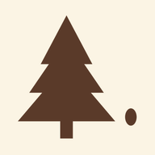
*App/browser icon 192x192*

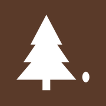
*Apple touch icon 180x180 (opaque)*

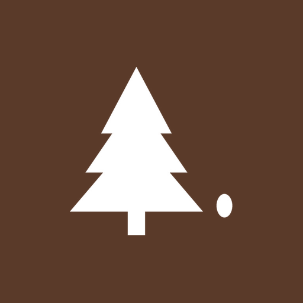
*Android maskable icon 512x512 (content inside safe circle)*

```html
<link rel="icon" href="/favicon.ico" sizes="48x48">
<link rel="icon" href="/icon-192.png" type="image/png" sizes="192x192">
<link rel="apple-touch-icon" href="/apple-touch-icon.png">
<link rel="manifest" href="/site.webmanifest">
<meta name="theme-color" content="#5a3a29">
```
- Copy every file to the site root and paste `assets/favicons/head-snippet.html` into the `<head>` of every page. The snippet already sets the browser theme colour to Pinecone Brown.
- The maskable icon keeps the symbol inside the central safe zone (the inner 80% circle), so Android can crop it to a circle, squircle or square without clipping the pip.
- At 16px and 32px the pip becomes a few pixels. Check the favicon in a real browser tab on light and dark browser themes before launch. If it reads as a speck, ask the designer for a favicon-only version with a slightly larger pip.

> **Don't** use the full emblem as a favicon or app icon, or place the symbol on Honey Glaze or Forest Pine for these files. One icon colourway everywhere builds recognition.

### Open Graph and link previews

- Size: 1200 × 630px, PNG or JPG under 1MB. A template is in `assets/social/web/`.
- Layout: a Flour Cream or Pinecone Brown background, the emblem (correct variant for the background) left of centre, and a short headline in `h2` Fraunces. Keep text and logo inside the central 1080 × 560px, because platforms crop the edges.
- Product photography can fill the image if the emblem sits on a solid panel, never directly on the photo.
- Always set `og:image:alt` describing the image, for example "A loaf of seeded rye on a wooden board, with the Pip & Pine Bakery logo".

### Email templates

| Spec | Rule |
|---|---|
| Width | 600px single column, fluid down to 320px |
| Text | Live HTML text, at least 14px (16px recommended), line height at least 1.5 |
| Fonts | Fraunces and Source Sans 3 as web fonts where supported, with Georgia (headings) and Arial (body) fallbacks |
| Buttons | Bulletproof HTML buttons (not images), at least 44px tall, `surface-brand` + `text-on-brand` |
| Images | Every image has alt text; decorative images have empty alt; key messages never live only in an image |
| Logo | Transparent PNG of the emblem, 120px wide displayed (240px file), on a Flour Cream or white header band with at least 16px padding |
| Footer | Bakery name and postal address in text, unsubscribe link, plain-language reason for receiving the email |

**Dark mode:** some email apps invert backgrounds. Because the full-colour emblem is a single dark brown, it can disappear on an inverted dark background. Place it inside a solid Flour Cream or white table cell with padding, so the cell protects it, or supply the light single-colour version via a dark-mode media query where the email platform supports it. Test in Apple Mail, Gmail and Outlook (light and dark) before every new template goes live.

> **Do** write a real subject line and preview text; they are the first brand impression in the inbox.

> **Don't** send an email that is one large image. It fails screen readers, blocks in many inboxes, and cannot be read on small screens.

### Email signatures

Keep signatures short, friendly and text-first:

```text
Name Surname (she/her)
Role, Pip & Pine Bakery
Phone number
Website address
```

- Pronouns are optional and the individual's choice.
- Type: the email app's default sans-serif (Arial or Calibri) at 10–11pt or 14px; name in bold. Do not install brand fonts into signatures, because recipients will not have them.
- Optional logo: the tree-and-pip symbol as a PNG at 2×, displayed 24–80px wide, with empty alt text (`alt=""`) because the name appears as text beside it. Use the full emblem only at 96px or wider. Every word of the signature must also exist as text, so it works with images blocked.
- No quotes, animated GIFs, seasonal banners or social icons without text labels, unless the brand team approves a campaign banner for a set period.

### Video and webinars

- **Title cards:** Flour Cream or Pinecone Brown background, emblem (correct variant) centred, title in Fraunces. Hold for at least 3 seconds; follow chapter 10 for any logo animation.
- **Lower thirds:** name in `label` weight Source Sans 3, role below, on a solid Pinecone Brown or Flour Cream bar with radius `radius-md`. Keep them inside the title-safe area (the inner 90% of the frame).
- **Captions:** accurate, human-checked captions on every video, as a burned-in option for social and as `.srt`/`.vtt` files for web players. Source Sans 3 or the player default, white or Flour Cream text on a Pinecone Brown or black box at 80% or more opacity, no more than two lines of about 32–42 characters.
- **End cards:** emblem plus one call to action in text (for example the website address), for 3–5 seconds.
- **Thumbnails:** a clear photo of the bake or person, a headline of no more than five words in Fraunces on a solid panel, and the symbol in a corner; never text set directly over a busy photo.
- **Webinars and online events:** use a branded background or slide (chapter 17) rather than a virtual background that crops the presenter's hands, and offer live captions.

> **Accessibility** Provide a transcript for recorded videos and audio-describe anything shown but not said (for example, a step in a recipe demonstration).


## Social media

Social media is where most people first meet Pip & Pine Bakery, often on a phone, often with the sound off, and often only for a second. This chapter keeps every account recognisable, every post accessible, and every reply warm and quick, so a small team can post with confidence.

### Channels and purpose

Each channel has one main job. Posting frequency is guidance for a small team, not a promise: post less rather than post something off-brand.

| Channel | Main job | Typical audience | Suggested frequency |
|---|---|---|---|
| Instagram | Show the bakes and the craft: photos, Reels and Stories | Local customers, food lovers | 3–5 feed posts a week; Stories most baking days |
| Facebook | Practical news for neighbours: opening hours, holiday times, events, orders | Local customers, families, community groups | 2–3 posts a week |
| LinkedIn | Recruitment, suppliers, local business partnerships | Job seekers, suppliers, businesses ordering catering | 1 post a week |
| X | Quick updates and replies: sold out, opening changes | Local followers, press | Only when there is news |
| YouTube | Longer how-it's-made videos and Shorts | Food lovers, people researching the bakery | Monthly at most; optional |
| TikTok | Short, behind-the-bench videos | Younger local customers | 1–3 videos a week; optional |
| Web sharing (Open Graph) | The preview image when anyone shares our website | Everyone | Set once per page |

*Proposed — confirm with leadership:* if the team has less than about three hours a week for social, run Instagram and Facebook well and park the others with a pinned post saying where to find us.

> **Do** keep a dormant account tidy: current avatar, accurate bio, and a pinned post pointing to the active channel.

> **Don't** open a new channel without a named owner and a plan for replies.

### Handles and naming

*Proposed — confirm availability on every platform before registering:* use **@pipandpinebakery** everywhere it fits. X allows only 15 characters, so use **@pipandpine** there. Register the short version on other platforms too, so nobody else can take it.

| Platform | Handle (proposed) | Display name | Bio limit |
|---|---|---|---|
| Instagram | @pipandpinebakery | Pip & Pine Bakery | 150 characters |
| Facebook | @pipandpinebakery | Pip & Pine Bakery | 101-character intro |
| LinkedIn | linkedin.com/company/pipandpinebakery | Pip & Pine Bakery | 120-character tagline |
| X | @pipandpine | Pip & Pine Bakery | 160 characters |
| YouTube | @pipandpinebakery | Pip & Pine Bakery | 1,000-character description |
| TikTok | @pipandpinebakery | Pip & Pine Bakery | 80 characters |

Character limits change; check them when you update a bio.

#### Bio template

Write the bio in plain words, in this order, and cut from the end to fit:

1. What we are: "Bakery in [town or area]."
2. One line of personality from [Voice and tone](#voice-and-tone).
3. Opening hours or "Hours and orders below".
4. Website link.

Do not use emoji as bullets in bios, and never use Unicode "fonts" for emphasis.

#### Links, verification and sub-accounts

- **Link in bio:** link to our own website (a page listing current links), not a third-party link page, so we own the address and the page is accessible.
- **Verification:** apply for verification or a business badge where the platform offers it free. Keep the display name exactly "Pip & Pine Bakery", with the ampersand.
- **Sub-accounts:** we do not run sub-accounts by default. If a second site or team needs one, the pattern is "Pip & Pine Bakery [Place]" and @pipandpine[place], approved by the Social lead and added to the account register.

### Profile and cover images

_Specifications last reviewed 2026-10-02. Platform specifications change frequently. Verify against each platform's help centre before publishing and update this file and the style guide's review date. Sizes are recommended upload sizes in pixels; safe zones are approximate insets (fractions of width/height) kept clear of platform UI and cropping._

**Image sizes by platform**

| Platform | Format | Size | Ratio | Safe zone | Notes |
|---|---|---|---|---|---|
| Instagram | Profile picture | 320 × 320 px | 1:1 | inside circular crop |  |
| Instagram | Feed post (square) | 1080 × 1080 px | 1:1 | 8% margin |  |
| Instagram | Feed post (portrait 4:5) | 1080 × 1350 px | 4:5 | 8% margin |  |
| Instagram | Feed post (portrait 3:4) | 1080 × 1440 px | 3:4 | 8% margin | Profile grid previews crop to 3:4; keep key content central. |
| Instagram | Story | 1080 × 1920 px | 9:16 | inset T14% R6% B14% L6% |  |
| Instagram | Reel / cover | 1080 × 1920 px | 9:16 | inset T14% R6% B35% L6% | Reel cover is cropped to 1:1 on the profile grid and 3:4 in previews. |
| Facebook | Page profile picture | 720 × 720 px | 1:1 | inside circular crop |  |
| Facebook | Page cover | 1640 × 624 px | 2.63:1 | inset T10% R18% B10% L18% | Displays at 820x312 on desktop and 640x360 on mobile; mobile crops about 17% from each side, so keep logos and text in the central 64%. |
| Facebook | Feed post (4:5) | 1080 × 1350 px | 4:5 | 8% margin |  |
| Facebook | Feed post (square) | 1080 × 1080 px | 1:1 | 8% margin |  |
| Facebook | Link share image | 1200 × 630 px | 1.90:1 | 8% margin |  |
| Facebook | Story | 1080 × 1920 px | 9:16 | inset T14% R6% B14% L6% |  |
| Facebook | Event cover | 1920 × 1005 px | 1.91:1 | 8% margin |  |
| LinkedIn | Company page logo | 400 × 400 px | 1:1 | 8% margin |  |
| LinkedIn | Company page cover | 1512 × 256 px | 5.91:1 | inset T10% R5% B10% L20% | Displays at about 1128x191; keep the same ~6:1 ratio. Logo overlaps the lower-left on some layouts. Sources disagree on upload size (1512x256 vs 4200x700); verify on LinkedIn's Page image specs. |
| LinkedIn | Employee profile banner | 1584 × 396 px | 4:1 | inset T10% R5% B10% L30% | Profile photo overlaps the lower-left. |
| LinkedIn | Post image (landscape) | 1200 × 627 px | 1.91:1 | 8% margin |  |
| LinkedIn | Post image (square) | 1080 × 1080 px | 1:1 | 8% margin |  |
| LinkedIn | Post image (portrait 4:5) | 1080 × 1350 px | 4:5 | 8% margin |  |
| X (Twitter) | Profile picture | 400 × 400 px | 1:1 | inside circular crop |  |
| X (Twitter) | Header | 1500 × 500 px | 3:1 | inset T12% R5% B20% L25% | Profile photo overlaps lower-left; top and bottom crop on some devices. |
| X (Twitter) | Post image (16:9) | 1600 × 900 px | 16:9 | 8% margin |  |
| X (Twitter) | Post image (square) | 1080 × 1080 px | 1:1 | 8% margin |  |
| X (Twitter) | Link card image | 1200 × 628 px | 1.91:1 | 8% margin |  |
| YouTube | Channel icon | 800 × 800 px | 1:1 | inside circular crop |  |
| YouTube | Channel banner | 2560 × 1440 px | 16:9 | inset T35% R20% B35% L20% | Text and logo must sit inside the central 1546x423 safe area visible on all devices. |
| YouTube | Video thumbnail | 1280 × 720 px | 16:9 | inset T5% R18% B15% L5% | Duration badge covers the lower-right. |
| YouTube | Video watermark | 150 × 150 px | 1:1 | 8% margin |  |
| YouTube | Short | 1080 × 1920 px | 9:16 | inset T12% R15% B25% L6% |  |
| TikTok | Profile photo | 720 × 720 px | 1:1 | inside circular crop |  |
| TikTok | Video | 1080 × 1920 px | 9:16 | inset T8% R15% B22% L6% |  |
| Website sharing (Open Graph) | Open Graph / social share image | 1200 × 630 px | 1.90:1 | inset T8% R8% B8% L8% |  |

**Accessibility features by platform**

| Platform | Image descriptions (alt text) | Video captions |
|---|---|---|
| Instagram | Supported: Advanced settings > Accessibility > Write alt text (feed posts). | Auto-captions available for Reels; review and correct them, or burn in reviewed open captions. |
| Facebook | Supported: Edit photo > Alternative text (overrides automatic alt text). | Upload an .srt caption file or use auto-generated captions, then review them. |
| LinkedIn | Supported: Alt text option when adding an image to a post. | Upload an .srt caption file with native video. |
| X (Twitter) | Supported: Add description when attaching an image (up to 1,000 characters). | Upload an .srt caption file with video via Media Studio, or burn in reviewed captions. |
| YouTube | No image alt text; describe visuals in the video, title and description, and provide accurate captions. | Upload reviewed caption files; do not rely on unedited auto-captions. |
| TikTok | Supported for photo posts via alt text option; for video, rely on captions and on-screen text. | Turn on auto-captions and edit them before posting. |
| Website sharing (Open Graph) | Set og:image:alt and twitter:image:alt meta tags. | n/a |
- **Avatar:** always the tree-and-pip symbol in Pinecone Brown on a light background, from the generated set. The full emblem is not used on avatars because its "BAKERY" line cannot be read at avatar size. Every circular avatar keeps the symbol well inside the crop.
- **Cover, header and banner:** Pinecone Brown with the white knockout emblem, kept inside the platform safe zone shown in each `-guides.svg` overlay.
- **YouTube watermark:** the symbol only.
- **Campaigns:** you may change covers for a season or campaign. Never change the avatar, add frames, ribbons or seasonal hats to it, or recolour it. People find us by the avatar; changing it breaks recognition and looks like an impersonating account.

> **Do** export avatars from the supplied templates and check them in the platform's circular preview before saving.

> **Don't** upload the full emblem as an avatar or squeeze text into a cover's corners, where the profile photo and buttons cover it.

### Post design

#### Templates and safe zones

Every format has a PNG preview, an editable SVG template and a `-guides.svg` safe-zone overlay. The template has a `guides` layer: hide it before export. Keep text, logos and faces inside the safe zone, because platform buttons, captions and profile photos cover the edges, especially on Stories, Reels, Shorts and TikTok.

##### Instagram

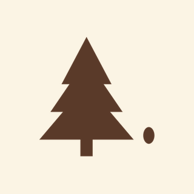
*Instagram Profile picture (320x320) — Logo sized to sit inside the circular crop.*


*Instagram Feed post (square) (1080x1080) layout preview; add the headline using the SVG template*


*Instagram Feed post (portrait 4:5) (1080x1350) layout preview; add the headline using the SVG template*


*Instagram Feed post (portrait 3:4) (1080x1440) layout preview; add the headline using the SVG template — Profile grid previews crop to 3:4; keep key content central.*


*Instagram Story (1080x1920) layout preview; add the headline using the SVG template*

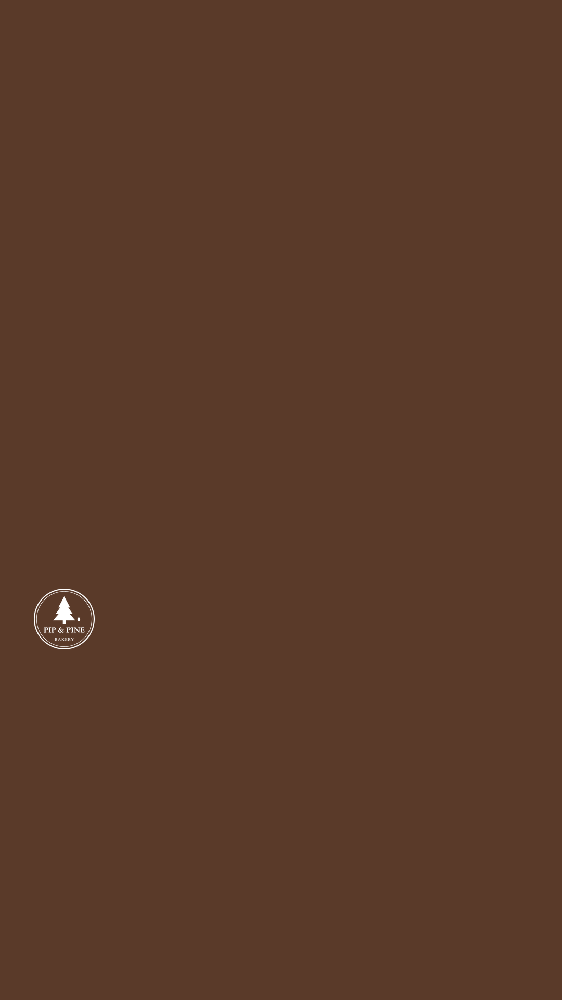
*Instagram Reel / cover (1080x1920) layout preview; add the headline using the SVG template — Reel cover is cropped to 1:1 on the profile grid and 3:4 in previews.*

##### Facebook


*Facebook Page profile picture (720x720) — Logo sized to sit inside the circular crop.*


*Facebook Page cover (1640x624) — Displays at 820x312 on desktop and 640x360 on mobile; mobile crops about 17% from each side, so keep logos and text in the central 64%.*


*Facebook Feed post (4:5) (1080x1350) layout preview; add the headline using the SVG template*


*Facebook Feed post (square) (1080x1080) layout preview; add the headline using the SVG template*


*Facebook Link share image (1200x630) layout preview; add the headline using the SVG template*

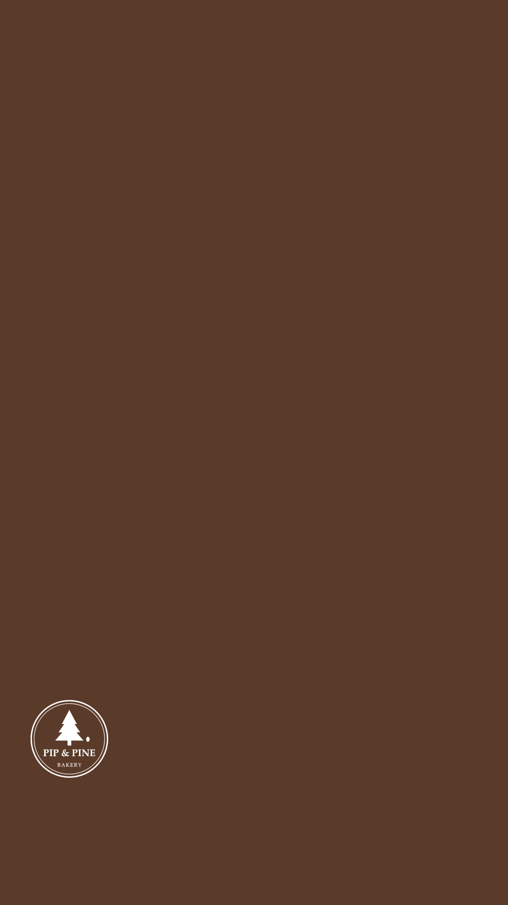
*Facebook Story (1080x1920) layout preview; add the headline using the SVG template*


*Facebook Event cover (1920x1005) layout preview; add the headline using the SVG template*

##### LinkedIn

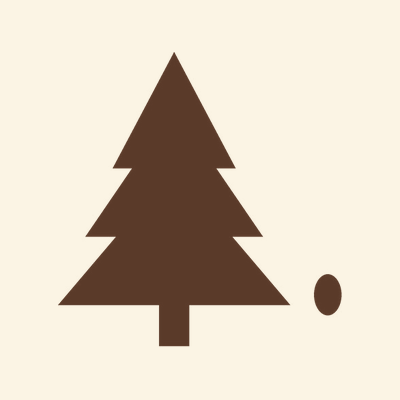
*LinkedIn Company page logo (400x400)*

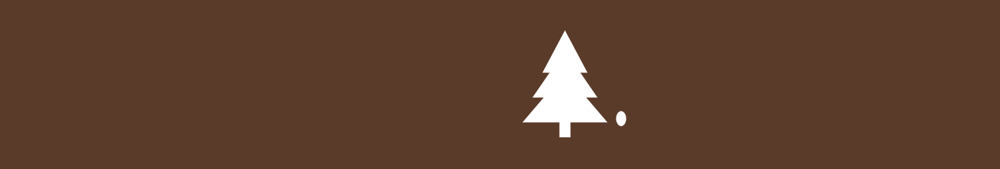
*LinkedIn Company page cover (1512x256) — Full logo would be below its minimum size on phones, so the symbol is used. Displays at about 1128x191; keep the same ~6:1 ratio. Logo overlaps the lower-left on some layouts. Sources disagree on upload size (1512x256 vs 4200x700); verify on LinkedIn's Page image specs.*

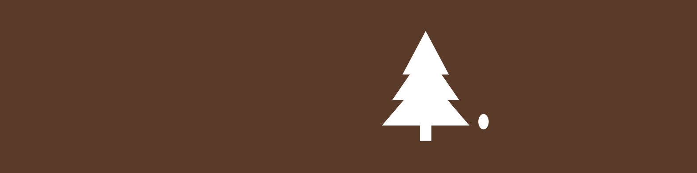
*LinkedIn Employee profile banner (1584x396) — Full logo would be below its minimum size on phones, so the symbol is used. Profile photo overlaps the lower-left.*


*LinkedIn Post image (landscape) (1200x627) layout preview; add the headline using the SVG template*


*LinkedIn Post image (square) (1080x1080) layout preview; add the headline using the SVG template*


*LinkedIn Post image (portrait 4:5) (1080x1350) layout preview; add the headline using the SVG template*

##### X (Twitter)

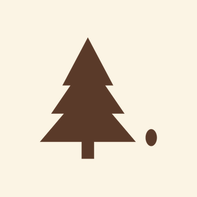
*X (Twitter) Profile picture (400x400) — Logo sized to sit inside the circular crop.*

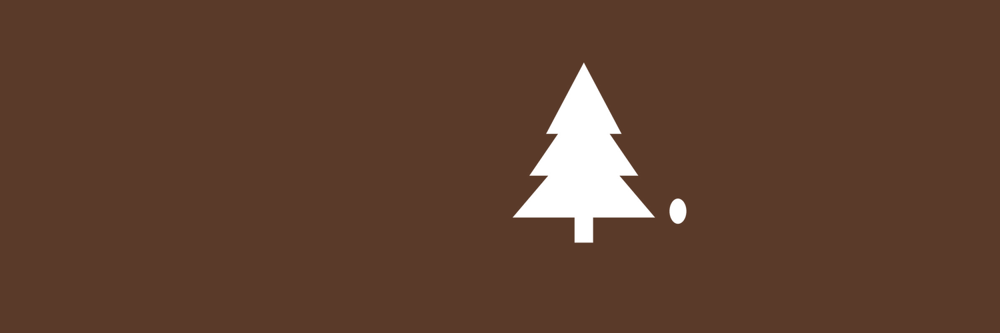
*X (Twitter) Header (1500x500) — Full logo would be below its minimum size on phones, so the symbol is used. Profile photo overlaps lower-left; top and bottom crop on some devices.*


*X (Twitter) Post image (16:9) (1600x900) layout preview; add the headline using the SVG template*

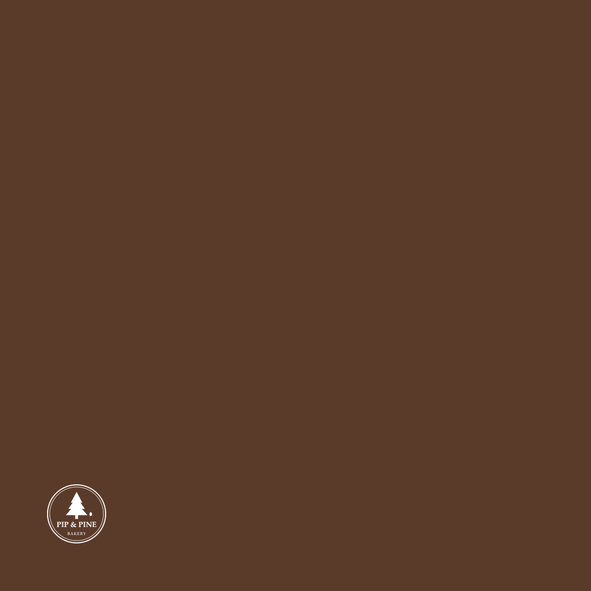
*X (Twitter) Post image (square) (1080x1080) layout preview; add the headline using the SVG template*


*X (Twitter) Link card image (1200x628) layout preview; add the headline using the SVG template*

##### YouTube

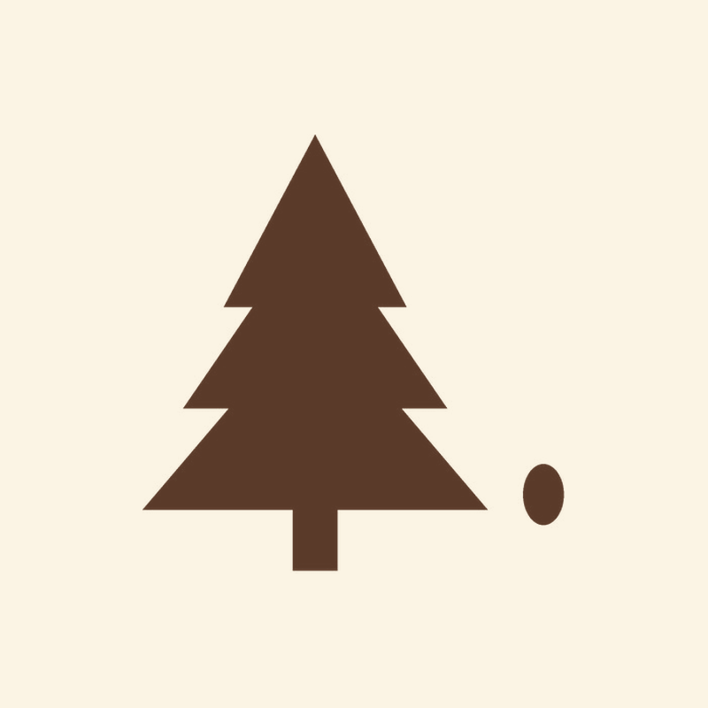
*YouTube Channel icon (800x800) — Logo sized to sit inside the circular crop.*

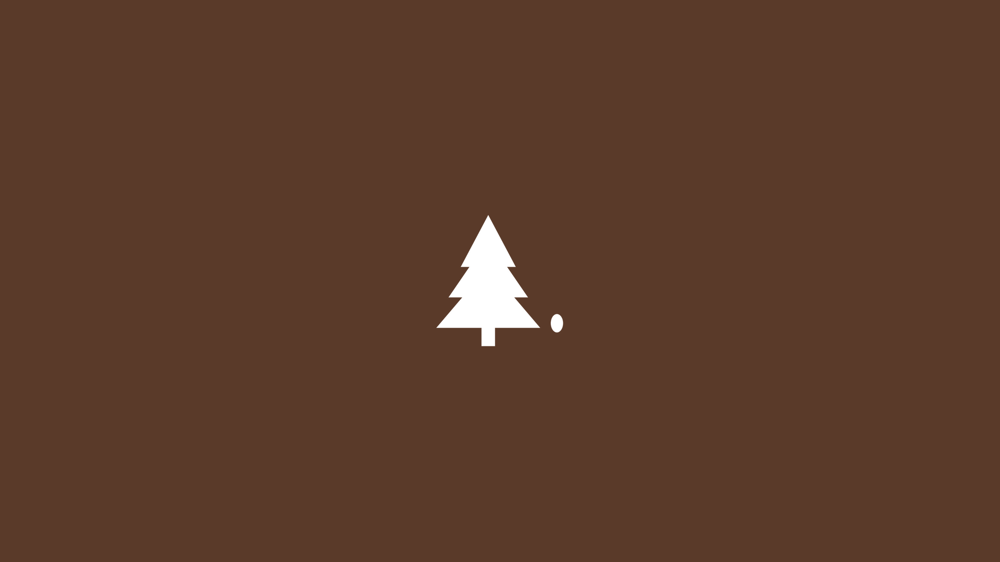
*YouTube Channel banner (2560x1440) — Full logo would be below its minimum size on phones, so the symbol is used. Text and logo must sit inside the central 1546x423 safe area visible on all devices.*

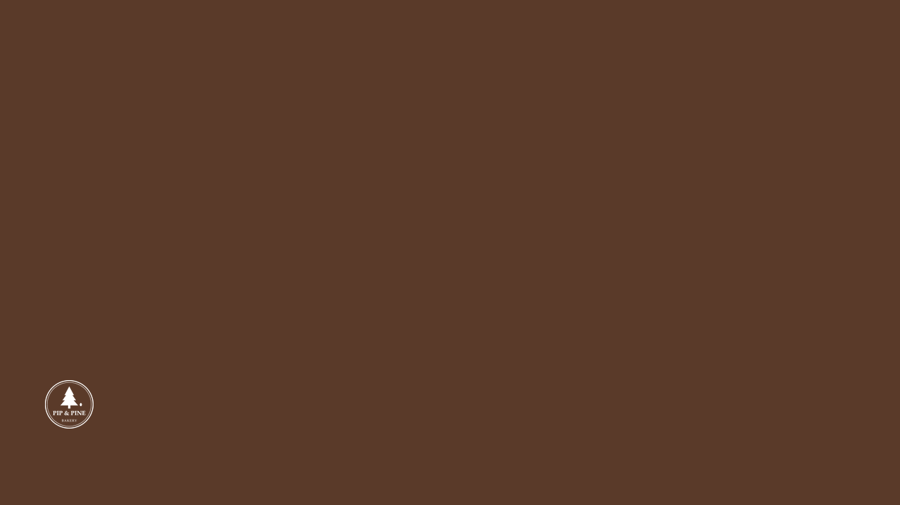
*YouTube Video thumbnail (1280x720) layout preview; add the headline using the SVG template — Duration badge covers the lower-right.*

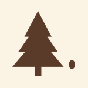
*YouTube Video watermark (150x150)*

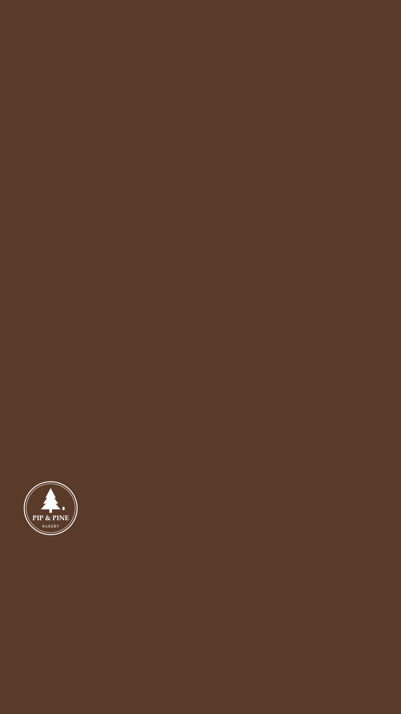
*YouTube Short (1080x1920) layout preview; add the headline using the SVG template*

##### TikTok


*TikTok Profile photo (720x720) — Logo sized to sit inside the circular crop.*


*TikTok Video (1080x1920) layout preview; add the headline using the SVG template*

##### Website sharing (Open Graph)

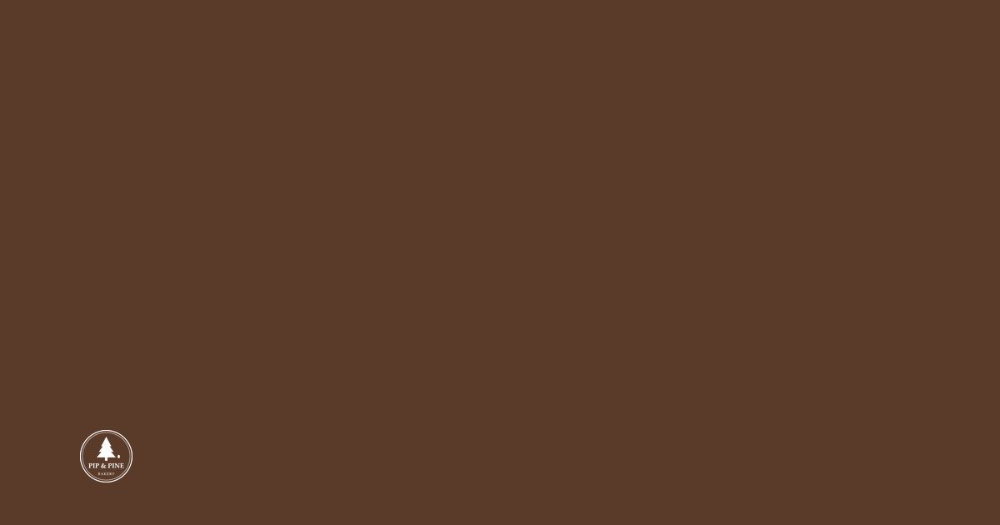
*Website sharing (Open Graph) Open Graph / social share image (1200x630) layout preview; add the headline using the SVG template*

Each format also has an editable SVG template (with a hideable `guides` layer) and a `-guides.svg` safe-zone overlay in the same folder.
#### Logo on posts

- Use the symbol, not the full emblem, as a sign-off on posts and video: top-left corner, inside the safe zone, about 8–10% of the image width (at least 96px on a 1080px-wide post).
- Use white on Pinecone Brown or Forest Pine, and Pinecone Brown on Flour Cream or white.
- Use the full emblem only on cover slides, end cards and announcements, at least 25% of the image width, so "BAKERY" stays readable.
- Leave the logo off photos where it would cover the food or a person.

#### Text on images

- At most about 20 words per image. Say the rest in the caption.
- Text height at least 4% of the image height (about 43px on a 1080 × 1080 post; 77px on a 1920px-tall Story).
- Headlines in Fraunces, everything else in Source Sans 3. No other fonts.
- Text must reach 4.5:1 against its background. Approved pairs: white or Flour Cream on Pinecone Brown, white on Forest Pine, Pinecone Brown or Forest Pine on Flour Cream or white.
- Honey Glaze is a highlight colour. On Pinecone Brown it only just reaches 4.5:1, so use it for large headlines only, never small text. On white or Flour Cream it is decorative only; use accent-600 for any text in that colour.
- On photos, place text on a Pinecone Brown or Forest Pine panel at 80% or more opacity with white text, or on a solid Flour Cream panel with Pinecone Brown text, never directly on a busy image. Never put white text on Honey Glaze, solid or translucent.

#### Carousels

- Slide 1 uses the same cover layout every time: headline in Fraunces, symbol top-left.
- Number slides ("2/6") in the same corner throughout.
- The final slide carries one call to action, such as "Order at [website]", and the full emblem.
- Maximum 10 slides. Each slide gets its own alt text.

#### Video

- Intro: none, or the symbol for no more than 1 second. Start with the food, not the logo.
- Outro: an end card with the emblem and one call to action, 2–3 seconds.
- Lower thirds: Source Sans 3 semibold, white on a Pinecone Brown panel, inside the safe zone, on screen for at least 3 seconds.
- Burned-in captions: Source Sans 3, at least 4% of video height, white text on a Pinecone Brown or black box at 80% or more opacity, positioned above the platform's bottom safe line.

> **Do** let the bakes fill the frame and keep brand elements small and consistent.

> **Don't** stretch, crop or recolour the logo, add drop shadows, or place it over a busy photo.

### Content pillars

*Proposed — confirm with leadership:* four themes, with an approximate share of posts over a month.

| Pillar | Purpose | Share |
|---|---|---|
| From our ovens | Today's bakes, seasonal specials, new products: what to come in for | 40% |
| Behind the bench | How things are made, ingredients, the team at work (with consent) | 25% |
| Good neighbours | Local events, partners, customers' photos (with permission), community news | 20% |
| Need to know | Opening hours, holiday times, ordering, allergen information, jobs | 15% |

Only post facts the bakery has confirmed: ingredients, sourcing claims, awards and "freshly made" statements must be true and checked.

### Writing for social

Our voice is the same everywhere; see [Voice and tone](#voice-and-tone) for the attributes. On social we are casual and light for posts, balanced and serious for replies and complaints.

| Platform | Caption length | Tone note |
|---|---|---|
| Instagram | 1–3 short paragraphs | Sensory, warm, specific |
| Facebook | 1–2 short paragraphs | Practical first: what, when, where |
| LinkedIn | Up to 150 words | Plain and professional, still warm |
| X | One or two sentences | News first |
| YouTube | Title under 60 characters; description with a summary first | Descriptive, searchable |
| TikTok | One line | Natural, spoken |

- **Hook:** put the point in the first 125 characters, as most platforms cut the caption there. "Cinnamon buns are back this weekend." beats "Guess what?"
- **Call to action:** one per post, specific: "Order by Thursday at [website]".
- **Links:** say where they go: "See this week's menu: [link]". Never "link in bio!!!" alone; say "Menu link in our bio".
- **Mentions and tags:** tag partners and suppliers only with their agreement. Tag customers only when they have tagged us first or agreed. Never tag children.
- **Allergens:** never answer an allergen question with a guess in comments. Point to the allergen information and to staff in person or by phone.

### Hashtags

*Proposed — confirm with leadership:* our brand hashtags are **#PipAndPine** and **#PipAndPineBakery**. Campaign hashtags follow the same pattern, for example #PipAndPine[Season]Bakes, and the Social lead approves each one.

- Always write hashtags in CamelCase, so screen readers read them as words.
- Put hashtags at the end of the post, after the call to action.
- Check a campaign hashtag is not already used for something else before launching it.

| Platform | Maximum hashtags |
|---|---|
| Instagram | 3 |
| LinkedIn | 3 |
| TikTok | 3 |
| YouTube | 2–3, in the description |
| X | 1–2 |
| Facebook | 0–2 |

### Emoji

Emoji can add warmth, but screen readers read every one aloud by its full name. Our approved set fits a bakery and our tone:

| Emoji (Unicode name) | Use for |
|---|---|
| bread (U+1F35E) | Loaves, bread news |
| croissant (U+1F950) | Pastries |
| evergreen tree (U+1F332) | Brand sign-off, seasonal posts |
| sheaf of rice (U+1F33E) | Grains, flour, ingredients |
| hot beverage (U+2615) | Coffee and breakfast |
| red heart (U+2764) | Thanks to customers and partners |

- At most 3 emoji per post, at the end of a sentence, never in the middle.
- Never use emoji instead of words (a clock emoji is not opening hours; write "Open from [time]").
- Never repeat emoji in strings, use them as bullets, or use them in complaints, apologies, food safety or allergen messages.

### Accessibility on social

Accessibility is mandatory on every post, not optional polish. Many customers use screen readers, captions or magnification, and sound-off viewing is the default for most people.

- **Alt text on every image.** Describe what matters: "A tray of iced cinnamon buns on the counter, ready for Saturday." Keep it under about 125 characters; for images with lots of text, repeat the text in full.
- **Text in images appears in the caption or alt text** too, word for word.
- **Captions on every video**, checked by a person. Auto-captions are a first draft, not a finished caption.
- **Transcripts** for any video longer than 1 minute, linked in the description or on our website.
- **Sound-off design:** the video must make sense muted. Put the key message on screen.
- **CamelCase hashtags**, at the end.
- **Emoji:** no more than 3, never in place of words.
- **No Unicode "fonts"** (mathematical bold, italic or script letters). Screen readers skip or spell them out letter by letter.
- **Contrast:** text on graphics at least 4.5:1; meaningful graphics at least 3:1. Never use colour alone to show meaning, such as a red price for "sold out".
- **No flashing** more than 3 times a second. Warn before any strobing.
- **Plain language:** short sentences; spell out abbreviations.
- **Descriptive links:** say where a link goes.

#### Accessibility features by platform

| Platform | Alt text | Captions |
|---|---|---|
| Instagram | Advanced settings, then Accessibility, then Write alt text (feed posts) | Auto-captions on Reels: review and correct them, or burn in reviewed captions |
| Facebook | Edit photo, then Alternative text (replace the automatic text) | Upload an .srt file or review auto-captions |
| LinkedIn | Alt text option when adding an image | Upload an .srt file with native video |
| X | Add description when attaching an image (up to 1,000 characters) | Upload an .srt file via Media Studio, or burn in reviewed captions |
| YouTube | No image alt text: describe visuals in the video, title and description | Upload reviewed caption files |
| TikTok | Alt text option on photo posts | Turn on auto-captions and edit them before posting |
| Web sharing | Set `og:image:alt` and `twitter:image:alt` | Not applicable |

> **Accessibility** If you cannot write alt text or captions for a post today, do not post it today.

### Community management

Replies are part of the brand. Be quick, kind and human, and sign off with a first name or initial when the team agrees.

| Situation | Response time (business hours) | What to do |
|---|---|---|
| Question (hours, orders, products) | Same business day | Answer, or point to the right page |
| Allergen or dietary question | Same business day | Point to allergen information and invite them to speak to staff; never guess |
| Complaint | Within 4 business hours | Acknowledge, apologise where appropriate, move to private messages, follow up publicly once resolved |
| Food safety concern | Within 1 hour of seeing it | Reply privately at once and escalate to the manager on duty |
| Wrong information about us | Same day | Correct it calmly, with a source |
| Abuse, hate, harassment, spam | Immediately | Hide or remove, report, do not engage |

*Proposed — confirm with leadership:* business hours for replies, and a weekend cover rota.

- **Take it private** whenever the conversation needs an order number, contact details, health information or a refund.
- **Escalation path:** community manager, then Social lead, then the owner or manager on duty. Food safety, legal threats and press enquiries go straight to the owner.
- **Moderation:** we hide or remove hate speech, harassment, personal data, spam and illegal content. We do not remove honest criticism.
- **Trolls:** one calm, factual reply at most, then stop.

> **Do** reply to a complaint publicly once ("Sorry about this, we've sent you a message"), then solve it privately.

> **Don't** argue in public, copy and paste the same reply, or delete fair criticism.

### Crisis and sensitive moments

A crisis might be a food safety issue, an allergen incident, an unexpected closure, a serious complaint going viral or a sensitive national moment.

1. **Pause** all scheduled posts on every channel at once.
2. **Tell** the owner or manager on duty. Only they approve crisis posts.
3. **Hold:** if needed, post a short holding statement: "We know about [issue] and are looking into it now. We'll update here by [time]." Customer safety instructions come first.
4. **Update** at the time you promised, even if there is little new.
5. **Resume** normal posting only when the owner agrees.

Stay silent on news and events that have nothing to do with the bakery. During national mourning or a local tragedy, pause promotional posts and do not attach the brand to the event.

> **Warning** For product recalls or allergen incidents, follow the food safety authority's instructions and legal advice before posting. Use plain words, the action first, and no emoji or humour.

### Employee advocacy

We are proud when the team shares their work.

- Staff may share and like our public posts, and post their own photos of their work, as long as no customer can be identified without consent and nothing confidential appears (recipes, rotas, prices before launch, kitchen documents).
- Personal accounts are personal: staff speak for themselves, not for the bakery. Only official accounts speak for Pip & Pine Bakery.
- If staff promote the bakery, they should make clear they work here, for example "I work at Pip & Pine Bakery".
- Staff may use the LinkedIn personal banner from the asset kit. It is optional; nobody has to.
- Nobody replies to complaints about the bakery from a personal account. Pass them to the Social lead.

### Partners, influencers and user-generated content

- **Disclosure:** under UK advertising rules (the ASA's CAP Code and CMA guidance), any paid, gifted or affiliate post must be clearly labelled at the start, with "#ad" or "Ad" and the platform's paid-partnership label where available. This applies to posts by influencers we work with and to our own posts about partners when there is a commercial relationship. Ask for legal review of every paid agreement.
- **Co-branded posts:** follow [Co-branding and partnerships](#co-branding-and-partnerships) for logo order, sizing and approval.
- **Customer photos and videos:** ask for permission in writing (a comment or message saying yes is enough), credit the creator by handle in the caption, and never edit their image beyond cropping. Remove it promptly if they ask.

### Governance

| Role | Who | Responsibilities |
|---|---|---|
| Social lead | *To be named* | Owns this chapter, the calendar, account register and approvals |
| Community manager | *To be named* (can be the Social lead) | Daily replies and moderation |
| Approver | Owner or manager on duty | Crisis posts, paid partnerships, anything legal or sensitive |
| Contributors | Any trained staff member | Suggest content and photos; post only with access granted by the Social lead |

- **Who can post:** only people listed in the account register. Routine posts need no extra approval; paid partnerships, competitions, campaigns and crisis posts need the Approver.
- **Security:** turn on two-factor authentication on every account. Use a business password manager and role-based access; never share personal logins. Remove access on someone's last day and review admins every quarter.
- **Account register:** list every account, its handle, owner, admins and recovery email and phone. Recovery details must belong to the business, not a person.
- **Records:** keep competition terms, partnership agreements, permissions for reposted content and photo consent forms for at least 2 years, or as legal advice requires.
- **Privacy:** never post personal data, order details or customer names without consent. Get written consent before posting photos where someone can be identified. For children, get consent from a parent or guardian, and never give a child's name or school.
- **Competitions:** publish full terms before launch and follow each platform's promotion rules.

### Social media: do and don't
> **Do** use the symbol avatar, the supplied covers and the templates for every account.

> **Do** write alt text, check captions and put the key message on screen for sound-off viewing.

> **Do** reply quickly and take personal matters to private messages.

> **Don't** alter the avatar for campaigns, use Unicode "fonts", or write hashtags in lower case.

> **Don't** guess about allergens or post a fact about the bakery that has not been confirmed.

> **Don't** post a paid or gifted collaboration without "Ad" at the start.

### Pre-publish checklist

**Brand**

- [ ] Correct template, brand colours, Fraunces and Source Sans 3 only
- [ ] Logo in the approved corner, size and colour, inside the safe zone
- [ ] Fits a content pillar; one clear call to action

**Accessibility**

- [ ] Alt text written; text in the image repeated in caption or alt text
- [ ] Captions reviewed; works with sound off; no flashing
- [ ] Text contrast at least 4.5:1 and at least 4% of image height
- [ ] CamelCase hashtags at the end; no more than 3 emoji; no Unicode "fonts"

**Legal**

- [ ] Paid, gifted or affiliate content labelled "Ad" at the start
- [ ] Consent for every identifiable person; parental consent for children
- [ ] Permission and credit for any customer content
- [ ] Prices, dates, ingredients and allergen claims checked

**Proof-read**

- [ ] Spelling in UK English, names and tags correct
- [ ] Links work and say where they go
- [ ] Read aloud once: does it sound like us?


## Print and stationery

Print is where a bakery brand is held in the hand: a card tucked into a cake box, a price list on the counter, a flyer at a market stall. Our emblem already looks like a printed stamp, so print should feel crafted and tactile, on uncoated or matt stock, with generous Flour Cream space and nothing that makes it harder to read.

### Before you print

The master logo is currently a 1200px JPG. That is enough for a business card proof, but **not** for professional print work. Before any print run larger than desktop printing, ask the brand team for the vector master (PDF, EPS or SVG). If it does not yet exist, a designer must redraw the emblem first (see chapter 20).

| Setting | Rule |
|---|---|
| Logo files | Vector PDF or EPS for professional print; PNG only for office printers |
| Images | 300 ppi at final size, CMYK, embedded |
| Bleed | 3mm on every edge where colour or images run off the page |
| Safe margin | Keep text and the logo at least 4mm inside the trim (business cards), 5mm on everything else |
| Black | 100% K for small text; rich black for large dark areas only, as specified by your printer |
| Fonts | Embed or outline Fraunces and Source Sans 3 in the print PDF (PDF/X-4 preferred) |

### Print colour and paper

- **CMYK:** the CMYK values in chapter 4 are mathematical conversions. Ask the printer to proof them on the actual stock and adjust; Pinecone Brown and Forest Pine are dark, earthy colours that can print muddy or too green on uncoated paper.
- **Pantone:** to be matched from a physical Pantone swatch book under daylight, in both coated (C) and uncoated (U) versions, then recorded by the brand team in `brand.json`. Do not pick a Pantone from a screen.
- **Single-colour jobs:** the emblem is designed in one colour, so one-colour Pinecone Brown print (a spot colour, once matched) is ideal for stamps, bags and labels and keeps costs down.
- **Proofing:** always approve a hard-copy proof on the final stock before any run over 250 items, or any item with food-contact inks.
- **Paper:** choose uncoated or matt stock, ideally with a warm white or cream shade close to Flour Cream. It reduces glare, suits the handmade feel, and is easier to read. Prefer recycled or FSC®-certified papers; ask the printer for their certification and only state it on the item if they confirm it.

> **Do** print the full-colour emblem on white, cream or Flour Cream stock, and the white single-colour emblem on Pinecone Brown or Forest Pine.

> **Don't** print the emblem below 25mm wide. Below that, the letter-spaced "BAKERY" fills in; use the symbol (at least 8mm) instead.

### Business cards

| Spec | UK and Europe |
|---|---|
| Size | 85 × 55mm, plus 3mm bleed |
| Stock | Uncoated or matt, 350–450gsm |
| Front | Emblem centred at 25–30mm on Flour Cream, or white emblem on Pinecone Brown |
| Back | Name, role, phone, email, website and address (as needed), left-aligned |

**Information hierarchy:** name in Fraunces semibold 10–11pt; role in Source Sans 3 at 8–9pt; contact details in Source Sans 3 regular at 8pt minimum. Never set any text below 7pt, and avoid reversed (white) text below 8pt because it fills in on uncoated stock. Use Pinecone Brown or the dark neutral for all text; Honey Glaze is for a small decorative detail only (for example a thin rule or the pip printed as a spot), never for text on a light card.

### Letterhead, compliment slips and envelopes

| Item | Size | Logo position |
|---|---|---|
| Letterhead | A4, 210 × 297mm | Emblem top-left or top-centre, 25–30mm wide, 15mm from the top edge |
| Continuation sheet | A4 | Symbol only, 10mm, top-left |
| Compliment slip | 99 × 210mm (⅓ A4) | Emblem left, "With compliments" in Fraunces |
| Envelopes | DL 110 × 220mm, C5 162 × 229mm, C4 229 × 324mm | Symbol or emblem top-left on the back flap or front; return address in Source Sans 3 |

- Letterhead margins are at least 20mm. Put the bakery's legal details (company name, registered number and address, if it is a limited company) in the footer at 7–8pt. Confirm these with the owner; never guess them.
- Body text in letters is Source Sans 3 at 11pt, or Arial or Calibri 11pt when using office templates (chapter 17).
- Keep a **digital letterhead** template (Word and Google Docs) that matches the printed one, so PDFs sent by email look identical. Do not print digital letterhead on top of pre-printed stationery.
- Check address window positions with your mail provider before printing windowed envelopes.

### Menus, flyers, brochures and posters

These carry the most information, so the grid matters.

- **Grid:** use a 12-column grid on A4 and A3 with 5mm gutters and at least 12mm margins; A5 and DL flyers use 6 columns. Align text to column edges and keep generous Flour Cream space; the emblem's circle looks best with air around it.
- **Headings:** Fraunces, sentence case. **Body and prices:** Source Sans 3, tabular figures for price lists so pence align.
- **Counter menus and price lists:** body text at least 12pt on A4 menus held in the hand, and at least 14pt on menus read at arm's length, and list allergens and dietary symbols with a written key (for example "VG = vegan"), never colour alone.
- **Posters (A3–A1):** one message, one image, the emblem at the bottom or top centre, and a headline readable from 3m (at least 60pt on A3).
- **Photography:** follow chapter 8. Never set text directly on a busy photo; use a solid Flour Cream or Pinecone Brown panel.

> **Do** add a QR code with the written short web address beside it, so people without a smartphone camera can still find the page.

> **Don't** use Honey Glaze for text on cream or white, or set long passages in capitals or italics.

### Accessible print

- Body text at least 11–12pt (12pt for anything handed to customers to read at length, such as menus and order forms).
- Text contrast follows the pairings in chapter 4; on cream stock use Pinecone Brown or the dark neutral.
- Left-aligned, never justified; line length 45–75 characters.
- Matt or uncoated stock to avoid glare.
- **Large print on request:** offer menus, price lists and allergen information in a large-print version (at least 16pt, ideally 18pt, Source Sans 3) and say so on the standard version: "Large-print menu available. Please ask."
- Keep a digital, accessible version (tagged PDF or web page) of every printed menu and leaflet, per chapter 17.

> **Accessibility** Allergen information must be easy for everyone to read. Never squeeze it into small print or a decorative colour; give it the same body size and contrast as the rest of the menu.


## Presentations and documents

Slides and documents are how Pip & Pine Bakery talks to suppliers, event organisers, wholesale customers and the team. Good templates save everyone time, keep the brand consistent when no designer is involved, and, built properly, are accessible to screen-reader users without extra work.

### Templates and fonts

The brand team owns one master template for each tool. Always start from it rather than copying an old file.

| Tool | Template | Fonts used |
|---|---|---|
| PowerPoint / Keynote | 16:9 slide master | Fraunces and Source Sans 3 if installed |
| Google Slides / Google Docs | 16:9 theme and document template | Fraunces and Source Sans 3 (both available in Google's font menu) |
| Word | Letter, report and document templates (`.dotx`) | Georgia for headings, Calibri or Arial for body |

Fraunces and Source Sans 3 are free (SIL Open Font License) and can be installed on every computer. When a file must open on computers without them, use the office substitutes: **Georgia** in place of Fraunces and **Calibri or Arial** in place of Source Sans 3. Never mix brand fonts and substitutes in one file. *Proposed — confirm with leadership:* the Word templates use the substitutes by default, because Word documents are often edited by people outside the bakery.

### Slide layouts

The master contains these layouts. Use them through **New slide → Layout**, never by drawing text boxes on a blank slide.

| Layout | Use | Brand treatment |
|---|---|---|
| Title | Opening slide | Pinecone Brown background, white emblem centred, title in Fraunces |
| Section | Divider between parts | Forest Pine or Flour Cream background, section title only |
| Content | Heading plus bullets or text | Flour Cream or white background, symbol bottom-right at 12mm |
| Two column | Comparison, text plus image | As content |
| Image | Full-bleed photo with a short caption on a solid panel | Caption panel in Flour Cream or Pinecone Brown |
| Quote | Customer or partner quotation (with permission) | Large Fraunces quote, attribution in Source Sans 3 |
| Data | A chart or table | Follow chapter 9 for colours and labels |
| End | Thanks, contact details | Mirrors the title slide |

- **Size:** 16:9 (1920 × 1080px / 13.33 × 7.5in). Keep text and the logo inside a 48px (0.33in) safe margin on every edge.
- **Text:** at least 24pt everywhere on a slide, including chart labels and footnotes. Titles 36–44pt in Fraunces.
- **One idea per slide.** Aim for no more than six lines of text; put detail in the speaker notes or a handout.
- **Colour:** use the pairings in chapter 4 only. White text belongs on Pinecone Brown or Forest Pine, never on Honey Glaze.
- **Logo:** emblem on title and end slides only; the symbol is enough on content slides. Never place the emblem over a photo.

> **Do** give every slide a unique title, even when it is visually hidden, so people navigating by title know where they are.

> **Don't** paste screenshots of text, tables or charts. Rebuild them as real text or native charts so they can be read, resized and translated.

### Accessible slides

1. Use the master layouts and their placeholders; the reading order then follows the layout.
2. Check the reading order in the Selection Pane (PowerPoint) or by tabbing through objects; fix any extra text boxes.
3. Add alt text to every meaningful image, chart and icon; mark decorative images as decorative.
4. Do not rely on colour to show meaning in charts or diagrams; add labels.
5. Avoid automatic slide transitions and flashing animation; keep any animation simple (chapter 10).
6. Run the built-in checker: **Review → Check Accessibility** in PowerPoint, Keynote's accessibility descriptions, or a manual check in Google Slides.
7. Share a tagged PDF or the original file, not an image export, as the handout.

### Document templates

#### Template set

- **Letter:** matches printed letterhead (chapter 16), body 11pt.
- **Report and proposal:** cover page with emblem and title, contents, numbered headings.
- **Policy and procedure:** for staff documents such as food safety or allergen procedures, with version table and review date.
- **Price list or order form:** for wholesale or event orders, with tables for products and prices.

#### Use real styles

- **Title**, **Heading 1–3** in Fraunces (or Georgia), Pinecone Brown. Never skip a level, and never make a heading by bolding body text.
- **Normal** body text in Source Sans 3 (or Calibri/Arial) at 11–12pt, line spacing 1.15–1.5, left-aligned, space after each paragraph instead of blank lines.
- **Lists** with the built-in bullet and number buttons.
- **Tables** with a marked header row (repeat on each page), no merged or split cells where you can avoid them, and no empty rows used for spacing.
- **Links** with descriptive text ("our allergen policy"), not bare web addresses or "click here".
- Margins at least 20mm; page numbers in the footer.

> **Accessibility** Set the document title in File → Properties and the language to English (United Kingdom). Screen readers announce both.

### PDF export

Every PDF we send or publish must be a **tagged PDF**:

- Export with **File → Save as → PDF → Options → Document structure tags for accessibility** (Word), or **Export → PDF → Accessible** in other tools. Do not use "Print to PDF", which strips the tags.
- Check that the PDF has a title (not the file name), the document language, and bookmarks from the headings.
- Check it with Adobe Acrobat's accessibility checker or the free PAC checker before publishing on the website.
- For printed pieces made in design software, export a separate tagged version for the web, or publish the content as a web page.

### File naming and version control

- Name files `pip-pine-bakery-{type}-{topic}-{yyyy-mm-dd}-v{n}.{ext}`, for example `pip-pine-bakery-proposal-catering-2026-10-02-v2.pdf`. Lower case, hyphens, no spaces.
- Keep masters in one shared folder owned by the brand team; work on copies.
- Increase the version number for every sent revision; mark the approved version `final` only once.
- Delete or archive superseded templates so old logos and colours do not circulate.

> **Don't** rename an old presentation to start a new one. It carries out-of-date layouts, fonts and hidden notes.


## Signage, environment and merchandise

A bakery brand lives in physical places: the shopfront, the counter, the cake box carried home, the apron behind the till, a stall at a market. These are where most customers meet Pip & Pine Bakery, so they must be consistent, durable and easy for everyone to read, including people with low vision and wheelchair users.

All physical items need the **vector logo master**. The current JPG cannot be enlarged for signs or converted for embroidery, so commission vector artwork before ordering anything in this chapter (see chapter 20). Ask suppliers for a physical sample or proof before every first order.

### Shopfront and exterior signs

- **Fascia:** the full emblem, or a designer-approved horizontal lock-up if the fascia is long and shallow. Pinecone Brown on Flour Cream, or white on Pinecone Brown or Forest Pine. Hand-painted signwriting suits the brand, provided the signwriter works from the vector artwork and does not redraw the lettering.
- **Projecting (hanging) sign:** the round emblem is ideal, painted or cut from wood or metal, the same design on both faces.
- **Size:** as a rule of thumb, allow about 25mm of cap height per 10m of viewing distance. For the emblem, measure the "PIP & PINE" capitals, not the whole circle.
- **Window graphics:** opening hours and contact details in Source Sans 3, at least 25mm cap height, white or Pinecone Brown on a solid panel so the text stays readable against the shop interior.
- **Pavement A-boards:** check your local council's rules first; many require a licence. Place them so they leave a clear path along the pavement, and never on tactile paving.
- **Finish:** matt or satin. Gloss reflects sunlight and lamps, and hides the text.
- **Paint and materials:** match brand colours to a physical paint system (for example RAL or NCS) chosen with the sign maker and recorded by the brand team. CMYK and screen values do not translate directly to paint.

> **Do** check planning permission and advertisement consent with the local planning authority before installing new or illuminated signs, particularly in a conservation area.

> **Don't** use the full-colour emblem on black or very dark materials. Use the white single-colour emblem, or put the emblem on a Flour Cream panel.

### Interior signs, menu boards and wayfinding

- **Menu boards:** product names may be in Fraunces; prices, descriptions and allergen keys in Source Sans 3, sentence case. Text readable from the back of the queue: at least 25mm cap height for prices and product names on boards read from 3–5m.
- **Chalkboards:** hand-lettered specials are welcome and suit the brand. Write clearly in lower case or sentence case, keep a permanent printed board for core items, prices and allergens, and never chalk important safety information.
- **Allergen notice:** clear, printed, at counter height, telling customers how to ask about allergens.
- **Wayfinding** (toilets, accessible toilet, exits, baby change): use standard pictograms (ISO 7001 public information symbols) with a text label, in Source Sans 3. Do not redraw them in a brand style.
- **Contrast:** aim for a difference of at least 70 points of light reflectance value (LRV) between text and sign, and make signs stand out from the wall, as BS 8300 recommends. Ask the sign maker for LRV values of the chosen paints.
- **Tactile and braille signs:** in the UK, follow BS 8300 and Approved Document M for accessible toilets and other public-facing facilities; check which signs need tactile or braille elements with your sign maker or building control. Mounting heights follow the same guidance.
- **Glass doors and screens:** add manifestation (visible markings) at the heights set in building regulations, so people do not walk into them. A band of the symbol repeated in a row works well; it must contrast with the background on both sides.

> **Accessibility** Keep counters, menus and payment points readable from a seated position. Place at least one copy of the menu at seated eye height or on a hand-held card.

### Packaging

Packaging is the brand's most-travelled touchpoint. Keep it simple: one colour where possible, generous plain space, the emblem as a stamp.

| Item | Logo treatment | Notes |
|---|---|---|
| Cake and pastry boxes | Emblem on the lid, at least 50mm wide, Pinecone Brown on white or kraft | Kraft board: test the print, as brown-on-brown may lose contrast; use a Flour Cream label if needed |
| Paper bags | Emblem or symbol, one-colour Pinecone Brown | Logo at least 25mm wide |
| Round stickers and seals | Emblem at 30mm or larger, or symbol on stickers under 30mm | A round sticker echoes the emblem shape |
| Product labels | Symbol plus product name in Fraunces | Mandatory information in Source Sans 3 |
| Rubber stamp | Symbol or emblem at 25mm or larger | Stamps lose fine detail; test the thin inner ring |

**Food information:** labels on food that is pre-packed for direct sale (for example sandwiches or cakes packed on the premises before a customer orders) must show the name of the food and a full ingredients list with the 14 allergens emphasised (for example in **bold**), under the UK Food Information Regulations ("Natasha's Law"). Mandatory text has a minimum x-height of 1.2mm, or 0.9mm on small packs. Check the current Food Standards Agency guidance or your local authority before printing; this guide does not replace it.

- Use food-safe, low-migration inks for anything that touches food, and confirm this with the printer.
- Prefer recyclable, compostable or reusable packaging, and only make environmental claims the supplier can evidence.

> **Don't** put allergen or ingredient information in Honey Glaze, in italics, or in decorative script.

### Uniforms and embroidery

- **Aprons, caps and polo shirts:** the white single-colour emblem on Pinecone Brown or Forest Pine fabric, or the Pinecone Brown emblem on natural or cream fabric.
- **Embroidery:** *Proposed — confirm with your embroiderer:* the full emblem at 60mm wide or larger (left chest or apron bib); below that, embroider the symbol only, at least 20mm high. The thin inner ring and "BAKERY" lettering need a digitised embroidery file made from the vector master, and the embroiderer may simplify them. Approve a stitched sample.
- **Thread colours:** match to physical thread cards for Pinecone Brown, Forest Pine and white, and record the thread references.
- **Name badges:** first name in Source Sans 3 bold, at least 24pt, symbol beside it. Pronouns optional.

### Events and markets

- **Gazebo and stall:** a branded table cloth or banner with the emblem at the front edge, a hand-held or easel menu (see menu boards above) and price tags in Source Sans 3 at least 18pt.
- **Roll-up banner (850 × 2000mm):** emblem in the top third (eye level and above, so it is seen over a crowd), one short message, website or social handle at least 60mm cap height, nothing important in the bottom 300mm where it is hidden by tables.
- **Bunting, flags and tote bags:** symbol or emblem, single colour.
- **Lanyards** (if used at trade events): 15–20mm wide, symbol repeated, breakaway clasp.

### Vehicles

*Proposed — use if the bakery runs delivery vehicles or bikes:* the emblem on both sides and the rear, Pinecone Brown on a white or cream vehicle, or white on a dark one, with the website in Source Sans 3. Keep any phone number large enough to read from 10m (at least 75mm cap height). Do not wrap the logo over door seams, handles or curved edges that distort the circle.

### Merchandise

- **Quality:** only items worthy of the bakery's name — tote bags, enamel mugs, tea towels, aprons. Order a sample first.
- **Sourcing:** prefer durable, sustainably sourced and ethically made items; ask suppliers for evidence before you mention it.
- **Logo:** single-colour printing (Pinecone Brown or white) suits the stamp-like emblem and most print methods. Respect the minimum sizes: emblem 25mm, symbol 8mm.
- **Placement:** centred or left-chest; never on seams, folds or curves that distort the circle.

> **Do** brief every supplier with the logo chapter (chapter 3), this chapter and the vector files, and ask for a proof.

> **Don't** let a supplier recreate, trace or recolour the logo, or add an outline or shadow to make it "stand out".


## Co-branding and partnerships

Local bakeries often work with others: a café that stocks our bread, a market or food festival, a charity bake sale, a supplier who names us as a customer. Clear co-branding rules protect both names, show the true relationship honestly, and keep our emblem recognisable next to someone else's.

### Types of relationship

| Relationship | Example (illustrative only) | How the logos appear |
|---|---|---|
| **Partnership of equals** | A joint product or event with another local business | Both logos at equal optical size, side by side, with a divider |
| **We sponsor** | We support a school fair or local sports team | Their brand leads; our logo smaller, with "Supported by" |
| **We are sponsored or hosted** | We trade at a market or festival | The organiser's brand leads; we follow their guidelines |
| **Stockist or supplier** | A café sells our bakes; we name a mill we buy from | Text credit first ("Bread by Pip & Pine Bakery"); logo only with written approval |
| **Sub-brand or product line** | A future range or seasonal collection | Endorsed by our name (see below) |

We have no confirmed partners at the time of writing; the examples show the type of relationship only.

### Lock-up rules

1. **Order:** the lead or host organisation's logo goes first (left, or top when stacked). For equal partners, the partner who initiates the material goes first, or agree the order in writing.
2. **Divider:** separate the logos with a thin vertical rule in Pinecone Brown or the dark neutral, or with a text connector in Source Sans 3: "in partnership with", "supported by", "baked by".
3. **Equal optical size:** our emblem is a dense circle, so it looks larger than a wide wordmark at the same height. Match visual weight, not measurements: our emblem is usually set at about 1.5 times the cap height of a partner's wordmark. Check by eye on a print-out at final size.
4. **Clear space:** apply our clear-space rule (chapter 3) around the **whole** lock-up and between our emblem and the divider.
5. **Alignment:** centre the logos on a shared horizontal axis; when stacked, centre them on a vertical axis.
6. **Minimum size:** our emblem never goes below 25mm (print) or 96px (screen) in a lock-up. If space is tighter, use the symbol only where the partner agrees, or a text credit.
7. **Backgrounds:** both logos must use versions approved for the shared background. If one partner's logo needs a white panel and ours does not, put both on the same panel.

> **Do** use one colour treatment for both logos when the background demands it, for example both white on Forest Pine, if the partner's guidelines allow.

> **Don't** merge our symbol with a partner's mark, place both inside a new shared badge, or recolour our emblem to match a partner's palette.

### Using partner logos

- Always ask the partner for their current logo files and brand guidelines. **Their guidelines take priority for their mark**, even when they differ from ours.
- Never download a partner's logo from a web search or redraw it.
- Get written permission to use their name or logo, and keep it with the project files.
- When a partner uses our logo, send them the approved files listed in the downloads section of chapter 20 and a link to chapters 3 and 19, and ask to see a proof before it is printed or published.

### Sub-brands and product brands

*Proposed — confirm with leadership:* keep a **branded-house** structure. New ranges, seasonal collections or services are described in words under the Pip & Pine Bakery name, for example "Pip & Pine Bakery Celebration Cakes", set in Fraunces next to the full emblem, not given their own logos. This keeps one memorable mark for a small business. If a separately named product line is ever needed, a designer creates an endorsed lock-up ("by Pip & Pine Bakery"), approved by the brand team and added to this guide before use.

### Approvals and lead times

| Item | Who approves | Allow at least |
|---|---|---|
| Social post or digital ad with a partner | Brand contact | 2 working days |
| Printed co-branded material | Brand contact and the partner | 5 working days, plus print time |
| Signage, packaging, merchandise or sponsorship | Owner and brand contact | 10 working days |
| New sub-brand or product naming | Owner | Agree a timeline case by case |

Send the brand contact (chapter 1) a draft or proof, the partner's approval if needed, and where and when it will appear.

### Co-branding accessibility

- Both logos must reach at least 3:1 against the background. If a partner's logo fails, put it on a panel or use their approved single-colour version.
- Alt text names both organisations and the relationship, for example "Pip & Pine Bakery in partnership with [partner name]". Never write "logos".
- State the relationship in live text nearby as well, so it is clear without the images.
- In video and slides, say the partnership aloud or in captions, not only on a logo slide.

> **Accessibility** A co-branded social graphic needs the same alt text, captions and plain-text credit as any other post (chapter 15).


## Legal, governance and assets

A brand only stays recognisable if someone looks after it. This chapter explains how to protect the Pip & Pine Bakery name and logo, which licences cover our fonts and images, who approves what, and where to find the official files.

### Trademarks and the logo

We have not confirmed whether the Pip & Pine Bakery name or emblem is a registered trademark.

- **Until registration is confirmed**, do not use the ® symbol. Using ® on an unregistered mark is an offence in the UK and many other countries.
- *Proposed — confirm with a legal adviser:* the ™ symbol may be used to signal an unregistered claim. If used, place it small, at the lower right of the wordmark, on formal and legal materials only, never on social avatars, favicons or packaging fronts where it adds clutter.
- Write the name as **Pip & Pine Bakery** in full on first mention, and **Pip & Pine** after that. Always use the ampersand, never "Pip and Pine" in running text.
- Never alter, redraw, animate or combine the logo with other marks except as described in the *Logo* and *Co-branding and partnerships* chapters.

> **Warning** Trademark status, the legal entity name and any registration numbers must come from the owner or a legal adviser. Do not add them to materials until confirmed.

### Copyright lines

Use this pattern on the website footer, printed brochures, packaging and documents:

> © [Year] [Legal entity name]. All rights reserved.

*Proposed — confirm with the owner:* the legal entity name to use in place of the bracketed text. Until it is confirmed, use "© [Year] Pip & Pine Bakery".

### Licences

#### Fonts

| Typeface | Role | Licence | What it allows |
|---|---|---|---|
| Fraunces | Display | SIL Open Font License 1.1 | Free for commercial use in print, web, apps, social, video and embedding. May not be sold on its own. |
| Source Sans 3 | Body | SIL Open Font License 1.1 | As above |
| JetBrains Mono | Code and data | SIL Open Font License 1.1 | As above |

Download fonts from their official Google Fonts pages (listed in *Typography*), not from third-party font sites, which may host altered or mislabelled files.

#### Images, illustration and music

- Keep a record (file name, source, photographer, licence, expiry date, model and property releases) for every photo, illustration, video and music track we publish.
- Stock images must have a licence that covers commercial use on every channel where they appear. Check for restrictions on packaging and on paid advertising.
- Photos of customers or staff need written consent before publication, and children need consent from a parent or guardian.
- Credit photographers where the licence requires it, in a caption or credit line, not inside alt text.
- AI-generated images follow the rules in *Imagery and illustration*: label them where required and never present them as real products or people.

### Roles and approvals

| Role | Who | Responsibilities |
|---|---|---|
| Brand owner | Brand and Marketing team (*proposed — name a person*) | Keeps this guide current, approves exceptions, holds master artwork |
| Approvers | Brand owner, plus the owner of the bakery for new campaigns | Sign off new templates, packaging, signage, partnerships and paid campaigns |
| Creators | Staff, designers, agencies | Follow the guide and submit work for approval when listed below |

#### What needs approval

| Item | Approval needed? |
|---|---|
| Social posts made from approved templates | No, but follow *Social media* |
| Menu boards, price tickets and in-shop notices using templates | No |
| New packaging, signage, vehicle livery, uniforms or merchandise | Yes, with a printer's or manufacturer's proof |
| Co-branded materials, sponsorships and partner use of our logo | Yes, before anything is shared with the partner |
| Paid advertising and press materials | Yes |
| Any exception to a rule in this guide | Yes, in writing; the exception is logged |

Send work for approval with the file, where it will appear, the size, and the date it is needed. Allow at least two working days.

> **Do** ask for approval before a partner or supplier receives our logo files, and send them the co-branding rules at the same time.

> **Don't** approve your own exceptions, or treat a one-off approval as permission for future work.

### Asset library and file naming

All official files live in the `assets/` folder of this guide package and in the shared brand drive (*proposed — confirm location*). Use only these files. Name new files using this pattern, in lower case with hyphens:

`pip-pine-bakery-{type}-{topic}-{yyyy-mm-dd}-v{n}.{ext}`

For example: `pip-pine-bakery-menu-board-autumn-a1-2026-10-02-v1.pdf`.

| Folder | Contents |
|---|---|
| `assets/source/` | Master logo as supplied and the tree-and-pip symbol |
| `assets/logo/` | Full-colour, single-colour and white logos, clear-space versions and background tests |
| `assets/favicons/` | Favicons, app icons and the HTML snippet for the website |
| `assets/social/` | Profile images, covers, post templates and safe-zone overlays per platform |
| `tokens/` | Design tokens for the website and apps |

> **Note** The master logo is currently a 1,200 px JPG and the symbol was cropped from it. Ask the original designer for vector master files (SVG and EPS or PDF) before producing signage, embroidery or large-format print.

##### Logo files

- [primary-original.jpg](assets/logo/primary-original.jpg) — Original logo file as supplied
- [primary-full-colour.png](assets/logo/primary-full-colour.png) — primary logo, full colour (PNG, transparent)
- [primary-full-colour-clearspace.png](assets/logo/primary-full-colour-clearspace.png) — primary logo, full colour, with minimum clear space built in
- [primary-mono-dark.png](assets/logo/primary-mono-dark.png) — primary logo, mono dark (PNG, transparent)
- [primary-mono-dark-clearspace.png](assets/logo/primary-mono-dark-clearspace.png) — primary logo, mono dark, with minimum clear space built in
- [primary-mono-light.png](assets/logo/primary-mono-light.png) — primary logo, mono light (PNG, transparent)
- [primary-mono-light-clearspace.png](assets/logo/primary-mono-light-clearspace.png) — primary logo, mono light, with minimum clear space built in
- [symbol-full-colour.png](assets/logo/symbol-full-colour.png) — symbol logo, full colour (PNG, transparent)
- [symbol-full-colour-clearspace.png](assets/logo/symbol-full-colour-clearspace.png) — symbol logo, full colour, with minimum clear space built in
- [symbol-mono-dark.png](assets/logo/symbol-mono-dark.png) — symbol logo, mono dark (PNG, transparent)
- [symbol-mono-dark-clearspace.png](assets/logo/symbol-mono-dark-clearspace.png) — symbol logo, mono dark, with minimum clear space built in
- [symbol-mono-light.png](assets/logo/symbol-mono-light.png) — symbol logo, mono light (PNG, transparent)
- [symbol-mono-light-clearspace.png](assets/logo/symbol-mono-light-clearspace.png) — symbol logo, mono light, with minimum clear space built in
- [logo-on-white.png](assets/logo/backgrounds/logo-on-white.png) — Logo (full-colour) on white background
- [logo-on-light-neutral.png](assets/logo/backgrounds/logo-on-light-neutral.png) — Logo (full-colour) on light-neutral background
- [logo-on-primary.png](assets/logo/backgrounds/logo-on-primary.png) — Logo (mono-light) on primary background
- [logo-on-dark.png](assets/logo/backgrounds/logo-on-dark.png) — Logo (mono-light) on dark background
- [logo-on-secondary.png](assets/logo/backgrounds/logo-on-secondary.png) — Logo (mono-light) on secondary background
- [logo-on-accent.png](assets/logo/backgrounds/logo-on-accent.png) — Logo (full-colour) on accent background

##### Favicons and app icons

- [favicon.ico](assets/favicons/favicon.ico) — Browser favicon (16, 32, 48 px) on a solid brand tile
- [icon-16.png](assets/favicons/icon-16.png) — App/browser icon 16x16
- [icon-32.png](assets/favicons/icon-32.png) — App/browser icon 32x32
- [icon-48.png](assets/favicons/icon-48.png) — App/browser icon 48x48
- [icon-192.png](assets/favicons/icon-192.png) — App/browser icon 192x192
- [icon-512.png](assets/favicons/icon-512.png) — App/browser icon 512x512
- [apple-touch-icon.png](assets/favicons/apple-touch-icon.png) — Apple touch icon 180x180 (opaque)
- [icon-maskable-512.png](assets/favicons/icon-maskable-512.png) — Android maskable icon 512x512 (content inside safe circle)
- [site.webmanifest](assets/favicons/site.webmanifest) — Web app manifest
- [head-snippet.html](assets/favicons/head-snippet.html) — HTML <head> tags for favicons

##### Social media kit

- [instagram-avatar-320x320.svg](assets/social/instagram/instagram-avatar-320x320.svg) — Editable template: Instagram Profile picture
- [instagram-avatar-320x320.png](assets/social/instagram/instagram-avatar-320x320.png) — Instagram Profile picture (320x320)
- [instagram-feed-square-1080x1080.svg](assets/social/instagram/instagram-feed-square-1080x1080.svg) — Editable template: Instagram Feed post (square)
- [instagram-feed-square-1080x1080.png](assets/social/instagram/instagram-feed-square-1080x1080.png) — Instagram Feed post (square) (1080x1080) layout preview; add the headline using the SVG template
- [instagram-feed-portrait-1080x1350.svg](assets/social/instagram/instagram-feed-portrait-1080x1350.svg) — Editable template: Instagram Feed post (portrait 4:5)
- [instagram-feed-portrait-1080x1350.png](assets/social/instagram/instagram-feed-portrait-1080x1350.png) — Instagram Feed post (portrait 4:5) (1080x1350) layout preview; add the headline using the SVG template
- [instagram-feed-portrait-34-1080x1440.svg](assets/social/instagram/instagram-feed-portrait-34-1080x1440.svg) — Editable template: Instagram Feed post (portrait 3:4)
- [instagram-feed-portrait-34-1080x1440.png](assets/social/instagram/instagram-feed-portrait-34-1080x1440.png) — Instagram Feed post (portrait 3:4) (1080x1440) layout preview; add the headline using the SVG template
- [instagram-story-1080x1920.svg](assets/social/instagram/instagram-story-1080x1920.svg) — Editable template: Instagram Story
- [instagram-story-1080x1920.png](assets/social/instagram/instagram-story-1080x1920.png) — Instagram Story (1080x1920) layout preview; add the headline using the SVG template
- [instagram-reel-1080x1920.svg](assets/social/instagram/instagram-reel-1080x1920.svg) — Editable template: Instagram Reel / cover
- [instagram-reel-1080x1920.png](assets/social/instagram/instagram-reel-1080x1920.png) — Instagram Reel / cover (1080x1920) layout preview; add the headline using the SVG template
- [facebook-avatar-720x720.svg](assets/social/facebook/facebook-avatar-720x720.svg) — Editable template: Facebook Page profile picture
- [facebook-avatar-720x720.png](assets/social/facebook/facebook-avatar-720x720.png) — Facebook Page profile picture (720x720)
- [facebook-cover-1640x624.svg](assets/social/facebook/facebook-cover-1640x624.svg) — Editable template: Facebook Page cover
- [facebook-cover-1640x624.png](assets/social/facebook/facebook-cover-1640x624.png) — Facebook Page cover (1640x624)
- [facebook-feed-portrait-1080x1350.svg](assets/social/facebook/facebook-feed-portrait-1080x1350.svg) — Editable template: Facebook Feed post (4:5)
- [facebook-feed-portrait-1080x1350.png](assets/social/facebook/facebook-feed-portrait-1080x1350.png) — Facebook Feed post (4:5) (1080x1350) layout preview; add the headline using the SVG template
- [facebook-feed-square-1080x1080.svg](assets/social/facebook/facebook-feed-square-1080x1080.svg) — Editable template: Facebook Feed post (square)
- [facebook-feed-square-1080x1080.png](assets/social/facebook/facebook-feed-square-1080x1080.png) — Facebook Feed post (square) (1080x1080) layout preview; add the headline using the SVG template
- [facebook-link-1200x630.svg](assets/social/facebook/facebook-link-1200x630.svg) — Editable template: Facebook Link share image
- [facebook-link-1200x630.png](assets/social/facebook/facebook-link-1200x630.png) — Facebook Link share image (1200x630) layout preview; add the headline using the SVG template
- [facebook-story-1080x1920.svg](assets/social/facebook/facebook-story-1080x1920.svg) — Editable template: Facebook Story
- [facebook-story-1080x1920.png](assets/social/facebook/facebook-story-1080x1920.png) — Facebook Story (1080x1920) layout preview; add the headline using the SVG template
- [facebook-event-1920x1005.svg](assets/social/facebook/facebook-event-1920x1005.svg) — Editable template: Facebook Event cover
- [facebook-event-1920x1005.png](assets/social/facebook/facebook-event-1920x1005.png) — Facebook Event cover (1920x1005) layout preview; add the headline using the SVG template
- [linkedin-avatar-400x400.svg](assets/social/linkedin/linkedin-avatar-400x400.svg) — Editable template: LinkedIn Company page logo
- [linkedin-avatar-400x400.png](assets/social/linkedin/linkedin-avatar-400x400.png) — LinkedIn Company page logo (400x400)
- [linkedin-cover-1512x256.svg](assets/social/linkedin/linkedin-cover-1512x256.svg) — Editable template: LinkedIn Company page cover
- [linkedin-cover-1512x256.png](assets/social/linkedin/linkedin-cover-1512x256.png) — LinkedIn Company page cover (1512x256)
- …and 34 more in `assets/social/`

##### Design tokens

- [_tokens.scss](tokens/_tokens.scss)
- [tailwind-theme.css](tokens/tailwind-theme.css)
- [tailwind.preset.js](tokens/tailwind.preset.js)
- [tokens.css](tokens/tokens.css)
- [tokens.json](tokens/tokens.json)
### Review cadence

This guide is reviewed every 12 months, and also after any rebrand, a change of social platform, or a change to accessibility law or standards. The brand owner leads the review, checks that social media specifications are still current, re-runs the accessibility gate and publishes a new version.

### Version history

| Version | Date | Changes |
|---|---|---|
| 1.0.0 | 2026-10-02 | First edition, created from the Pip & Pine Bakery logo. Colour names, supporting colours, typefaces, foundations and the symbol crop are proposals awaiting confirmation. |

Version numbers follow a simple rule: a patch number (1.0.1) for corrections, a minor number (1.1.0) for additions such as a new platform or template, and a major number (2.0.0) for a rebrand.

